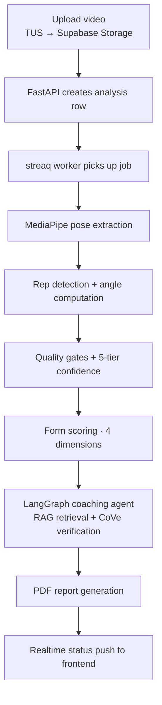

# Spelix

Science-based barbell form coaching. Upload a squat, bench, or deadlift video; get structured, citation-backed coaching feedback grounded in peer-reviewed biomechanics literature.

**Live:** [spelix.app](https://spelix.app) · Private beta · Source-available under [BSL 1.1](./LICENSE)

---

## What it does

1. **Upload** a barbell lift video (squat / bench / deadlift).
2. **CV pipeline** extracts pose landmarks (MediaPipe BlazePose Heavy), detects reps, and computes joint angles and per-rep metrics.
3. **Form scoring** across four dimensions — Movement Quality, Technique, Path & Balance, Control — with a 5-tier per-rep confidence model.
4. **AI coaching** generates structured feedback (summary, strengths, issues, correction plan, recommended cues) grounded in a curated corpus of peer-reviewed biomechanics papers, with inline citations.
5. **Expert-in-the-loop** — a kinesiology specialist curates the research corpus and validates coaching quality through a dedicated portal.

## Architecture

Monorepo, two deployable units:

- **`backend/`** — Python 3.12, FastAPI, async SQLAlchemy 2.0, streaq + Redis worker, MediaPipe + OpenCV CV pipeline, LangGraph agent, WeasyPrint PDF reports. Deployed on a DigitalOcean droplet behind Caddy.
- **`frontend/`** — React 19, Vite 8, TypeScript strict, Tailwind CSS 4, shadcn/ui, Recharts. Deployed on Vercel.

Supporting services: Supabase (Postgres, Auth, Storage, Realtime), Qdrant Cloud (vector store), Cohere (embeddings + rerank), Anthropic Claude + OpenAI (coaching + keyframe analysis), LangSmith (agent tracing).

### Request flow



The browser uploads directly to Supabase Storage via a TUS signed URL — FastAPI never handles video bytes.

## Project layout

```
backend/      FastAPI app, CV pipeline, coaching agent, worker
  app/
    api/      HTTP routes (analyses, coaching, expert, admin, beta)
    cv/       MediaPipe pipeline, rep detection, scoring, quality gates
    services/ coaching (LangGraph), RAG, distillation, storage
    models/   SQLAlchemy ORM
    workers/  streaq async jobs
  tests/      unit + integration + MC/DC decision-coverage suites
  alembic/    migrations
frontend/     React SPA
  src/
    pages/      route components (upload, results, history, expert, admin)
    components/ shared UI
    hooks/      data fetching + realtime
    api/        typed API clients (generated from the OpenAPI schema)
config/       threshold configs (versioned scoring parameters)
reports/      WeasyPrint PDF templates
docs/         SRS, architecture docs, ADRs
```

## Coaching pipeline highlights

- **5-tier per-rep confidence model** — every rep gets a confidence tier (High → Very Low) computed from the 10th percentile of phase-adjusted frame confidences. Low-confidence metrics are surfaced honestly (with the fraction of interpolated frames), never silently dropped.
- **Dual-collection RAG** — peer-reviewed biomechanics papers plus a compounding "Coach Brain" knowledge layer, retrieved via Cohere embeddings with rerank over Qdrant.
- **LangGraph agent** — composable tools (rep metrics, paper retrieval, Coach Brain lookup, form-deviation flagging, user-history comparison) selected adaptively by the model, not a fixed script. Every run is traced in LangSmith.
- **Chain-of-Verification (CoVe)** — every distilled Coach Brain candidate is verified against the research corpus before it enters a review queue.
- **Two distinct human-in-the-loop roles:**
  - The **kinesiology specialist** (expert portal) curates the peer-reviewed paper corpus and annotates/validates coaching outputs.
  - The **admin** (maintainer) reviews machine-distilled Coach Brain candidates — approve / edit / reject — in a separate admin-only queue before any insight is promoted to production retrieval.

## Testing

- **Backend:** 2,496 tests (unit, integration, and MC/DC), including **86 MC/DC (Modified Condition/Decision Coverage) decision tests across 7 decision tables** for safety-critical scoring and quality-gate logic — the coverage standard used in DO-178C Level A avionics software.
- **Frontend:** 765 component + hook tests across 77 files (Vitest + React Testing Library).
- **Database:** 27 Alembic migrations.
- **CI:** GitHub Actions runs the full suite plus TruffleHog secret scanning on every push; merges to `main` auto-deploy to production.

## License

Spelix is source-available under the [Business Source License 1.1](./LICENSE). You may read, modify, and make non-production and limited production use of the code; use that competes with Spelix as a hosted or embedded coaching product is not granted during the license term. The license **automatically converts to Apache License 2.0 on 2030-05-30** (four years after first public release). For production or commercial use beyond these terms, contact **licensing@spelix.app**.

Third-party dependency licenses are inventoried in [docs/dependency-licenses.md](./docs/dependency-licenses.md).

This repository is the application source. The live production deployment, its infrastructure, and all real user data are **not** part of this repository. See [SECURITY.md](./SECURITY.md) to report vulnerabilities and [CONTRIBUTING.md](./CONTRIBUTING.md) before opening issues or PRs.

---

*Spelix is a personal project built to production standards — real users, real CI/CD, real safety-critical testing discipline.*
