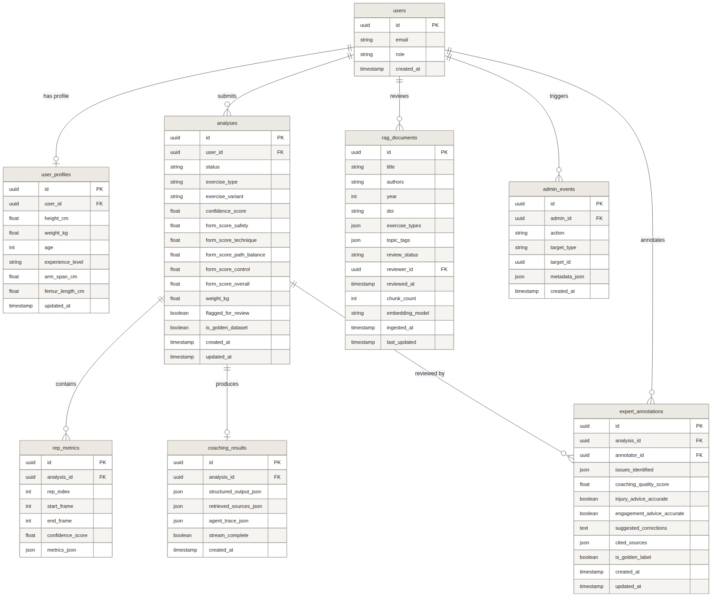

# Spelix

> *from Latin **speculor** — to observe, to analyze, to reflect*

**Software Requirements Specification** · v2.1 · spelix.app

---

### Changelog

| Version | Date | Changes |
|---------|------|---------|
| v2.1 | 2026-04-12 | Requirements engineering review: resolved 6 blocking issues (ADR-BRAIN-07 consistency, entry_type enum alignment, eval score dependency chain, CoachBrainEntry schema reconciliation, ERD/use-case counts, retrieval pipeline deduplication). Added FR-BRAIN-16 (consent withdrawal handling), FR-BRAIN-17 (knowledge lifecycle ADD/UPDATE/NOOP), FR-BRAIN-18 (confirmation_count semantics). Fixed Appendix D section numbering, video_path deletion timing, phase count, TDD numbering, cost model, phase mapping table, Vite/Tailwind version reconciliation, consent_version format. Status promoted from Draft to Approved. |
| v2.0 | 2026-04-11 | Coach Brain integration: FR-BRAIN-01 through -15, NFR-PRIV-01 through -07, ADR-BRAIN-01 through -07, ADR-RAG-01 through -03. Phase 2 RAG layer updates. Updated phase list, data model, diagrams, competitive analysis. |
| v1.11 | 2026-04-08 | Pre-Coach-Brain baseline. Phases 0–4 functional and non-functional requirements. |

---

## Diagrams

All diagrams are in [`docs/`](.) as PNG files.

| File | Description |
|---|---|
| [`erd.png`](erd.png) | Entity-relationship diagram — 11 tables with cardinalities (includes coach_brain_entries, consent_records, athlete_memory added in v2.0) |
| [`usecase_diagram.png`](usecase_diagram.png) | Use case diagram — 32 use cases across 4 actors (UC-27 through UC-32 added in v2.0 for Coach Brain, consent, and distillation) |
| [`class_exercise_analyzer.png`](class_exercise_analyzer.png) | Class: Strategy pattern — ExerciseAnalyzerFactory + 3 concrete analyzers |
| [`class_scoring_composite.png`](class_scoring_composite.png) | Class: Composite pattern — 4 ScoreComponents → OverallFormScore |
| [`class_agent_tools.png`](class_agent_tools.png) | Class: Blackboard pattern — AgentState + LangGraph tools (retrieve_papers, retrieve_coach_brain, flag_form_deviation, etc.) |
| [`class_backend_services.png`](class_backend_services.png) | Class: Service layer — QualityGateService, ConfidenceCalculator, CVPipelineWorker |
| [`seq_upload_trigger.png`](seq_upload_trigger.png) | Sequence: Signed URL upload flow + quality gate branch |
| [`seq_cv_pipeline.png`](seq_cv_pipeline.png) | Sequence: ARQ worker CV pipeline (landmark extraction → scoring → artifacts) |
| [`seq_rag_agent.png`](seq_rag_agent.png) | Sequence: Phase 2–3 RAG retrieval + CoVe agent loop |
| [`seq_sse_streaming.png`](seq_sse_streaming.png) | Sequence: Cache hit/miss + SSE token stream to browser |
| [`state_analyses_status.png`](state_analyses_status.png) | State: Job state machine incl. quality_gate_rejected |
| [`state_rag_documents.png`](state_rag_documents.png) | State: Paper review lifecycle (pending → approved → indexed) |
| [`state_agent_flow.png`](state_agent_flow.png) | State: LangGraph node flow with CoVe verify + retry loop |

---

## 1. Introduction

### 1.1 Purpose

This Software Requirements Specification (SRS) defines the complete functional and non-functional requirements for Spelix — a science-based, AI-powered workout form analysis platform. The name Spelix is derived from the Latin speculor, meaning to observe, to analyze, and to reflect — capturing the core purpose of the system. It serves as the authoritative reference for all planning, architectural design, implementation, and testing activities across all five development phases.

This document is intended for the developer (Atharva), the expert kinesiology collaborator, and any technical reviewers evaluating the project.

### 1.2 Scope

Spelix is a private web application hosted at spelix.app for a small group of users. Users upload short barbell exercise videos and receive:

- Computer vision analysis: pose estimation, rep detection, per-rep biomechanical metrics, and barbell path tracking

- AI-generated coaching feedback: technique improvement and movement quality guidance grounded in exercise science research and distilled coaching knowledge, with citations

- Personalized analysis: calibrated to the user's body stats (height, weight, age, experience, optional limb measurements)

- Progress tracking: trends and insights across sessions per exercise

- Compounding coaching intelligence: a Coach Brain knowledge layer that distills validated coaching wisdom from real analysis outcomes, improving coaching quality over time

The system supports three barbell exercises: squat, bench press (flat/incline/decline), and deadlift (conventional/sumo/Romanian). All exercises are barbell-only; dumbbells and machines are out of scope.

The system is structured in five development phases (numbered 0–4):

1.  Phase 0 — Core platform: authentication, upload, CV pipeline, rep detection, user profiles, basic results UI

2.  Phase 1 — Multimodal foundation: GPT-4o keyframe analysis, LLM coaching output, form scoring

3.  Phase 2 — RAG knowledge layer + Coach Brain foundation: exercise science corpus, hybrid retrieval, citation rendering, follow-up chat, Coach Brain collection with seed corpus, health data consent, DPIA

4.  Phase 3 — Agent orchestration + Coach Brain automation: LangGraph agent, composable tools, adaptive reasoning, agent trace UI, distillation pipeline, expert review queue, auto-triage

5.  Phase 4 — Eval infrastructure + personalization: deepeval metrics, Langfuse logging, admin eval dashboard, per-athlete episodic memory

### 1.3 Definitions and Acronyms

|                          |                                                                                                                                                                                                                                            |
|--------------------------|--------------------------------------------------------------------------------------------------------------------------------------------------------------------------------------------------------------------------------------------|
| **Spelix**               | The product name. Derived from the Latin speculor — to observe, to analyze, to reflect.                                                                                                                                                    |
| **CV**                   | Computer Vision                                                                                                                                                                                                                            |
| **MediaPipe**            | Google's open-source ML framework for body landmark detection                                                                                                                                                                              |
| **LLM**                  | Large Language Model                                                                                                                                                                                                                       |
| **RAG**                  | Retrieval-Augmented Generation                                                                                                                                                                                                             |
| **ARQ**                  | Async Redis Queue — Python async job queue                                                                                                                                                                                                 |
| **TUS**                  | Tus Resumable Upload Protocol                                                                                                                                                                                                              |
| **RLS**                  | Row Level Security (Supabase/PostgreSQL)                                                                                                                                                                                                   |
| **JWT**                  | JSON Web Token                                                                                                                                                                                                                             |
| **SSE**                  | Server-Sent Events — used for streaming coaching output                                                                                                                                                                                    |
| **Rep**                  | One complete repetition of an exercise                                                                                                                                                                                                     |
| **Landmark**             | A body joint or keypoint detected by MediaPipe (33 per frame)                                                                                                                                                                              |
| **Valgus**               | Inward collapse of the knee joint — a common squat injury risk                                                                                                                                                                             |
| **Bar Path**             | The trajectory of the barbell through space during a rep                                                                                                                                                                                   |
| **Form Score**           | Composite 1.0–10.0 rating of form quality                                                                                                                                                                                                  |
| **Expert Reviewer**      | A kinesiology-qualified collaborator who curates the RAG corpus, labels the golden dataset, validates angle thresholds, and scores coaching output quality                                                                                 |
| **Golden Dataset**       | A set of 20–30 expert-labeled video + expected coaching output pairs used for automated eval regression testing                                                                                                                            |
| **Coach Brain**          | A second Qdrant vector collection storing distilled, validated coaching knowledge (cues, heuristics, compensation patterns) that compounds with every athlete interaction. The compounding intelligence layer.                              |
| **Distillation Pipeline**| An asynchronous LangGraph StateGraph that extracts candidate coaching entries from completed analyses + eval scores, validates quality, and stores approved entries in Coach Brain.                                                          |
| **CoachBrainEntry**      | A structured coaching knowledge unit containing: entry_type (cue/heuristic/compensation), exercise, phase, trigger_conditions, coaching_action, confidence_score, confirmation_count, and status.                                           |
| **RRF**                  | Reciprocal Rank Fusion — a score-agnostic rank-based method for merging results from dense and sparse retrieval. Stable across datasets with no tuning required (k=60 default).                                                             |
| **Contextual Padding**   | Prepending structured metadata (exercise, phase, entry_type) to short coaching text before embedding, improving retrieval quality by 35% (Anthropic Contextual Retrieval research).                                                         |
| **DPIA**                 | Data Protection Impact Assessment — mandatory under GDPR Article 35 when processing health data with automated decision-making. Must be completed before Coach Brain processing begins.                                                     |
| **k-anonymity**          | Privacy property requiring that any individual in a dataset cannot be distinguished from at least k-1 other individuals. Coach Brain enforces n ≥ 20 minimum group size before surfacing bin-specific coaching patterns.                    |
| **Seed Corpus**          | The initial set of 20+ manually curated and expert-validated coaching entries loaded into Coach Brain before automated distillation begins. LLM-assisted generation with certified coach review.                                             |
| **Matryoshka Embeddings**| Cohere embed-v4 dimensionality reduction at [256, 512, 1024, 1536]. Spelix uses 1024 dimensions for both collections — 95% of full-quality retrieval at 67% storage cost.                                                                   |
| **HITL**                 | Human-in-the-Loop — evaluation workflow where expert reviewers score AI outputs that fall below confidence thresholds                                                                                                                      |
| **Safety Score**         | Scoring dimension 1: rates movement patterns that pose risk of acute or overuse injury. User-facing label is "Movement Quality" to avoid FDA SaMD classification and FTC substantiation triggers.                                          |
| **Technique Score**      | Scoring dimension 2: rates body positioning for effective force production. Replaces prior "Muscle Engagement" — pose estimation measures angles and positions, not muscle activation.                                                     |
| **Path & Balance Score** | Scoring dimension 3: rates bar path efficiency and bilateral balance (deviation, bar-to-body distance, lateral shift, heel rise).                                                                                                          |
| **Control Score**        | Scoring dimension 4: rates eccentric tempo consistency and rep-to-rep form stability — no consumer competitor currently offers this as a scored dimension.                                                                                 |
| **Eccentric Phase**      | The lowering/descent portion of a rep (squat: descent; deadlift: return to floor; bench press: lowering to chest).                                                                                                                         |
| **Sticking Point**       | The lift phase where bar velocity is lowest and form deviation most likely occurs.                                                                                                                                                         |
| **RMSE**                 | Root Mean Square Error — accuracy unit (mm or degrees) when comparing landmarks/angles to gold-standard motion capture. Best published monocular squat RMSE: 56.3 mm (Dill et al., 2024).                                                  |
| **MAE**                  | Mean Absolute Error — average error magnitude (no direction). Published knee flexion MAE for monocular pose estimators: 9.3–21.9° (Rode et al., 2025).                                                                                     |
| **ICC**                  | Intraclass Correlation Coefficient — reliability statistic. Koo & Li (2016): <0.50 poor, 0.50–0.75 moderate, 0.75–0.90 good, >0.90 excellent. Target for golden dataset annotation: ICC ≥0.75.                                           |
| **KAM**                  | Knee Abduction Moment — frontal-plane load associated with ACL injury risk. Valgus angle is a proxy; tibia length modulates threshold per Myer et al. (2010).                                                                              |
| **PEDro**                | Physiotherapy Evidence Database quality scale (0–10). Minimum score ≥4 for Layer 2 corpus inclusion; ≥6 for Layer 1 systematic reviews.                                                                                                    |
| **RAGAS**                | Retrieval-Augmented Generation Assessment Suite — faithfulness (claims supported by context / total claims), contextual recall, answer relevance. Target thresholds: faithfulness ≥0.8, groundedness ≥0.8.                                 |
| **CoVe**                 | Chain-of-Verification (Meta AI, Dhuliawala et al., ACL 2024) — draft → plan verification questions → answer independently → revise. Reduces hallucinated entities by ~77%, FACTSCORE +28%.                                                 |
| **SaMD**                 | Software as a Medical Device — FDA classification triggered when software diagnoses, treats, or prevents specific diseases/injuries. Spelix must stay outside this classification by avoiding clinical language in all user-facing output. |
| **BIPA**                 | Illinois Biometric Information Privacy Act — requires prior written consent before collecting biometric identifiers (including body geometry scans). Immediate conversion to anonymous skeleton data is the primary mitigation strategy.   |
| **FTC**                  | US Federal Trade Commission — requires RCT-level evidence to substantiate claims that a product "prevents injuries." All Spelix claims must use wellness/optimization language, never clinical prevention claims.                          |
| **DXA**                  | Document units used in .docx (1440 DXA = 1 inch).                                                                                                                                                                                          |
| **SRS**                  | Software Requirements Specification (this document).                                                                                                                                                                                       |

### 1.4 Document Overview

Section 2 describes the product in context, including product perspective, functions, user classes, operating environment, constraints, assumptions, a use case overview, and a market context section with competitive analysis. Section 3 specifies all functional requirements grouped by subsystem, including the Coach Brain compounding intelligence layer (Section 3.16). Section 4 defines non-functional requirements including privacy and data protection (Section 4.8). Section 5 provides a high-level architecture overview including patterns, design decisions, and Architecture Decision Records (ADRs). Section 6 describes external interfaces. Section 7 provides the data model overview. Section 8 documents future scope including the PWA, iOS Capacitor paths, ARQ→streaq migration, and knowledge graph layer. Appendix A lists the full technology stack.

## 2. Overall Description

### 2.1 Product Perspective

Spelix is a new, self-contained web application accessible at spelix.app. It is developed as an AI extension of an existing workout video processing prototype (github.com/atharva6905/WorkoutFormAnalyzer), which itself performs MediaPipe pose estimation, rep detection, and video artifact generation via a FastAPI/Redis/RQ async pipeline. Spelix rebuilds that prototype with a production-quality backend, replaces RQ with ARQ for native async operation, and extends it with four phases of AI capability: multimodal LLM keyframe analysis, RAG over peer-reviewed exercise science literature, LangGraph agentic orchestration, and automated evaluation infrastructure.

Spelix is not a component of a larger system — it is the complete system. It owns its own database, authentication layer, file storage, and job queue. All external AI and infrastructure services are accessed as third-party APIs over HTTPS. The system boundary is: the React frontend (Vercel), the FastAPI backend and ARQ workers (DigitalOcean droplet), and the Supabase-managed PostgreSQL database and Storage bucket. Everything outside this boundary is an external dependency.

#### System Interfaces Summary

|                     |                                                                                                                                                                                                            |
|---------------------|------------------------------------------------------------------------------------------------------------------------------------------------------------------------------------------------------------|
| **User Interface**  | React 19 SPA at spelix.app. Communicates with FastAPI backend via HTTPS REST + SSE. Communicates with Supabase directly via @supabase/js for auth, realtime subscriptions, and TUS resumable video upload. |
| **Backend API**     | FastAPI + Python 3.12 on DigitalOcean 2GB droplet behind Caddy reverse proxy. Validates Supabase JWTs, creates DB records, issues signed upload URLs, enqueues ARQ jobs.                                   |
| **Worker**          | ARQ async job processor on the same droplet. Executes the full CV and AI coaching pipeline. Communicates with Supabase Storage, Anthropic, OpenAI, Cohere, and Qdrant Cloud.                               |
| **Database**        | Supabase-managed Postgres with Row Level Security. Accessed by FastAPI and ARQ worker via SQLAlchemy + pooler connection (port 6543).                                                                      |
| **File Storage**    | Supabase Storage bucket. Videos uploaded directly by browser via signed TUS URL. Artifacts (annotated MP4, PDF, CSV, plot PNG) uploaded by the worker via supabase-py.                                     |
| **Realtime**        | Supabase Realtime WebSocket channel. Worker writes status changes to DB; Supabase pushes them to subscribed browser clients, eliminating all polling.                                                      |
| **Vector Database** | Qdrant Cloud free tier. Two named collections on a single cluster: `papers_rag` (exercise science document embeddings) and `coach_brain` (distilled coaching knowledge with hybrid dense+sparse vectors). Queried by ARQ worker during RAG retrieval and coaching context stages. Application-layer orchestration merges cross-collection results via Cohere reranking. |
| **AI APIs**         | Anthropic Claude Sonnet 4.6 (agent reasoning + coaching + distillation), OpenAI GPT-4o (keyframe vision analysis + exercise detection fallback), Cohere embed-v4 + Rerank 4.0 (embeddings + retrieval reranking).         |
| **Observability**   | LangSmith (agent execution traces), Langfuse Cloud (eval event logging), Datadog Pro (infrastructure metrics), Sentry (error tracking).                                                                    |

### 2.2 Product Functions

The following numbered functions summarise the capabilities of Spelix. Each maps to one or more functional requirement subsystems defined in Section 3.

6.  Authentication and session management — email/password and Google OAuth sign-in, JWT-validated sessions, email verification, password reset, account deletion with full data purge.

7.  User profile and body stats management — onboarding flow collecting height, weight, age, experience level; optional limb measurements; persistent profile editable at any time; stats used to personalise AI coaching thresholds.

8.  Video upload and exercise configuration — TUS resumable upload directly to Supabase Storage via signed URL; exercise type and variant auto-detection with manual override; per-upload 40s/2min duration toggle; filming guidance per exercise.

9.  Computer vision pipeline — MediaPipe BlazePose landmark extraction (33 keypoints), Savitzky-Golay signal smoothing, exercise-specific rep detection state machine, per-rep metric extraction, OpenCV barbell path tracking, confidence scoring, annotated video and plot generation.

10. AI coaching pipeline — GPT-4o keyframe visual analysis; RAG retrieval over peer-reviewed biomechanics literature (Cohere embed-v4 + BM25 + Cohere Rerank 4.0 + Qdrant); Coach Brain retrieval for distilled coaching knowledge; LangGraph agent with composable tools (observe → prioritise → retrieve → flag deviation → compare history → generate plan → validate); streaming coaching output via SSE.

11. Form scoring — four-dimension composite model: Safety Score (injury risk patterns), Technique Score (body positioning for effective force production, replaces the prior "Muscle Engagement" framing which names something pose estimation cannot measure), Path & Balance Score (bar path efficiency + system balance), and Control Score (eccentric tempo + rep-to-rep consistency). Each dimension 1.0–10.0 producing a weighted Overall Form Rating. Control Score is the first scored dimension of its kind in any consumer fitness product.

12. Results and reporting — results page with annotated video, streaming coaching, citation tooltips, rep metrics table, bar path chart, agent reasoning sidebar; downloadable annotated MP4 and PDF summary report; CSV data export.

13. Progress analytics — per-exercise trend data over last 5 sessions; global dashboard insights; recurring issue highlighting; load-dependent trend analysis where weight is logged.

14. Expert reviewer portal — flagged analysis review queue (anonymised); structured annotation submission; corpus paper upload and approval workflow; golden dataset labelling; angle threshold validation interface; Coach Brain entry review queue (Phase 3).

15. Admin dashboard — user management; analysis metadata log; confidence audit panel; system health monitor; RAG corpus management; Coach Brain management; eval quality dashboard (Phase 4); prompt version management (Phase 4).

16. Coach Brain — a compounding intelligence layer storing distilled, validated coaching knowledge (cues, heuristics, compensation patterns) in a second Qdrant collection. Seeded with expert-validated entries (Phase 2), then grown automatically via an async distillation pipeline that extracts coaching wisdom from completed analyses with quality-gated expert review (Phase 3). Per-athlete episodic memory enables personalized cue effectiveness tracking (Phase 4).

### 2.3 User Classes

|                     |                                                                                                                                                                                                                                                                                                                                                                                                                                                                                               |
|---------------------|-----------------------------------------------------------------------------------------------------------------------------------------------------------------------------------------------------------------------------------------------------------------------------------------------------------------------------------------------------------------------------------------------------------------------------------------------------------------------------------------------|
| **Regular User**    | A registered user who uploads exercise videos and views coaching results. Has access to all personal analysis and history features. Responsible for accurate body stat entry. Current target: ~10 users.                                                                                                                                                                                                                                                                                      |
| **Expert Reviewer** | A kinesiology-qualified collaborator (Year 3 Pre-Med) embedded in the development process. Reviews and annotates the RAG corpus, labels the golden evaluation dataset with ground-truth coaching assessments, validates angle thresholds against published research, scores flagged AI coaching outputs for quality, and reviews candidate Coach Brain entries from the distillation pipeline (Phase 3). Has access to anonymised analyses flagged for review, the corpus management interface, and the Coach Brain expert review queue. Cannot see other users' personal data. Role assigned in Supabase metadata. |
| **Admin**           | A privileged user who manages the RAG knowledge corpus, views aggregate system metrics, manages users, and accesses the eval and prompt management dashboards. Admin role assigned in Supabase user metadata.                                                                                                                                                                                                                                                                                 |

### 2.4 Operating Environment

- Frontend: React 19.2 + Vite 8 + TypeScript served via Vercel free Hobby tier at spelix.app. Vite 8 uses Rolldown (Rust-based bundler). Node.js 22 LTS required.

- Backend API: FastAPI + Python 3.12 on DigitalOcean 2GB droplet ($12/month, ~16 months covered by GitHub Education credit)

- Worker: ARQ async job queue on the same droplet; CPU-bound operations executed in asyncio executor threads

- Reverse proxy: Caddy with automatic TLS certificate provisioning and renewal

- Database: Supabase Postgres free tier (500MB); accessed via PgBouncer pooler at port 6543

- File storage: Supabase Storage free tier (1GB CDN-served); 50MB per-file limit enforced client-side

- Vector DB: Qdrant Cloud free tier (1GB, 2 collections: `papers_rag` and `coach_brain`)

- Cache / queue broker: Redis on the same droplet or DigitalOcean managed Redis

- Client browser: modern desktop and mobile browsers (Chrome 120+, Firefox 120+, Safari 17+); Internet Explorer and legacy Edge not supported

- Local development: Docker Compose with docker-compose.dev.yml; production uses docker-compose.prod.yml (omits local Postgres and Redis)

### 2.5 Design and Implementation Constraints

#### Scope constraints

- Exercises are restricted to barbell squat, barbell bench press (flat/incline/decline), and barbell deadlift (conventional/sumo/Romanian). Dumbbell, machine, and bodyweight exercises are out of scope.

- Analysis is post-processing only. Real-time (live camera feed during a lift) analysis is out of scope for all phases.

- iOS and Android native app distribution is out of scope. A PWA option may be added as a zero-cost enhancement post-launch (see Section 8).

#### Technical constraints

- Bench press must be filmed from the side view. MediaPipe accuracy degrades significantly for supine poses filmed from above — a research-confirmed limitation documented in the biomechanics literature.

- Video duration: minimum ~2 seconds (single rep), default maximum 40 seconds, opt-in maximum 2 minutes; videos above 2 minutes are rejected at upload time.

- Supabase Storage free tier imposes a 50MB per-file limit. The upload page must warn users if their video approaches this threshold before upload begins.

- Node.js 22 LTS is required. Vite 8 requires Node.js 20.19+ or 22.12+ — earlier versions will fail to run the frontend build. Specify Node.js 22 in .nvmrc and in Docker frontend image (node:22-alpine). Do not use Node.js 18 or 20 below 20.19.

- Python 3.12 is the mandatory backend runtime. MediaPipe 0.10.x does not publish pre-built wheels for Python 3.13 and has no announced support timeline (GitHub issues #6025, #6081, #6159 open as of April 2026). Attempting to install MediaPipe on Python 3.13 will fail. All Docker images, CI runners, and virtual environments must use python:3.12. Do NOT upgrade to Python 3.13 until MediaPipe explicitly publishes 3.13 wheels.

- All CPU-bound CV operations (MediaPipe, OpenCV, Matplotlib) must run in asyncio.get_event_loop().run_in_executor() threads inside the ARQ worker; blocking the event loop is a defect.

- SUPABASE_SERVICE_ROLE_KEY must never appear in any frontend bundle, environment variable, or client-accessible config. Violation constitutes a critical security defect.

- The system runs on a single 2GB DigitalOcean droplet. Horizontal scaling of the ARQ worker is architecturally supported (stateless workers + shared Redis queue) but not required at current scale.

#### CV accuracy and known technical limitations

- MediaPipe BlazePose produces high noise on the z-axis in monocular (single-camera) setups. Depth ambiguity means forward lean — a critical safety signal for squat and deadlift — cannot be detected reliably from a single camera angle. The system must surface this as a confidence-adjusted limitation, not a silent failure.

- Barbells and weight plates frequently occlude hand and wrist keypoints during barbell exercises, causing MediaPipe to misplace or drop those landmarks. The system must degrade confidence gracefully when key keypoints are occluded rather than reporting phantom values.

- MediaPipe was trained predominantly on everyday activity datasets, not loaded barbell exercises. This creates systematic bias in keypoint placement under load — a constraint the system addresses through expert-validated angle thresholds and calibrated confidence scoring, not by ignoring it.

- The analysis pipeline must be deterministic: the same video input must always produce the same landmark sequence, rep segmentation, metrics, and scores. Non-deterministic scoring (as observed in Formcheck.ai) is a product-level defect. Any randomness in the pipeline (e.g., sampling, model temperature) must be seeded or eliminated.

#### AI and cost constraints

- All AI coaching claims must be grounded in a document retrieved from the Qdrant knowledge base. A coaching output that makes a factual claim without a retrieved citation is a system failure, not a quality issue.

- Total LLM API cost per analysis must not exceed $0.15 with prompt caching enabled. The system must be designed to stay within this budget even without caching (graceful degradation).

- Only papers in the "reviewed and approved" state in the rag_documents table may be indexed into Qdrant. This constraint is enforced at the ingestion pipeline level, not by convention.

#### Regulatory and legal constraints

- Spelix is not a medical device and must not be marketed as one. A visible disclaimer must appear on all coaching output: "This feedback is for educational and performance purposes only. It is not a substitute for advice from a qualified coach, physiotherapist, or medical professional."

- GDPR-aligned data handling is required: users can export all their personal data (Article 20) and request complete deletion (Article 17). Account deletion must purge all associated records and Storage artifacts within the session.

- The "Safety Score" dimension is user-facing labelled as "Movement Quality" to avoid FDA SaMD classification. The phrase "injury risk score" must never appear in any user-facing string, marketing copy, or notification. All user-facing language must use wellness/optimization framing per FDA General Wellness guidance (January 2026 update).

- Spelix must never claim it "prevents injuries" — this would trigger FTC substantiation requirements demanding RCT-level evidence. All marketing and in-app copy must use "form improvement," "fitness optimization," and "movement quality" language.

- Video of a person exercising is treated as sensitive personal information under CCPA/CPRA (California explicitly includes exercise data containing identifying information in its biometric definition). Notice at collection, consumer access/deletion rights, and opt-out of sale/sharing must be implemented.

- All barbell form analysis data (body proportions, movement quality scores, session history) is treated as special-category health data under GDPR Article 9. The CJEU Grand Chamber (2022) interpreted health data broadly — body proportion data "reveals information relating to physical health status" per Recital 35. Explicit opt-in consent under Article 9(2)(a) is required, separate from general ToS acceptance. Legitimate interest under Article 6(1)(f) is not available for special-category data — Article 9(2) provides a closed list of exceptions.

- A Data Protection Impact Assessment (DPIA) under GDPR Article 35 is mandatory before Coach Brain processing begins. The system meets at least 5 of the WP29's 9 high-risk criteria: evaluation/scoring of movement quality, automated decision-making with significant effect, systematic monitoring, sensitive health data, and innovative use of AI/ML technology. The DPIA must address Article 35(7) requirements.

- Coach Brain trigger conditions must use categorical bins (3–5 categories per attribute) for body proportions rather than precise measurements. Minimum group size of n ≥ 20 enforced before surfacing bin-specific patterns (k-anonymity). Differential privacy is impractical below ~5,000 users — defer to Phase 4.

- The Privacy Policy must include GDPR Article 13 information obligations: explicit identification of health data categories, specific purposes listed separately (individual coaching, aggregate pattern extraction, per-athlete tracking), legal basis mapping (Article 6(1)(b) + Article 9(2)(a)), named data recipients, retention periods per data category, automated decision-making disclosure under Article 22, and right to withdraw consent.

- For Illinois users: raw video data containing facial or body geometry is potentially subject to BIPA. The system must convert uploaded video to anonymous skeleton keypoints immediately upon CV processing and must not retain raw video beyond the minimum required window. If cloud-side raw video retention is necessary, written consent per BIPA §15(b) is required at upload.

#### Quality constraints

- Minimum 90% test coverage across backend Python modules, measured by pytest-cov and enforced in GitHub Actions CI.

- Minimum 90% frontend test coverage via Vitest.

- TDD discipline: unit tests written before implementation for all service-layer functions.

### 2.6 Assumptions and Dependencies

#### User assumptions

- Users film in reasonably well-lit environments with the full body visible from head to feet throughout the lift.

- Users provide accurate body stats at onboarding. AI coaching thresholds are calibrated to declared stats; systematically inaccurate input degrades personalisation.

- Users have access to a modern desktop or laptop browser. The app is responsive to mobile viewports but primary use is expected on desktop.

- Videos are filmed at a minimum resolution of 480p and a minimum frame rate of 24fps. Lower-quality video is accepted but produces lower confidence scores.

#### Infrastructure assumptions

- Supabase free tier limits (500MB DB, 1GB Storage, 50MB per file, 500 concurrent connections) are sufficient at the target scale of ~85 analyses/month with ~10 users.

- DigitalOcean $200 GitHub Education credit covers approximately 16 months at $12/month for the 2GB droplet.

- Qdrant Cloud free tier (1GB, shared infrastructure) provides acceptable query latency (<200ms p95) for both collections at initial corpus size. Two collections on a single cluster is within safe operational limits — Qdrant warns against hundreds of collections, not single digits. If free tier 1-collection limit is restrictive, self-hosted Qdrant on the DigitalOcean droplet is the fallback (~200MB RAM overhead).

- Redis on a single droplet (or DigitalOcean managed Redis at ~$15/month) provides sufficient queue throughput for the expected job volume.

#### Third-party API dependencies

- Anthropic, OpenAI, and Cohere APIs maintain current pricing, availability, and model interfaces. Breaking API changes require prompt code updates; no formal SLA is assumed.

- LangGraph ≥1.0 (version-pinned) does not introduce breaking changes within the 1.x series — it reached v1.0 stable in October 2025 and follows semver from that point. The prior concern about "major breaking changes at minor version bumps" applied to pre-1.0 only and is now resolved. Strict version pinning is still a requirement as a general practice, but is no longer a high-risk mitigation.

- LangSmith free tier (5,000 traces/month) and Langfuse Cloud free tier (50,000 events/month) are sufficient for portfolio-scale usage.

- Supabase Realtime is available and delivers status updates within 2 seconds under normal conditions. Transient outages result in the frontend falling back to a manual refresh prompt.

#### Expert collaborator dependencies

- The kinesiology expert collaborator is available for approximately 2–3 hours per week for corpus review, coaching annotation, and threshold validation tasks. Reduced availability delays the Phase 2 golden dataset and corpus review timeline but does not block Phase 0 or Phase 1 development.

- The expert collaborator's kinesiology knowledge is treated as domain expertise, not medical advice. All threshold values they validate are backed by peer-reviewed citations, not personal clinical opinion.

#### Domain and legal

- Domain spelix.app is registered and owned by the project author via Porkbun. No trademark conflicts exist in any category as of the SRS date (verified against USPTO TESS).

- The name Spelix is derived from the Latin speculor and has no conflicting registrations in the software or fitness domains.

#### CV accuracy and calibration

- No published study has validated any markerless pose estimation system against gold-standard motion capture (Vicon/Qualisys) for loaded barbell exercises. All accuracy claims in this SRS are derived from bodyweight exercise validation studies. Best published monocular BlazePose squat RMSE: 56.3 mm vs Qualisys (Dill et al., 2024, n=9, bodyweight only). Conservative real-world knee flexion angle accuracy estimate: ±10–15° RMSE. BlazePose 3D MPJPE across models: 146–249 mm (Rode et al., 2025) — z-axis is unreliable for clinical use.

- Even the best CV form-checking app available at time of writing missed approximately 30% of clinically meaningful faults when validated against gold-standard motion capture. Spelix does not assume its CV output is perfectly accurate — the confidence scoring, expert validation, and honest uncertainty communication are architectural responses to this known baseline.

- Systematic pose estimation bias has been documented: identical deviations are flagged more frequently in high-BMI users than in leaner users with the same movement error. Spelix must validate against a demographically diverse golden dataset to identify and mitigate this bias.

- A 2025 IJACSA paper achieved F1 scores of 69–100% across six squat fault categories, but acknowledged real-world deployment requires exercise-specific fine-tuning. Spelix's expert-validated thresholds and confidence calibration partially compensate for out-of-distribution performance.

### 2.7 Use Case Overview

This section identifies the primary actors and their associated use cases. A visual use case diagram is maintained as a separate planning artifact. The tables below define the full actor-to-use-case mapping for reference.

#### Actors

|                         |                                                                                                                                                                                                                 |
|-------------------------|-----------------------------------------------------------------------------------------------------------------------------------------------------------------------------------------------------------------|
| **Regular User**        | Any registered individual who submits exercise videos for analysis and consumes coaching output. Primary system actor.                                                                                          |
| **Expert Reviewer**     | The kinesiology collaborator. Reviews anonymised coaching outputs, curates the RAG corpus, and labels the golden eval dataset. Extends Regular User — can perform all user actions plus reviewer-specific ones. |
| **Admin**               | The system operator (developer). Full system visibility including user management, eval dashboard, and corpus administration. Extends Regular User.                                                             |
| **ARQ Worker (System)** | Internal automated actor. Triggered by job enqueue events. Executes the CV pipeline and AI coaching pipeline. Has no UI; interacts only with DB, Storage, and external AI APIs.                                 |

#### Use case mapping

|                                               |                                            |
|-----------------------------------------------|--------------------------------------------|
| **UC-01 Register and sign in**                | Regular User, Expert Reviewer, Admin       |
| **UC-02 Complete body stats profile**         | Regular User                               |
| **UC-03 Upload exercise video**               | Regular User                               |
| **UC-04 Configure exercise type and variant** | Regular User                               |
| **UC-05 View analysis results**               | Regular User, Expert Reviewer (anonymised) |
| **UC-06 View streaming coaching feedback**    | Regular User                               |
| **UC-07 Interact with citation tooltips**     | Regular User                               |
| **UC-08 View agent reasoning trace**          | Regular User                               |
| **UC-09 Follow-up chat with AI coach**        | Regular User                               |
| **UC-10 Download annotated video or PDF**     | Regular User                               |
| **UC-11 View progress history and trends**    | Regular User                               |
| **UC-12 Export personal data (CSV)**          | Regular User                               |
| **UC-13 Delete account and all data**         | Regular User                               |
| **UC-14 Run CV and AI coaching pipeline**     | ARQ Worker (System)                        |
| **UC-15 Generate PDF report**                 | ARQ Worker (System)                        |
| **UC-16 Review flagged analysis**             | Expert Reviewer                            |
| **UC-17 Submit coaching quality annotation**  | Expert Reviewer                            |
| **UC-18 Upload research paper to corpus**     | Expert Reviewer, Admin                     |
| **UC-19 Approve or reject paper**             | Expert Reviewer                            |
| **UC-20 Label analysis as golden dataset**    | Expert Reviewer                            |
| **UC-21 Validate angle thresholds**           | Expert Reviewer                            |
| **UC-22 Manage users**                        | Admin                                      |
| **UC-23 View system health and queue status** | Admin                                      |
| **UC-24 View analysis metadata log**          | Admin                                      |
| **UC-25 View eval quality dashboard**         | Admin                                      |
| **UC-26 Manage RAG corpus**                   | Admin                                      |
| **UC-27 Provide health data consent**         | Regular User                               |
| **UC-28 Withdraw health data consent**        | Regular User                               |
| **UC-29 Review Coach Brain entry**            | Expert Reviewer                            |
| **UC-30 Manage Coach Brain collection**       | Admin                                      |
| **UC-31 Ingest seed corpus**                  | Admin                                      |
| **UC-32 Run distillation pipeline**           | ARQ Worker (System)                        |

### 2.8 Market Context and Competitive Positioning

This section summarises findings from market research conducted prior to development. It establishes Spelix's competitive position and the evidence basis for key product decisions.

#### Market size

The AI fitness coaching market is valued at $7–17 billion in 2025 (range reflects definitional differences across research sources) and is growing at a 14–20% CAGR, projecting $19–49 billion by 2032. The app-based sub-segment is the largest by market share. Connected fitness hardware (Tonal, Tempo) has faced post-pandemic headwinds, while software-only solutions benefit from lower capital requirements and lower consumer price points. The specific niche of AI-assisted barbell form analysis with scientific grounding is currently unserved.

#### Competitive landscape by tier

| **Tier**                            | **Key players**                               | **Price range**       | **Positioning and limitations**                                                                                                                                                                                                                                                                                                                                                                                             |
|-------------------------------------|-----------------------------------------------|-----------------------|-----------------------------------------------------------------------------------------------------------------------------------------------------------------------------------------------------------------------------------------------------------------------------------------------------------------------------------------------------------------------------------------------------------------------------|
| **Tier 1 — Hardware platforms**     | Tonal, Tempo                                  | $4,295+ + $40–60/mo | Tonal: 17 EM sensors, 500 data points/rep, $535M funded, 175K users, sub-1% churn. Tempo: 3D ToF sensor, ~$300M raised but only $15M 2024 revenue. Neither provides scientific citations. Tempo real-world reviews note surprisingly limited form feedback.                                                                                                                                                              |
| **Tier 2 — Mobile form-check apps** | CueForm AI, Formcheck.ai, Gymscore, Formax AI | $0–35/mo             | Crowded with early-stage entrants of inconsistent quality. Formcheck.ai (Jan 2025, ~9K users) App Store reviews describe identical clips producing "vastly different answers" — a fundamental reliability failure. CueForm AI ($10/mo) targets SBD but provides no citations. Gymscore claims "95%+ accuracy" (self-reported, unvalidated). None provide scientific citations, expert review, or granular per-rep metrics. |
| **Tier 3 — B2B rehabilitation**     | Kemtai, Kaia Health, Sency.ai                 | B2B / employer-paid   | Strongest clinical validation in the market. Kemtai: 111 body data points, validated vs Vicon MoCap (2cm average deviation), FDA-listed, CE-marked. Kaia Health: $125M+ raised, 90M+ covered lives, multiple peer-reviewed RCTs in JMIR. Both focus exclusively on physiotherapy rehabilitation — neither targets barbell strength training.                                                                               |
| **Tier 4 — Bar path trackers**      | Metric VBT, WL Analysis, Bar Path, BarSense   | Free–$13/mo          | Single-purpose apps tracking barbell trajectory, velocity, and power. Answer "where did the bar go?" but not "what did my body do wrong?" Metric VBT (free) has a loyal following with excellent reviews by doing one thing exceptionally well.                                                                                                                                                                             |

**Nearest competitor: AiKYNETIX**

AiKYNETIX ($12.99/month) is the closest competitor to Spelix. It offers barbell trajectory tracking, 3D joint angle analysis, and posture assessment for squats, deadlifts, and bench press, with motion technology validated by the University of Houston Lab. It targets both individual athletes and B2B coaches.

However, AiKYNETIX lacks all three of Spelix's core differentiators: coaching is not grounded in peer-reviewed literature with citations, there is no RAG retrieval pipeline over a curated research corpus, and there is no expert validation workflow. The gap is the difference between "AI says your knee angle is off" and "AI says your knee angle is off — here is why that matters biomechanically according to [Smith et al., 2021], validated by a kinesiology specialist."

**Key finding: no product combines CV analysis, RAG grounding, and expert validation**

A 2024 JMIR study evaluated AI-generated exercise recommendations across 26 clinical populations and found only 8% provided any reference source, with overall comprehensiveness scoring 41.2% against ACSM gold-standard guidelines. The only published RAG implementation for fitness coaching is a 2024 University of Twente thesis applying GPT-4o with RAG to swimming coaching using a YouTube video knowledge base — not peer-reviewed literature, and not barbell training. No published research combines CV form analysis with RAG retrieval from scientific literature. LangGraph-based agentic fitness architectures exist only as developer prototypes with no CV integration or production quality. Spelix's planned multi-tool agentic pipeline would be the first commercially deployed agentic fitness coaching system grounded in peer-reviewed exercise science literature found in this research.

#### Competitive comparison

| **Product**          | **Category** | **Price**               | **Citations**           | **Expert review**      | **Per-rep metrics** | **Bar path** | **Compounding knowledge** |
|----------------------|--------------|-------------------------|-------------------------|------------------------|---------------------|--------------|---------------------------|
| Tonal                | Hardware     | $4,295 + $60/mo       | No                      | Coach classes          | Yes                 | N/A          | Static ML models          |
| Tempo                | Hardware     | $245–$3,995 + $39/mo | No                      | Trainer classes        | Limited             | No           | Static ML models          |
| AiKYNETIX            | App          | $13/mo                 | No                      | No                     | Yes                 | **Yes**      | No                        |
| Formcheck.ai         | App          | Freemium                | No                      | No                     | Score only          | No           | No                        |
| CueForm AI           | App          | $10/mo                 | No                      | No                     | Limited             | Limited      | No                        |
| Gymscore             | App          | TBD                     | No                      | No                     | Per-rep score       | No           | No                        |
| Kemtai               | B2B/Rehab    | B2B                     | Clinical only           | PT oversight           | Adherence           | No           | No                        |
| Juggernaut AI        | App          | $35/mo                 | No                      | No                     | None                | No           | No                        |
| Metric VBT           | Bar tracker  | Free                    | No                      | No                     | Velocity            | **Yes**      | No                        |
| **Spelix (planned)** | App          | TBD                     | **Yes — peer-reviewed** | **Kinesiology expert** | **Biomechanical**   | **Yes**      | **Coach Brain flywheel**  |

#### Strategic implications for development

- Accuracy is the existential risk. Research shows even the best CV form-checking app misses roughly 30% of clinically meaningful faults, and all apps show confirmation bias — flagging errors more in high-BMI users while missing identical deviations in leaner users. Spelix's honest confidence scoring, expert validation layer, and calibrated uncertainty directly address this failure mode.

- Narrow barbell-only scope is strategically correct. Squats, deadlifts, and bench press are consistently the top three exercises users want form-checked and have the richest biomechanics literature, making RAG retrieval more effective and accuracy optimisation achievable.

- Determinism is a baseline requirement, not a quality target. Formcheck.ai's fundamental failure is non-deterministic scoring — identical clips producing different results. Spelix must guarantee that the same video input produces the same analysis output.

- Users want to know why. Community analysis shows users consistently criticising existing apps for "overconfident recommendations without citing sources." The Cronometer vs MyFitnessPal dynamic — where USDA-verified data drove user preference over user-submitted data — demonstrates that evidence transparency earns fitness community trust.

- The compounding knowledge layer is the primary competitive moat. Foundation models are commodities, biomechanics papers are public, and CV pipelines are replicable. The only defensible asset is a proprietary, validated, compounding knowledge base of coaching intelligence — specific cue→outcome mappings segmented by athlete type, validated across real coaching interactions. A well-funded competitor ($5M) can replicate Coach Brain's software architecture in 3–6 months; replicating the accumulated coaching knowledge base requires 18–36 months of user interactions. No competitor in the landscape has built an explicit, curated, compounding coaching knowledge base — they rely on static ML models or hard-coded rules.

### 2.9 Greenfield Declaration

Spelix is a complete greenfield rebuild. It does NOT extend, migrate, or maintain backward compatibility with the existing workout form analyzer codebase (github.com/atharva6905/WorkoutFormAnalyzer). The existing codebase uses RQ (not ARQ), synchronous PostgreSQL (not Supabase), and a different schema — it serves as reference implementation only.

Implementation consequences:

- No data migration scripts required. Alembic migration history starts from migration 001 on a fresh Supabase instance.

- No backward compatibility constraints. The API contract, data model, and queue architecture are designed from scratch against this SRS.

- Existing code is reference-only. Patterns worth reusing (CV service structure, rep detection heuristics) are re-implemented in the new codebase from scratch to ensure they conform to the new architecture and test suite from day one. No copy-paste from the old repo.

## 3. Functional Requirements

*Phase column: 0 = Core platform, 1 = Multimodal, 2 = RAG, 3 = Agent, 4 = Eval. Priority: Must = essential, Should = important, Could = enhancement.*

### 3.1 Authentication and Authorization (FR-AUTH)

All user data is isolated via Row Level Security. Supabase Auth issues JWTs validated by FastAPI on every protected request.

| **ID**         | **Requirement**                                                                                                   | **Priority** | **Phase** |
|----------------|-------------------------------------------------------------------------------------------------------------------|--------------|-----------|
| **FR-AUTH-01** | Users register and sign in via email/password or Google OAuth                                                     | **Must**     | 0         |
| **FR-AUTH-02** | Supabase Auth issues JWTs; FastAPI validates JWT on all protected endpoints via SUPABASE_JWT_SECRET               | **Must**     | 0         |
| **FR-AUTH-03** | Email verification required before the first analysis is submitted                                                | **Should**   | 0         |
| **FR-AUTH-04** | Password reset via email link (Supabase Auth built-in flow)                                                       | **Must**     | 0         |
| **FR-AUTH-05** | User session persisted across browser sessions via localStorage (@supabase/js)                                    | **Must**     | 0         |
| **FR-AUTH-06** | Row Level Security enforced at Supabase Postgres layer — users access only their own rows                         | **Must**     | 0         |
| **FR-AUTH-07** | Users can delete their own account; all associated data (analyses, metrics, artifacts, coaching output) is purged | **Must**     | 0         |
| **FR-AUTH-08** | Admin role is a Supabase user metadata field; admin-only routes/pages are protected server-side                   | **Must**     | 0         |

### 3.2 User Profile and Body Stats (FR-PROF)

Body stats directly personalize AI coaching thresholds. For example, a taller lifter with longer femurs has anatomically different squat depth targets. All thresholds are grounded in cited biomechanics research.

| **ID**         | **Requirement**                                                                                                                     | **Priority** | **Phase** |
|----------------|-------------------------------------------------------------------------------------------------------------------------------------|--------------|-----------|
| **FR-PROF-01** | First-login onboarding flow prompts user to enter body stats before submitting their first analysis                                 | **Must**     | 0         |
| **FR-PROF-02** | Required stats: height (cm), weight (kg), age (years), training experience level (Beginner / Intermediate / Advanced)               | **Must**     | 0         |
| **FR-PROF-03** | Optional stats: arm span (cm), femur length (cm) — user-measured or inferred from landmarks                                         | **Should**   | 0         |
| **FR-PROF-04** | Experience levels defined: Beginner (<1 year), Intermediate (1–3 years), Advanced (>3 years)                                      | **Must**     | 0         |
| **FR-PROF-05** | Profile editable at any time in account settings page                                                                               | **Must**     | 0         |
| **FR-PROF-06** | Body stats injected into AI coaching context; angle thresholds and recommendations adjusted per user body type using cited research | **Must**     | 1         |
| **FR-PROF-07** | MediaPipe landmark-inferred body proportions cross-validated against declared stats to flag major discrepancies                     | **Could**    | 1         |

### 3.3 Video Upload and Management (FR-UPLD)

Videos are uploaded directly from the browser to Supabase Storage via signed URL and TUS resumable upload. FastAPI never handles video bytes — it creates the DB record and returns the signed URL only.

| **ID**         | **Requirement**                                                                                                                                                                                                                                                                                                                                                                                                                                                                                                                                                                                                                                                                                                                                                                                                                                                                                                                                                                                                                                                         | **Priority** | **Phase** |
|----------------|-------------------------------------------------------------------------------------------------------------------------------------------------------------------------------------------------------------------------------------------------------------------------------------------------------------------------------------------------------------------------------------------------------------------------------------------------------------------------------------------------------------------------------------------------------------------------------------------------------------------------------------------------------------------------------------------------------------------------------------------------------------------------------------------------------------------------------------------------------------------------------------------------------------------------------------------------------------------------------------------------------------------------------------------------------------------------|--------------|-----------|
| **FR-UPLD-01** | Accepted video formats: MP4, MOV, AVI                                                                                                                                                                                                                                                                                                                                                                                                                                                                                                                                                                                                                                                                                                                                                                                                                                                                                                                                                                                                                                   | **Must**     | 0         |
| **FR-UPLD-02** | Default maximum video duration: 40 seconds                                                                                                                                                                                                                                                                                                                                                                                                                                                                                                                                                                                                                                                                                                                                                                                                                                                                                                                                                                                                                              | **Must**     | 0         |
| **FR-UPLD-03** | Minimum video duration: ~2 seconds (single rep)                                                                                                                                                                                                                                                                                                                                                                                                                                                                                                                                                                                                                                                                                                                                                                                                                                                                                                                                                                                                                         | **Must**     | 0         |
| **FR-UPLD-04** | Per-upload toggle on the upload page to extend maximum duration to 2 minutes for that upload                                                                                                                                                                                                                                                                                                                                                                                                                                                                                                                                                                                                                                                                                                                                                                                                                                                                                                                                                                            | **Should**   | 0         |
| **FR-UPLD-05** | Videos exceeding the active maximum duration are rejected with an informative error before upload begins                                                                                                                                                                                                                                                                                                                                                                                                                                                                                                                                                                                                                                                                                                                                                                                                                                                                                                                                                                | **Must**     | 0         |
| **FR-UPLD-06** | Upload uses TUS resumable protocol; can resume interrupted uploads for large files                                                                                                                                                                                                                                                                                                                                                                                                                                                                                                                                                                                                                                                                                                                                                                                                                                                                                                                                                                                      | **Must**     | 0         |
| **FR-UPLD-07** | Upload flow: frontend calls POST /analyses → FastAPI creates DB record + returns signed Supabase Storage URL → frontend uploads directly to Storage → frontend calls POST /analyses/{id}/start                                                                                                                                                                                                                                                                                                                                                                                                                                                                                                                                                                                                                                                                                                                                                                                                                                                                          | **Must**     | 0         |
| **FR-UPLD-08** | Upload progress indicator visible to user during upload phase                                                                                                                                                                                                                                                                                                                                                                                                                                                                                                                                                                                                                                                                                                                                                                                                                                                                                                                                                                                                           | **Should**   | 0         |
| **FR-UPLD-09** | Inline filming guidance displayed on upload page for each exercise: camera angle, distance, lighting, position. Exercise must be selected before the upload step.                                                                                                                                                                                                                                                                                                                                                                                                                                                                                                                                                                                                                                                                                                                                                                                                                                                                                                       | **Must**     | 0         |
| **FR-UPLD-10** | Users can rename analyses and add free-text tags (e.g., "Competition prep week 3") post-upload.                                                                                                                                                                                                                                                                                                                                                                                                                                                                                                                                                                                                                                                                                                                                                                                                                                                                                                                                                                         | **Should**   | 0         |
| **FR-UPLD-11** | Users can delete individual analyses; all associated DB records and Supabase Storage artifacts are removed.                                                                                                                                                                                                                                                                                                                                                                                                                                                                                                                                                                                                                                                                                                                                                                                                                                                                                                                                                             | **Must**     | 0         |
| **FR-UPLD-12** | Error handling — mid-upload connection drop: TUS protocol handles resumable upload natively. Frontend surfaces "Upload paused — tap to resume" with byte-level progress on reconnect. No user action needed beyond tap.                                                                                                                                                                                                                                                                                                                                                                                                                                                                                                                                                                                                                                                                                                                                                                                                                                                 | **Must**     | 0         |
| **FR-UPLD-13** | Error handling — storage quota exceeded: check available Supabase Storage before upload begins using admin API. If within 95% of quota, surface a warning. If at 100%, reject with "Storage full — contact admin."                                                                                                                                                                                                                                                                                                                                                                                                                                                                                                                                                                                                                                                                                                                                                                                                                                                      | **Must**     | 0         |
| **FR-UPLD-14** | Error handling — corrupt or unsupported video: if FFprobe cannot read the file or detects a truncated codec, reject before enqueueing with message: "Video file appears corrupt or unsupported. Please re-export and try again."                                                                                                                                                                                                                                                                                                                                                                                                                                                                                                                                                                                                                                                                                                                                                                                                                                        | **Must**     | 0         |
| **FR-UPLD-15** | Video lifecycle and artifact retention policy: (1) Raw video — worker downloads from Supabase Storage to /tmp/spelix/{analysis_id}.mp4 at job start. All CV operations use the local temp copy. Raw video deleted from Supabase Storage after the full CV pipeline completes (not after quality gate). Local temp file deleted on job exit regardless of outcome. (2) Artifacts — annotated MP4, plot PNG, and PDF are retained in Supabase Storage for 7 days after analysis completion, then automatically deleted via a scheduled ARQ cleanup job. 7-day retention is a deliberate cost decision: at current scale (~108 analyses/month) it keeps active artifact storage at ~413 MB — within the Supabase free tier 1 GB limit — versus ~1.78 GB active storage under 30-day retention which would require Supabase Pro ($25/month). Users are notified on the results page that their analysis artifacts are available for 7 days and should download their PDF/video before expiry. Retention duration stored in app config and adjustable without code changes. | **Must**     | 0         |
| **FR-UPLD-16** | POST /api/v1/analyses — request body: {exercise_type: string, exercise_variant: string, filename: string, file_size_bytes: int}. Success response 201: {id: UUID, upload_url: string (TUS signed URL, TTL 1h), status: "queued", expires_at: ISO datetime}. Error responses: 400 if exercise_type or exercise_variant is invalid/missing; 413 if file_size_bytes > 52428800 (50MB); 429 if user has exceeded 10 uploads/day (NFR-SECU-10); 401 if unauthenticated.                                                                                                                                                                                                                                                                                                                                                                                                                                                                                                                                                                                                     | **Must**     | 0         |
| **FR-UPLD-17** | POST /api/v1/analyses/{id}/start — called by frontend after TUS upload completes. No request body. Response 202: {id: UUID, status: "queued", message: "Analysis queued for processing"}. Error responses: 404 if analysis_id not found; 403 if analysis belongs to a different user; 409 if analysis status is not "queued" (already processing or complete); 401 if unauthenticated. This endpoint enqueues the ARQ job and transitions status; it does NOT run quality gates (those run in the worker).                                                                                                                                                                                                                                                                                                                                                                                                                                                                                                                                                              | **Must**     | 0         |
| **FR-UPLD-18** | ARQ worker job function signature: async def process_analysis(ctx: dict, analysis_id: UUID) -> None. All analysis parameters read from DB by analysis_id. Job returns None; success/failure communicated via analyses.status writes. Job must be idempotent. ARQ WorkerSettings: queue_name="arq:queue" (default), redis_settings=RedisSettings.from_url(env.REDIS_URL), job_timeout=300 (matches NFR-RELI-04 5-minute hard timeout), max_jobs=1 (single concurrent job on 2GB droplet — prevents MediaPipe OOM), keep_result=0 (results not stored in Redis after completion). REDIS_URL read from environment variable.                                                                                                                                                                                                                                                                                                                                                                                                                                              | **Must**     | 0         |
| **FR-UPLD-19** | Artifact retention policy: annotated MP4, plot PNG, and PDF are retained for 7 days after analysis completion, then automatically deleted from Supabase Storage. Cost rationale: at 5 users × 5 analyses/week (~108 analyses/month), 7-day retention keeps active storage at ~413 MB (108 × 7/30 × 16.5 MB per analysis), comfortably within the 1 GB Supabase Storage free tier and avoiding the $25/month Supabase Pro upgrade. Users are shown a banner on the results page: "Your results and video are available for 7 days. Download your PDF or annotated video before they expire." Deletion is triggered by a scheduled ARQ cron job running nightly. The analyses row is retained permanently (it contains only metadata, not artifact bytes) so history and trend data are preserved. | **Must** | 0 |

### 3.4 Exercise Selection and Auto-Detection (FR-XDET)

Phase 0: User manually selects exercise type and variant from a dropdown before uploading. This is the simplest and most reliable path. Auto-detection is deferred to Phase 1 to keep Phase 0 scope manageable. Phase 1 adds heuristic auto-detection with GPT-4o fallback; the user can always override. Requiring selection in Phase 0 eliminates an entire ML subsystem from the critical path.

| **ID**         | **Requirement**                                                                                                                                                                                                                                              | **Priority** | **Phase** |
|----------------|--------------------------------------------------------------------------------------------------------------------------------------------------------------------------------------------------------------------------------------------------------------|--------------|-----------|
| **FR-XDET-01** | Phase 0: User selects exercise type (squat / deadlift / bench press) and variant from a dropdown on the upload page before uploading. Selection is required before the upload begins.                                                                        | **Must**     | 0         |
| **FR-XDET-02** | Phase 0: Supported variants: bench press (flat/incline/decline), deadlift (conventional/sumo/Romanian), squat (high-bar/low-bar). User must select both type and variant.                                                                                    | **Must**     | 0         |
| **FR-XDET-03** | Phase 1+: Auto-detect exercise type using heuristic body-position analysis (body orientation, hip-knee-ankle relationships, landmark geometry). User selection pre-populated, not forced.                                                                    | **Should**   | 1         |
| **FR-XDET-04** | Phase 1+: Fallback detection: if heuristic confidence < 0.7, GPT-4o vision model called on first 3 keyframes for classification                                                                                                                             | **Should**   | 1         |
| **FR-XDET-05** | User can always override both exercise type and variant after initial selection or detection                                                                                                                                                                 | **Must**     | 0         |
| **FR-XDET-06** | Manual override triggers full re-analysis from scratch including CV pipeline and AI coaching                                                                                                                                                                 | **Must**     | 0         |
| **FR-XDET-07** | Phase 1+: Detection confidence and detected type/variant displayed on upload confirmation screen                                                                                                                                                             | **Should**   | 1         |
| **FR-XDET-08** | System scoped to barbell exercises only; dumbbell and machine variations are out of scope                                                                                                                                                                    | **Must**     | 0         |
| **FR-XDET-09** | Upload button is disabled (grayed out, aria-disabled=true) until both exercise type and variant are selected. No separate error message — the disabled state is the constraint. On selection of both fields, button enables immediately without page reload. | **Must**     | 0         |

### 3.5 Computer Vision Pipeline (FR-CVPL)

The CV pipeline is a Pipe and Filter architecture. Each stage is a stateless function receiving and returning typed data structures. CPU-bound stages run in asyncio executor threads inside the ARQ async worker. The pipeline uses BlazePose Heavy exclusively — Google's own benchmarks show a 23-point mAP gap between Heavy (68.1 2D mAP) and Lite (45.0 mAP), making Heavy the only defensible choice for accuracy-critical applications.

Phase 0 supports sagittal (side) view only. Diagonal and oblique views added in Phase 1 once baseline accuracy is validated. All coaching framing guidance must reflect this constraint.

#### Camera and filming requirements

- Required: sagittal (side) view in Phase 0. Diagonal rear-oblique supported from Phase 1. 180–250 cm distance, camera at hip height (0.8–1.0 m), ≥720p input resolution, ≥30 fps

- Bench press: ~45° lateral view; supine position reduces BlazePose face detection reliability — reduced confidence expected for all bench analyses

- Camera placement guidance (exercise-specific silhouette + distance marker) displayed on upload page before file selection

**Quality gate — runs in ARQ worker before CV pipeline (async)**

*ARCHITECTURE DECISION: Quality gates run as the first step in the ARQ worker job, NOT in the FastAPI request handler. Reason: video frame decoding (OpenCV/FFmpeg) is CPU-intensive and would block the 2GB web server if run synchronously. Upload endpoint returns immediately after enqueueing. Worker transitions status to quality_gate_pending, runs gates, then either quality_gate_rejected (terminal) or processing (pipeline starts). Formal predicate syntax: REJECT IF agg(metric[frames][landmarks]) op threshold.*

| **ID**         | **Requirement**                                                                                                                                                                                                                                                                                                                                                                                                                                                                                                                                                                                                                                         | **Priority** | **Phase** |
|----------------|---------------------------------------------------------------------------------------------------------------------------------------------------------------------------------------------------------------------------------------------------------------------------------------------------------------------------------------------------------------------------------------------------------------------------------------------------------------------------------------------------------------------------------------------------------------------------------------------------------------------------------------------------------|--------------|-----------|
| **FR-CVPL-01** | BlazePose Heavy model required. BlazePose Lite is prohibited in production. Enforced in configuration, not runtime.                                                                                                                                                                                                                                                                                                                                                                                                                                                                                                                                     | **Must**     | 0         |
| **FR-CVPL-02** | All CPU-bound CV operations (MediaPipe, OpenCV, Matplotlib) wrapped in asyncio.get_event_loop().run_in_executor() to avoid blocking the ARQ event loop                                                                                                                                                                                                                                                                                                                                                                                                                                                                                                  | **Must**     | 0         |
| **FR-CVPL-03** | Quality gate execution: runs as first step in ARQ worker. Upload endpoint enqueues job and returns 202. Worker sets status=quality_gate_pending, runs all gates, then transitions to quality_gate_rejected or processing. Gate results stored in analyses.quality_gate_result JSON regardless of outcome. Each gate function returns GateCheckResult(passed: bool, name: str, level: str, metric_value: float, threshold: float, user_message: str). The orchestrating function aggregates all GateCheckResults into QualityGateResult(passed: bool, status: str, checks: list[GateCheckResult]) and writes it to analyses.quality_gate_result JSONB. | **Must**     | 0         |
| **FR-CVPL-04** | P0 — Full-body detection. REJECT IF: mean(visibility[frames=0:5][landmarks∈{11,12,13,14,23,24,25,26}]) < 0.30. Landmark subset is upper/lower body joints: left/right shoulders, elbows, hips, knees. User message: "We couldn't detect your full body. Ensure you're visible head-to-toe and the camera is at hip height."                                                                                                                                                                                                                                                                                                                        | **Must**     | 0         |
| **FR-CVPL-05** | P0 — Framing check. REJECT IF: body bounding box area < 30% OR > 80% of total frame area (computed from min/max of all 33 landmark pixel coordinates across first 5 frames). <30% = too far; >80% = cropped. Separate messages per case.                                                                                                                                                                                                                                                                                                                                                                                                            | **Must**     | 0         |
| **FR-CVPL-06** | P1 — Single-person gate. REJECT IF: MediaPipe detect() returns >1 person with detection_confidence > 0.7 in any of the first 10 frames. User message: "Multiple people detected — please film alone."                                                                                                                                                                                                                                                                                                                                                                                                                                                 | **Must**     | 0         |
| **FR-CVPL-07** | P1 — Resolution gate. REJECT IF: min(frame_width, frame_height) < 720px. User message: "Video resolution too low — record at 720p or higher."                                                                                                                                                                                                                                                                                                                                                                                                                                                                                                          | **Must**     | 0         |
| **FR-CVPL-08** | P2 — Lighting gate. WARN IF: mean(cv2.mean(frame_gray)[0]) < 60 OR > 240 across first 10 frames. Warning does not block analysis; surfaced as "poor lighting detected" badge on results page.                                                                                                                                                                                                                                                                                                                                                                                                                                                       | **Should**   | 0         |
| **FR-CVPL-09** | P2 — Camera stability gate. WARN IF: mean optical flow magnitude of background pixels exceeds 3.0 px/frame (computed via cv2.calcOpticalFlowFarneback on 5 frame pairs). Warning: "Camera appears to be moving."                                                                                                                                                                                                                                                                                                                                                                                                                                        | **Should**   | 0         |
| **FR-CVPL-10** | P3 — Motion blur. WARN IF: mean(cv2.Laplacian(frame_gray).var()) < 100.0 across first 10 frames. Warning: "Video may be blurry — try filming in brighter light."                                                                                                                                                                                                                                                                                                                                                                                                                                                                                       | **Could**    | 0         |
| **FR-CVPL-11** | All gate results stored in analyses.quality_gate_result as JSON: {passed: bool, status: "quality_gate_rejected" | "warnings_only", checks: [{name, level, result, metric_value, threshold, user_message}]}. Admin audit panel filters by gate failure type.                                                                                                                                                                                                                                                                                                                                                                                          | **Must**     | 0         |

**Landmark extraction, rep detection, and Phase 0 confidence**

| **ID**         | **Requirement**                                                                                                                                                                                                                                                                                                                                                                                                                                                                                                                                                                                                                                                                                                                                                                                                                       | **Priority** | **Phase** |
|----------------|---------------------------------------------------------------------------------------------------------------------------------------------------------------------------------------------------------------------------------------------------------------------------------------------------------------------------------------------------------------------------------------------------------------------------------------------------------------------------------------------------------------------------------------------------------------------------------------------------------------------------------------------------------------------------------------------------------------------------------------------------------------------------------------------------------------------------------------|--------------|-----------|
| **FR-CVPL-12** | MediaPipe Pose configuration (authoritative — all fields required): model_complexity=2 (Heavy), static_image_mode=True, min_detection_confidence=0.5, min_tracking_confidence=0.5, num_threads=1. These exact values enforce determinism and model variant selection. Any deviation is a defect. BlazePose Heavy extracts 33 landmarks per frame including per-landmark visibility [0.0–1.0] and presence score [0.0–1.0]. Implementation must apply sigmoid() if values appear to be pre-sigmoid logits — documented in MediaPipe GitHub #4411 and #4462.                                                                                                                                                                                                                                                                      | **Must**     | 0         |
| **FR-CVPL-13** | Most prominent person selected when multiple people present (pre-gate fallback only; gate should reject before this).                                                                                                                                                                                                                                                                                                                                                                                                                                                                                                                                                                                                                                                                                                                 | **Must**     | 0         |
| **FR-CVPL-14** | Savitzky-Golay filter (window=7, polyorder=3) applied to smooth angle time-series before rep detection.                                                                                                                                                                                                                                                                                                                                                                                                                                                                                                                                                                                                                                                                                                                               | **Must**     | 0         |
| **FR-CVPL-15** | Rep detection algorithm: threshold-crossing on the primary joint angle per exercise. A rep is counted when the angle crosses the descent threshold, remains beyond it for minimum duration (0.5s), then returns past the hysteresis band (±5°). Partial reps counted if ROM exceeds 50% of expected range. Per-exercise specification: (a) Squat: primary joint = hip. Standing threshold = hip angle >160°; depth threshold = hip angle <90°. (b) Deadlift (all variants): primary joint = hip. Standing = hip angle >160°; bottom = hip angle <70° for conventional/sumo, <90° for Romanian. (c) Bench press (all variants): primary joint = elbow. Lockout threshold = elbow angle >160°; bottom = elbow angle <90°. All thresholds configurable in ThresholdConfig from Phase 1 — hardcoded as named constants in Phase 0. | **Must**     | 0         |
| **FR-CVPL-16** | Phase 0 confidence (simple): per-rep confidence_score = mean(visibility[exercise_relevant_landmarks]) across all frames in that rep. Exercise-relevant landmark sets: squat/deadlift = {23,24,25,26,27,28} (hips, knees, ankles); bench = {11,12,13,14,15,16} (shoulders, elbows, wrists). Session-level analyses.confidence_score = mean of all per-rep confidence_scores. Written to the analyses row by the worker after all reps are processed.                                                                                                                                                                                                                                                                                                                                                                                 | **Must**     | 0         |
| **FR-CVPL-17** | When barbell or weight plates occlude key keypoints, the system detects via low visibility scores, flags affected metrics as unreliable, and surfaces a targeted warning in UI: "wrist alignment could not be assessed — barbell occluded keypoints."                                                                                                                                                                                                                                                                                                                                                                                                                                                                                                                                                                                 | **Must**     | 0         |
| **FR-CVPL-18** | Forward lean detection and all z-axis measurements tagged as "monocular estimate — single camera" in confidence metadata; not presented as equivalent in reliability to in-plane angle measurements.                                                                                                                                                                                                                                                                                                                                                                                                                                                                                                                                                                                                                                  | **Must**     | 1         |
| **FR-CVPL-19** | Annotated video specification: skeleton overlay (exercise-relevant connections only, not all 33 landmarks — squat/deadlift: hips/knees/ankles/shoulders; bench: shoulders/elbows/wrists/hips), line color #00FF88 (green), line thickness 2px. Angle labels: displayed at the three key joints per exercise (squat: left and right knee, left hip; deadlift: left hip, left knee; bench: left and right elbow), font Arial 18px white with 1px black outline, shown as integer degrees (e.g. "95°"). Rep counter: top-left corner, Arial 24px bold white, format "Rep: N / M" where N = completed reps and M = total detected. Cumulative rep count (completed reps only — not in-progress). Frame rate and resolution must match input video.                                                                                       | **Must**     | 0         |

**Five-tier composite confidence algorithm (Phase 1 — replaces simple mean)**

*All five tiers assigned to Phase 1. They are interdependent: Tier 5 requires Tier 4 which requires Tier 3. Implementing them across separate phases creates broken dependencies. Phase 0 uses FR-CVPL-16 simple mean. Phase 1 replaces it entirely with this algorithm. Display uses categorical labels only — Zhang et al. (FAT* 2020) found raw confidence numbers miscalibrate non-expert trust.*

| **ID**         | **Requirement**                                                                                                                                                                                                                                             | **Priority** | **Phase** |
|----------------|-------------------------------------------------------------------------------------------------------------------------------------------------------------------------------------------------------------------------------------------------------------|--------------|-----------|
| **FR-CVPL-20** | Tier 1 — Per-landmark: landmark_conf = sigmoid(visibility) × sigmoid(presence). Applied per all 33 landmarks per frame.                                                                                                                                     | **Must**     | 1         |
| **FR-CVPL-21** | Tier 2 — Per-angle: angle_conf = min(conf_A, conf_B, conf_C) for angle computed from landmarks A, B, C. Minimum, not mean — one unreliable landmark invalidates the entire angle estimate.                                                                  | **Must**     | 1         |
| **FR-CVPL-22** | Tier 3 — Per-frame: weighted_mean(landmark_conf[i] × weight[i]) where weights are exercise-specific (hips/knees/ankles for squat; shoulders/elbows/wrists for bench).                                                                                   | **Must**     | 1         |
| **FR-CVPL-23** | Tier 4 — Phase-adjusted: frame_conf × phase_multiplier. Multipliers: 1.0 for static peak positions, 0.85–0.95 for transitions, 0.70–0.80 for known high-occlusion phases (deep squat hip fold, sumo stance, bench supine). Configurable in ThresholdConfig. | **Must**     | 1         |
| **FR-CVPL-24** | Tier 5 — Per-rep: 10th percentile of phase-adjusted frame confidences across the rep (pessimistic bound, not mean). This replaces FR-CVPL-16 as the authoritative rep confidence score from Phase 1 onward.                                                 | **Must**     | 1         |
| **FR-CVPL-25** | UI confidence labels: ≥0.80 → High (green); 0.65–0.79 → Moderate (yellow); 0.50–0.64 → Low (orange); <0.50 → Very Low (red, suppress per-rep scores). Categorical labels only — never display raw decimal confidence to users.                             | **Must**     | 1         |

### 3.6 Barbell Detection and Tracking (FR-BDET)

OpenCV contour and circle detection locates the barbell in each frame. The bar centroid trajectory provides the bar path, which is a key biomechanical signal for all three exercises.

| **ID**         | **Requirement**                                                                                                                                          | **Priority** | **Phase** |
|----------------|----------------------------------------------------------------------------------------------------------------------------------------------------------|--------------|-----------|
| **FR-BDET-01** | OpenCV-based barbell detection applied to each frame to locate bar centroid                                                                              | **Must**     | 0         |
| **FR-BDET-02** | Bar centroid tracked across frames to produce a complete bar path trajectory                                                                             | **Must**     | 0         |
| **FR-BDET-03** | Squat: bar path lateral and anterior-posterior deviation from vertical tracked per rep                                                                   | **Must**     | 0         |
| **FR-BDET-04** | Deadlift: bar-to-body horizontal distance measured at key points (setup, liftoff, knee pass, lockout)                                                    | **Must**     | 0         |
| **FR-BDET-05** | Bench press: bar touch-point on chest (as % of sternum height) detected; bar path type (vertical vs J-curve) classified                                  | **Must**     | 0         |
| **FR-BDET-06** | If barbell not detected in >50% of frames, analysis continues but bar path fields are null; UI notes "barbell not detected — path analysis unavailable" | **Must**     | 0         |
| **FR-BDET-07** | Bar path visualization (2D trajectory plot) included in results page and PDF report                                                                      | **Should**   | 0         |

### 3.7 Rep Detection and Per-Rep Metrics (FR-REPM)

A per-exercise state machine segments the video into individual reps. Metrics extracted per rep are exercise-variant-specific and are defined to feed the four scoring dimensions: Safety, Technique, Path & Balance, and Control. Metrics are grouped below by exercise and by the dimension they primarily inform. New dimensions added in this version — Phase Breakdown, Eccentric Tempo, Lockout Quality, and Rep-to-Rep Consistency — address gaps identified in market research against Juggernaut Training Systems' Pillars of Technique, the Sjöberg protocol, and RepOne's set-level degradation metrics.

#### Squat metrics

- Safety: Knee valgus angle at depth (degrees), lumbar spine angle (degrees from neutral), heel rise (boolean + estimated magnitude via ankle dorsiflexion angle)

- Technique: Knee angle at depth (degrees), hip angle at depth (degrees), torso lean from vertical (degrees), squat depth classification (Above / At / Below parallel)

- Path & Balance: Bar path lateral deviation from vertical (mm), bar path anterior deviation (mm), lateral weight shift (left/right asymmetry via bilateral landmark symmetry, degrees)

- Control: Eccentric phase duration (seconds from initiation to bottom), lockout quality (full hip + knee extension achieved — boolean), phase of maximum deviation (setup / descent / bottom / ascent / lockout), rep-to-rep angle consistency (std deviation of knee angle at depth across all reps in set)

#### Deadlift — Conventional metrics

- Safety: Lumbar spine angle / degree of rounding from neutral (degrees), shoulder position relative to bar at setup

- Technique: Hip hinge angle at setup (degrees), knee angle at liftoff (degrees)

- Path & Balance: Bar-to-body horizontal distance at liftoff, knee pass, and lockout (cm), bar path lateral deviation (mm)

- Control: Eccentric phase duration (seconds, return to floor), lockout quality (full hip extension + shoulders behind bar — boolean), phase of maximum deviation, rep-to-rep hip angle consistency (std deviation)

#### Deadlift — Sumo metrics

- Safety: Lumbar spine angle (same as conventional)

- Technique: Stance width relative to shoulder width, hip external rotation angle (degrees), torso angle

- Path & Balance: Bar-to-body distance at key points (same as conventional), lateral weight shift (bilateral symmetry)

- Control: Eccentric phase duration, lockout quality, phase of maximum deviation

#### Deadlift — Romanian metrics

- Safety: Lumbar flexion under load (degrees from neutral), lower back rounding classification

- Technique: Hip hinge depth (% of full ROM), knee bend degree (degrees), torso angle at bottom

- Path & Balance: Bar proximity to legs at bottom position (cm)

- Control: Eccentric phase duration (lowering phase), rep-to-rep hip hinge depth consistency

**Bench press — Flat, Incline, and Decline metrics**

- Safety: Elbow flare angle at bottom (degrees between upper arm and torso), wrist alignment deviation (wrist over elbow — boolean + degrees off), shoulder protraction at bottom (loss of shoulder retraction)

- Technique: Bar touch point height (% sternum), grip width relative to shoulder width, arch classification (flat / arched, with degree)

- Path & Balance: Bar path classification (vertical / J-curve / excessive anterior drift), bar path deviation from optimal line (mm)

- Control: Eccentric phase duration (lowering to chest), lockout quality (full elbow extension — boolean), phase of maximum deviation, rep-to-rep elbow flare consistency

| **ID**         | **Requirement**                                                                                                                                                                                                                                                                                                                                                                                                    | **Priority** | **Phase** |
|----------------|--------------------------------------------------------------------------------------------------------------------------------------------------------------------------------------------------------------------------------------------------------------------------------------------------------------------------------------------------------------------------------------------------------------------|--------------|-----------|
| **FR-REPM-01** | Exercise-specific state machine detects rep boundaries and segments the video into individual reps                                                                                                                                                                                                                                                                                                                 | **Must**     | 0         |
| **FR-REPM-02** | Exercise-variant-specific metrics extracted per rep across all four scoring dimensions as defined in this section                                                                                                                                                                                                                                                                                                  | **Must**     | 0         |
| **FR-REPM-03** | All per-rep metrics stored in rep_metrics table as structured JSON; scalar summary fields stored on the analyses row                                                                                                                                                                                                                                                                                               | **Must**     | 0         |
| **FR-REPM-04** | Confidence score stored per rep: Phase 0 = simple mean visibility (FR-CVPL-16). Phase 1+ = Tier 5 per-rep confidence (FR-CVPL-24, 10th percentile of phase-adjusted frame confidences). The rep_metrics.confidence_score column stores whichever algorithm is active. A migration note must be added if Phase 0 data is retained after Phase 1 ships: existing scores used mean visibility, not the 5-tier output. | **Must**     | 0         |
| **FR-REPM-05** | Single-rep videos (minimum ~2 seconds) produce valid output for all dimensions except rep-to-rep consistency (which requires multiple reps)                                                                                                                                                                                                                                                                        | **Must**     | 0         |
| **FR-REPM-06** | Weight/load logged by user at upload and stored per analysis; used in history trend analysis                                                                                                                                                                                                                                                                                                                       | **Should**   | 0         |
| **FR-REPM-07** | Eccentric phase duration extracted per rep: time in seconds from movement initiation to the bottom position (squat/deadlift descent, bench lowering). Derived from frame timestamps at rep state machine transitions.                                                                                                                                                                                              | **Must**     | 1         |
| **FR-REPM-08** | Lockout quality assessed per rep for squat (full hip + knee extension), deadlift (full hip extension + shoulders visually behind bar), and bench press (full elbow extension). Stored as boolean with confidence tag.                                                                                                                                                                                              | **Must**     | 1         |
| **FR-REPM-09** | Phase of maximum deviation identified per rep: the system identifies which lift phase (setup / descent / bottom / ascent / lockout) shows the greatest deviation from expected form, enabling coaching to target specific moments rather than whole-rep averages                                                                                                                                                   | **Must**     | 1         |
| **FR-REPM-10** | Heel rise detection for squat: derived from ankle joint angle change relative to standing baseline. Boolean flag + estimated magnitude class (none / slight / significant).                                                                                                                                                                                                                                        | **Should**   | 1         |
| **FR-REPM-11** | Lateral weight shift assessed via bilateral landmark symmetry for squat and deadlift. Compares left vs right hip, knee, and ankle positions at equivalent moments. Asymmetry beyond threshold flagged per rep.                                                                                                                                                                                                     | **Should**   | 1         |
| **FR-REPM-12** | Rep-to-rep consistency metrics computed at analysis level (not per-rep): standard deviation of key angle measurements across all reps in the set (e.g., knee valgus angle, torso lean, eccentric duration). A high standard deviation flags technique that breaks down under fatigue — the Sheiko consistency-under-load principle.                                                                                | **Must**     | 1         |

### 3.8 AI Coaching Pipeline (FR-AICP)

The AI coaching pipeline processes results from the CV layer through a multi-stage system: vision LLM keyframe analysis (Phase 1), RAG-grounded knowledge retrieval (Phase 2), and a LangGraph agent with composable tools (Phase 3). All coaching output is structured, cited, and streamed to the UI via SSE.

| **ID**         | **Requirement**                                                                                                                                                                                                                                                                                                                                                                                                                                                                                                                                                                                           | **Priority** | **Phase** |
|----------------|-----------------------------------------------------------------------------------------------------------------------------------------------------------------------------------------------------------------------------------------------------------------------------------------------------------------------------------------------------------------------------------------------------------------------------------------------------------------------------------------------------------------------------------------------------------------------------------------------------------|--------------|-----------|
| **FR-AICP-01** | Keyframes extracted at rep boundary points and peak positions for each rep                                                                                                                                                                                                                                                                                                                                                                                                                                                                                                                                | **Must**     | 1         |
| **FR-AICP-02** | GPT-4o vision model analyzes extracted keyframes alongside structured pose metrics per rep                                                                                                                                                                                                                                                                                                                                                                                                                                                                                                                | **Must**     | 1         |
| **FR-AICP-03** | Coaching output follows fixed structure: Summary, Strengths, Issues (rep#, joint, description, risk level), Correction Plan, Recommended Cues                                                                                                                                                                                                                                                                                                                                                                                                                                                             | **Must**     | 1         |
| **FR-AICP-04** | Coaching priority enforced in prompt: Movement Quality issues addressed first, then Technique, then Path & Balance, then Control. Hierarchy follows Sjöberg protocol, Myer et al. body-region framework, and JTS ordering (fix dangerous patterns → build movement quality → optimize performance).                                                                                                                                                                                                                                                                                                       | **Must**     | 1         |
| **FR-AICP-05** | User body stats (height, weight, age, experience, optional limb measurements) injected into coaching context to personalize angle thresholds. Geometric bar-over-midfoot constraint used for torso angle estimation from segment lengths — note: no peer-reviewed regression equation exists for this; the model is derived from first principles and marked as an engineering estimate.                                                                                                                                                                                                                  | **Must**     | 1         |
| **FR-AICP-06** | Structured output enforced via instructor + Pydantic v2 schema requiring: recommendation_text, citations[] (each with title/authors/year/doi), confidence_level, safety_warnings[], and dimension_addressed. Malformed responses trigger automatic retry (max 3).                                                                                                                                                                                                                                                                                                                                     | **Must**     | 1         |
| **FR-AICP-07** | Coaching output streamed via SSE. CoVe verification (FR-AICP-08) runs BEFORE streaming. Pipeline: generate → verify → stream verified response. Phase 1 streams initial LLM response directly; Phase 2 introduces CoVe and the streaming source changes — a known architectural change point.                                                                                                                                                                                                                                                                                                             | **Must**     | 1         |
| **FR-AICP-08** | Four-stage prompt architecture (Phase 2+): (1) Cite-then-generate — retrieval BEFORE generation; (2) Structured generation via Pydantic schema, temperature 0.1 factual / 0.5–0.7 motivational; (3) CoVe: extract claims → generate verification questions → answer independently → revise → stream. Estimated latency: 6–13 seconds per iteration (3–5 sequential LLM calls). UX: spinner-then-stream pattern with structured SSE phase events (retrieving → verifying → streaming). Termination: max_iterations=2; convergence = all verification answers consistent with initial response; on no-convergence return latest with cove_verified=false — do NOT fail analysis; (4) RAGAS faithfulness ≥0.8 gate with FaithfulnesswithHHEM (Vectara HHEM-2.1-Open T5 classifier) for cost-efficient production scoring. TruLens groundedness used only as secondary explanation generator for sub-threshold outputs entering the review queue — not as a primary gate on every request. Sub-threshold outputs routed to expert review queue. Per-analysis eval scores (faithfulness, correctness, relevance, overall) are computed after coaching generation, stored in `coaching_results.eval_scores_json` (JSONB), and available from Phase 2 onward for downstream consumption by the distillation pipeline (Phase 3) and eval dashboard (Phase 4). | **Must**     | 2         |
| **FR-AICP-09** | RAG retrieval: hybrid dense (Cohere embed-v4, 1024 Matryoshka dimensions) + server-side BM25 via Qdrant's native sparse vector support (Qdrant/bm25 model with Modifier.IDF), followed by Cohere Rerank 4.0. Retrieval queries both `papers_rag` and `coach_brain` collections concurrently via `asyncio.gather`, merges results, and reranks the combined set. Coach Brain results above high-confidence threshold (0.82) serve as primary context; otherwise supplementary to papers. RAG chunking: recursive character split at 500 tokens, 50-token overlap with section-aware preprocessing (detect Abstract/Methods/Results/Discussion before chunking to prevent cross-section bleeding); metadata (title, authors, year, DOI, quality_tier) stored as Qdrant payload, not inside chunk text. Minimum 3 docs per issue before generation. PDF parsing via Docling (IBM, MIT license) as default; marker-pdf for equation-critical content. Deterministic chunk IDs generated as `sha256(f"{paper_id}:chunk:{chunk_index}")` for idempotent Qdrant upsert.                                                                                                                                                                                                                                                                                             | **Must**     | 2         |
| **FR-AICP-10** | Every coaching claim supported by at least one retrieved document. Claims without citation are a pipeline failure — ValidateOutputTool blocks uncited claims.                                                                                                                                                                                                                                                                                                                                                                                                                                             | **Must**     | 2         |
| **FR-AICP-11** | Retrieved source metadata (title, authors, year) stored alongside coaching output for citation rendering                                                                                                                                                                                                                                                                                                                                                                                                                                                                                                  | **Must**     | 2         |
| **FR-AICP-12** | Retrieval filtered by exercise type at query time                                                                                                                                                                                                                                                                                                                                                                                                                                                                                                                                                         | **Must**     | 2         |
| **FR-AICP-13** | Coaching prompt requires ACSM FITT-VP components (frequency, intensity, time, type, volume, progression) — JMIR 2024 found 41.2% comprehensiveness without explicit instruction.                                                                                                                                                                                                                                                                                                                                                                                                                          | **Should**   | 2         |
| **FR-AICP-14** | Mandatory safety hedging for preparticipation health screening or medical clearance category — JMIR found 53% of inaccuracies in this category. Default: direct to healthcare professional.                                                                                                                                                                                                                                                                                                                                                                                                               | **Must**     | 2         |
| **FR-AICP-15** | Error handling — Qdrant unavailable: fall back to ungrounded LLM generation (Phase 0 mode) with prominent degraded banner. Analysis NOT failed. Degraded mode logged to Langfuse.                                                                                                                                                                                                                                                                                                                                                                                                                         | **Must**     | 2         |
| **FR-AICP-16** | Error handling — Cohere rate limit / outage: HTTP 429 triggers exponential backoff, up to 3 retries (1s, 2s, 4s). On persistent failure: fall back to OpenAI text-embedding-3-small for embeddings, skip reranking, use top-k dense results. Fallback logged.                                                                                                                                                                                                                                                                                                                                             | **Must**     | 2         |
| **FR-AICP-17** | Follow-up chat with session data + knowledge base context available below coaching on results page                                                                                                                                                                                                                                                                                                                                                                                                                                                                                                        | **Must**     | 2         |
| **FR-AICP-18** | LangGraph agent with tools: get_rep_metrics, retrieve_papers (scientific evidence), retrieve_coach_brain (coaching methodology), flag_form_deviation (ThresholdConfig), compare_to_user_history, generate_correction_plan. Separate `@tool` functions per collection with descriptive docstrings for LLM-based tool selection. For deterministic flows (Phase 3 initial), use conditional edges rather than tool-calling to enforce retrieve → verify → compare → generate sequence.                                                                                                                                                                                                                                                                                                                                                                                                                                          | **Must**     | 3         |
| **FR-AICP-19** | Agent reasons adaptively based on observations, not a fixed script                                                                                                                                                                                                                                                                                                                                                                                                                                                                                                                                        | **Must**     | 3         |
| **FR-AICP-20** | Full agent reasoning trace logged to LangSmith; readable version in UI sidebar                                                                                                                                                                                                                                                                                                                                                                                                                                                                                                                            | **Must**     | 3         |
| **FR-AICP-21** | Prompt caching: system prompt, persona, tool schemas are stable (cached). Rep metrics and session data are fresh (uncached). RAG docs are per-analysis and typically uncacheable — do not attempt cross-analysis caching of retrieval results.                                                                                                                                                                                                                                                                                                                                                            | **Must**     | 1         |

### 3.9 Form Scoring System (FR-SCOR)

The scoring system uses a four-dimension Composite architecture. Each dimension independently produces a 1.0–10.0 score. The Overall Form Rating is a weighted composite. Adding a fifth dimension requires only implementing ScoreComponent — all downstream consumers (DB, UI, PDF, eval) require no changes.

The four-dimension model is grounded in: Sjöberg protocol (2020 — only formally validated barbell technique assessment system), Myer et al. (2014 — hierarchical fault distinction), and JTS Pillars of Technique.

Critical nomenclature: "Safety Score" is the internal field name (form_score_safety). User-facing label is "Movement Quality Score." The phrase "injury risk score" must never appear in any user-facing string, notification, or marketing copy. This single decision reduces FDA SaMD, FTC, and BIPA exposure simultaneously.

All angle thresholds below are configurable engineering defaults — not clinically validated values. The knee valgus threshold literature is contested: Hewett et al. (2005) 8° finding not replicated in Krosshaug (2016) or Nilstad (2021). Every threshold records its provenance citation.

| **ID**         | **Requirement**                                                                                                                                                                                                                                                                                                                                                                                                                                                                                                                                                                                                                                                                                   | **Priority** | **Phase** |
|----------------|---------------------------------------------------------------------------------------------------------------------------------------------------------------------------------------------------------------------------------------------------------------------------------------------------------------------------------------------------------------------------------------------------------------------------------------------------------------------------------------------------------------------------------------------------------------------------------------------------------------------------------------------------------------------------------------------------|--------------|-----------|
| **FR-SCOR-00** | Phase 0 hardcoded defaults: scoring engine uses the following fixed thresholds before ThresholdConfig exists. Squat: knee valgus caution 5°, high-risk 10°; lumbar flexion caution 28° (~50% max ROM), high-risk 44° (~80%). Bench: grip width flag > 1.5× biacromial. All: experience-level tolerance ±3° beginner, ±5° advanced. These are replaced by ThresholdConfig in Phase 1. Hardcoded values must be in named constants, never scattered magic numbers.                                                                                                                                                                                                                                 | **Must**     | 0         |
| **FR-SCOR-01** | Movement Quality Score (user-facing) / Safety Score (internal): 1.0–10.0. Computed from: lumbar spine angle (deadlift), knee valgus (squat), wrist misalignment (bench), shoulder retraction loss (bench), heel rise (squat). Score < 3.0 triggers mandatory top-of-page movement quality warning. All thresholds from ThresholdConfig (Phase 1) or hardcoded defaults (Phase 0).                                                                                                                                                                                                                                                                                                                | **Must**     | 1         |
| **FR-SCOR-02** | Technique Score: 1.0–10.0. Metrics: depth classification, torso lean, hip/knee angles, elbow flare, bar touch point, grip/stance width. Default bench grip caution: > 1.5× biacromial (Green & Comfort 2007). Default squat stance: 30° toe-out ±15°. All configurable.                                                                                                                                                                                                                                                                                                                                                                                                                          | **Must**     | 1         |
| **FR-SCOR-03** | Path & Balance Score: 1.0–10.0. Bar path deviation from vertical (squat/deadlift), bar-to-body distance (deadlift), bar path classification (bench), lateral weight shift, heel rise magnitude. Anchor: Nuckols bar-over-midfoot principle.                                                                                                                                                                                                                                                                                                                                                                                                                                                       | **Must**     | 1         |
| **FR-SCOR-04** | Control Score: 1.0–10.0. Eccentric phase duration per rep, lockout quality, phase of max deviation, rep-to-rep angle std dev. Anchor: Sheiko mastery-under-load principle.                                                                                                                                                                                                                                                                                                                                                                                                                                                                                                                        | **Must**     | 1         |
| **FR-SCOR-05** | Overall Form Rating: 1.0–10.0 weighted composite. Default weights: Movement Quality 40%, Technique 30%, Path & Balance 20%, Control 10%. Admin-configurable without code changes.                                                                                                                                                                                                                                                                                                                                                                                                                                                                                                                 | **Must**     | 1         |
| **FR-SCOR-06** | Scoring system extensible via ScoreComponent interface. Adding a fifth dimension requires no changes to DB writes, results page, PDF, or eval dashboard.                                                                                                                                                                                                                                                                                                                                                                                                                                                                                                                                          | **Must**     | 1         |
| **FR-SCOR-07** | Score descriptors: 9.0–10.0 = "Elite", 7.5–8.9 = "Advanced", 5.0–7.4 = "Intermediate", 3.0–4.9 = "Needs Work", <3.0 = "Needs Attention"                                                                                                                                                                                                                                                                                                                                                                                                                                                                                                                                                          | **Must**     | 1         |
| **FR-SCOR-08** | Per-issue badges: "Movement Quality" (red), "Technique" (blue), "Path & Balance" (amber), "Control" (teal) with High/Medium/Low severity.                                                                                                                                                                                                                                                                                                                                                                                                                                                                                                                                                         | **Must**     | 1         |
| **FR-SCOR-09** | App purpose statement: "This analysis evaluates Movement Quality, Technique, Path & Balance, and Control — grounded in peer-reviewed biomechanics research." No "injury prevention" or "injury risk" language anywhere user-facing.                                                                                                                                                                                                                                                                                                                                                                                                                                                               | **Must**     | 0         |
| **FR-SCOR-10** | CV analysis confidence displayed separately from form scores. Categorical label (High/Moderate/Low/Very Low) only — never a raw decimal.                                                                                                                                                                                                                                                                                                                                                                                                                                                                                                                                                          | **Must**     | 0         |
| **FR-SCOR-11** | ThresholdConfig storage (Phase 1): versioned JSON file in the repo at config/thresholds_v{N}.json. The file contains a top-level "version" field (e.g., "v1") that the application reads at startup via ThresholdConfigLoader — this value is written to analyses.threshold_version for every analysis. Expert Reviewer proposes changes via PR. PR review IS the approval flow — no admin UI needed in Phase 1. Example structure: {"version": "v1", "squat": {"knee_valgus_caution_deg": {"value": 5.0, "unit": "degrees", "provenance_citation": "Myer et al. 2010", "last_modified_by": "expert_reviewer"}}}. Changing ThresholdConfig does NOT retroactively alter existing scored analyses. | **Must**     | 1         |
| **FR-SCOR-12** | Training mode selector (Phase 3): Hypertrophy or Strength/Competition. Adjusts Technique Score weights per Israetel.                                                                                                                                                                                                                                                                                                                                                                                                                                                                                                                                                                              | **Could**    | 3         |

### 3.10 Results Page (FR-RESL)

| **ID**          | **Requirement**                                                                                                                                                                                                                                                                                                                                                                                                                                                                                                                                                                                                                                            | **Priority** | **Phase** |
|-----------------|------------------------------------------------------------------------------------------------------------------------------------------------------------------------------------------------------------------------------------------------------------------------------------------------------------------------------------------------------------------------------------------------------------------------------------------------------------------------------------------------------------------------------------------------------------------------------------------------------------------------------------------------------------|--------------|-----------|
| **FR-RESL-01a** | Phase 0 summary card: shows exercise type/variant, rep count, analysis confidence label (FR-RESL-08), and analysis timestamp. No dimension scores (FR-SCOR is Phase 1). Card layout must accommodate Phase 1 expansion to four dimension score pills (Movement Quality, Technique, Path & Balance, Control) without structural rework — reserve the space or use a responsive grid that expands gracefully.                                                                                                                                                                                                                                                | **Must**     | 0         |
| **FR-RESL-01**  | Phase 1+ summary cards: Overall Form Rating + all four dimension scores (Movement Quality, Technique, Path & Balance, Control), each with descriptor. Plus rep count, exercise/variant, confidence label. Movement Quality card highlighted when score < 3.0.                                                                                                                                                                                                                                                                                                                                                                                             | **Must**     | 1         |
| **FR-RESL-02**  | Annotated video playable inline; full-page download as MP4                                                                                                                                                                                                                                                                                                                                                                                                                                                                                                                                                                                                 | **Must**     | 0         |
| **FR-RESL-03**  | Phase 0: coaching output from Appendix D rendered as static markdown below the summary card. Phase 0 coaching is returned synchronously — the worker stores the full response in coaching_results and the results page fetches it via standard REST poll on page load. No SSE. Phase 1: coaching streamed in real time via SSE as it generates. The results page component must support both modes — static render in Phase 0, streaming in Phase 1 — without a full rewrite.                                                                                                                                                                              | **Must**     | 0         |
| **FR-RESL-04**  | Per-rep metrics table with all extracted measurements; sortable by rep index                                                                                                                                                                                                                                                                                                                                                                                                                                                                                                                                                                               | **Must**     | 0         |
| **FR-RESL-05**  | Bar path visualization chart (2D trajectory overlay)                                                                                                                                                                                                                                                                                                                                                                                                                                                                                                                                                                                                       | **Must**     | 0         |
| **FR-RESL-06**  | Citation tooltips on coaching claims: hovering shows source (title, authors, year) with link to source page                                                                                                                                                                                                                                                                                                                                                                                                                                                                                                                                                | **Must**     | 2         |
| **FR-RESL-07**  | "How AI Reasoned" button opens a sidebar showing the LangGraph agent trace in plain readable language                                                                                                                                                                                                                                                                                                                                                                                                                                                                                                                                                      | **Must**     | 3         |
| **FR-RESL-08**  | Confidence displayed as categorical label derived from the authoritative confidence algorithm: Phase 0 = mean visibility buckets (≥0.80 High, 0.65–0.79 Moderate, 0.50–0.64 Low, <0.50 Very Low per FR-CVPL-16). Phase 1+ = Tier 5 output buckets (FR-CVPL-25). Never display raw decimal confidence. Each category provides tailored actionable guidance: High → "results are reliable"; Moderate → "partial occlusion detected"; Low → "results may be unreliable — try better lighting or camera position"; Very Low → "unable to score reliably — please re-record."                                                                                  | **Must**     | 0         |
| **FR-RESL-09**  | Follow-up chat panel below coaching feedback                                                                                                                                                                                                                                                                                                                                                                                                                                                                                                                                                                                                               | **Must**     | 2         |
| **FR-RESL-10**  | Download PDF summary report button                                                                                                                                                                                                                                                                                                                                                                                                                                                                                                                                                                                                                         | **Must**     | 0         |
| **FR-RESL-11**  | Three-tier disclaimer framework visible on all results pages: (a) Primary: "This analysis is for fitness and performance purposes only and is not medical advice. Consult a qualified healthcare professional before beginning or modifying any exercise program." (b) AI transparency: "Generated by automated systems with inherent limitations. Results are probabilistic estimates, not clinical evaluations." (c) Assumption of risk: "Physical exercise carries inherent risk. You assume responsibility for your exercise choices."                                                                                                                 | **Must**     | 0         |
| **FR-RESL-12**  | Camera guidance panel on upload page: exercise-specific camera position, required distance (180–250 cm), height (~0.8–1.0 m hip level), angle. Reference silhouette showing expected framing.                                                                                                                                                                                                                                                                                                                                                                                                                                                              | **Must**     | 0         |
| **FR-RESL-13**  | Supabase Realtime subscription spec: frontend subscribes to channel postgres_changes on table analyses filtered by id=eq.{analysis_id}, listening for UPDATE events. Payload contains the full updated row. On Realtime disconnection: display "Connection lost — reconnecting…" indicator; on reconnect immediately fetch current status via GET /api/v1/analyses/{id}/status (REST poll, returns {id, status, updated_at}) to recover any missed transitions. Supabase JS client v2 syntax: supabase.channel("analysis:{id}").on("postgres_changes", {event: "UPDATE", schema: "public", table: "analyses", filter: "id=eq.{id}"}, callback).subscribe() | **Must**     | 0         |

### 3.11 Progress and History Analytics (FR-HIST)

History analytics are computed as a background step after each analysis completes. All computations are over the last N sessions per exercise/variant combination (configurable, default 10 sessions). The following computations are specified to be implemented exactly as defined — they are the minimum set to ship Phase 0 history.

| **ID**         | **Requirement**                                                                                                                                                                                                                                                                                                                                                                                                                                                                                                                                                                                                                                                                                        | **Priority** | **Phase** |
|----------------|--------------------------------------------------------------------------------------------------------------------------------------------------------------------------------------------------------------------------------------------------------------------------------------------------------------------------------------------------------------------------------------------------------------------------------------------------------------------------------------------------------------------------------------------------------------------------------------------------------------------------------------------------------------------------------------------------------|--------------|-----------|
| **FR-HIST-01** | Dashboard lists all analyses in reverse chronological order with status badge, exercise/variant, form score, and date                                                                                                                                                                                                                                                                                                                                                                                                                                                                                                                                                                                  | **Must**     | 0         |
| **FR-HIST-02** | Phase 0 per-exercise insights (computations over confidence scores and rep metrics only — form dimension scores are Phase 1): (a) 7-session rolling average of confidence_score per exercise/variant; (b) rep count trend — mean rep count over last 10 sessions; (c) most common quality gate warning type across last 10 sessions; (d) personal best confidence score for that exercise/variant. Note: score-based trends (rolling average of form_score_overall, dimension score trends, load-form correlation) are deferred to Phase 1 when FR-SCOR scoring exists. FR-HIST-02 scope expands automatically in Phase 1 with no schema changes needed — summary_metrics JSON absorbs the new fields. | **Must**     | 0         |
| **FR-HIST-03** | Global insights panel (Phase 0): most common quality gate warning type across ALL exercises in last 30 days; exercise with highest rep count variance (std dev of rep count over last 30 days). Phase 1 expansion: most common form issue tag across all exercises; highest-variance scoring dimension.                                                                                                                                                                                                                                                                                                                                                                                                | **Must**     | 0         |
| **FR-HIST-04** | Tracked metric storage: each analysis writes a summary_metrics JSON blob with computed trend inputs so the history page can be rendered without re-querying all rep_metrics.                                                                                                                                                                                                                                                                                                                                                                                                                                                                                                                           | **Must**     | 0         |
| **FR-HIST-05** | Recurring issue flag: if the same issue tag appears in 3+ of the last 5 sessions for an exercise, it is highlighted on the dashboard as "persistent issue."                                                                                                                                                                                                                                                                                                                                                                                                                                                                                                                                            | **Should**   | 2         |
| **FR-HIST-06** | Visual trend charts rendered with Recharts: line chart per dimension score over time, load-form scatter plot if weight logged.                                                                                                                                                                                                                                                                                                                                                                                                                                                                                                                                                                         | **Must**     | 0         |

### 3.12 Export and Data Management (FR-XPRT)

| **ID**         | **Requirement**                                                                                                                                                                                                                                                                                                                                                                                                                                                                                                                                                                                                                                                                                                                                                                                                                                                                       | **Priority** | **Phase** |
|----------------|---------------------------------------------------------------------------------------------------------------------------------------------------------------------------------------------------------------------------------------------------------------------------------------------------------------------------------------------------------------------------------------------------------------------------------------------------------------------------------------------------------------------------------------------------------------------------------------------------------------------------------------------------------------------------------------------------------------------------------------------------------------------------------------------------------------------------------------------------------------------------------------|--------------|-----------|
| **FR-XPRT-01** | Annotated video downloadable as MP4 from results page                                                                                                                                                                                                                                                                                                                                                                                                                                                                                                                                                                                                                                                                                                                                                                                                                                 | **Must**     | 0         |
| **FR-XPRT-02** | PDF summary report (WeasyPrint, HTML→PDF, A4, ~2–3 pages for a 5-rep set). Layout: Page 1 — header with Spelix logo/name, analysis date, exercise/variant, user name. Summary card row: Overall Form Rating + confidence label. Four dimension score pills. Page 1 continued — annotated frame captures: one keyframe per rep at the bottom position (max 6 frames across page width if >6 reps, crop to 6). Rep metrics table (rep#, key angles, confidence per rep). Page 2 — bar path chart (if barbell detected). Full coaching feedback text. Page 2/3 (if citations exist) — cited sources list with title, authors, year. Footer on all pages: mandatory disclaimer text from FR-RESL-11(a). Branding: plain white background, Spelix wordmark in header, no decorative elements. Template defined as an HTML/CSS file in the repo at reports/templates/analysis_report.html. | **Must**     | 0         |
| **FR-XPRT-03** | PDF generated as background ARQ task after analysis completes; stored in Supabase Storage; download URL served from results page                                                                                                                                                                                                                                                                                                                                                                                                                                                                                                                                                                                                                                                                                                                                                      | **Must**     | 0         |
| **FR-XPRT-04** | All user data exportable as CSV: analyses metadata, rep metrics, coaching summaries (GDPR Article 20 compliance)                                                                                                                                                                                                                                                                                                                                                                                                                                                                                                                                                                                                                                                                                                                                                                      | **Must**     | 0         |
| **FR-XPRT-05** | Account deletion purges all associated data: analyses, rep_metrics, coaching_results, Supabase Storage artifacts, and user_profile (GDPR Article 17)                                                                                                                                                                                                                                                                                                                                                                                                                                                                                                                                                                                                                                                                                                                                  | **Must**     | 0         |

### 3.13 Admin Dashboard (FR-ADMN)

The admin dashboard is accessible only to users with the admin role. It provides operational visibility and corpus management without exposing user PII. Includes Tier 1 (essential from launch), Tier 2 (operational), and Tier 3 (Phase 4) features.

| **ID**         | **Requirement**                                                                                                                                          | **Priority** | **Phase** |
|----------------|----------------------------------------------------------------------------------------------------------------------------------------------------------|--------------|-----------|
| **FR-ADMN-01** | Admin dashboard route protected by admin role check server-side; non-admins receive 403                                                                  | **Must**     | 0         |
| **FR-ADMN-02** | User management: list all users (email, join date, analysis count), disable/enable accounts, delete accounts                                             | **Must**     | 0         |
| **FR-ADMN-03** | Analysis metadata log: list all analyses with ID, exercise type, status, confidence level, processing time — no coaching content or PII                  | **Must**     | 0         |
| **FR-ADMN-04** | Confidence audit panel: filter analyses by confidence level; surface systematic low-confidence patterns by exercise type                                 | **Should**   | 0         |
| **FR-ADMN-05** | System health panel: ARQ queue depth, job success/failure rate (last 24h), average processing time per exercise type                                     | **Must**     | 0         |
| **FR-ADMN-06** | RAG corpus management interface (see FR-RAGK)                                                                                                            | **Must**     | 2         |
| **FR-ADMN-07** | Expert reviewer queue: admin can view all analyses flagged for expert review, their current status, and the annotations submitted by the expert reviewer | **Must**     | 2         |
| **FR-ADMN-08** | Eval dashboard: per-analysis coaching quality scores (faithfulness, specificity, groundedness), aggregate quality trends over time                       | **Must**     | 4         |
| **FR-ADMN-09** | Prompt version management: view prompt version history, compare quality metrics across versions                                                          | **Could**    | 4         |
| **FR-ADMN-10** | Coach Brain management interface: view all entries with entry_type, exercise, phase, status, confidence_score, confirmation_count, created_at. Filter by status (candidate/approved/rejected) and exercise. Admin can manually approve, reject, or edit coaching_action text on any entry.                                                          | **Must**     | 2         |
| **FR-ADMN-11** | Coach Brain retrieval metrics dashboard: retrieval_source distribution (coach_brain_primary / hybrid_brain_supplementary / papers_only_fallback), similarity score distributions, and hit rate trends over time. Used to validate when Coach Brain is contributing meaningfully to coaching output.                                                          | **Should**     | 2         |
| **FR-ADMN-12** | Coach Brain expert review queue (Phase 3): candidate entries from the distillation pipeline displayed as single-screen review cards showing coaching action text, entry type badge, exercise + phase, trigger condition tags, source analysis link, deepeval scorecard (faithfulness/correctness/relevance/overall, color-coded), CoVe verification result, confirmation count, top 2 similar existing approved entries. Approve/Reject/Needs Edit actions. Compensation entries flagged with `requires_technical_review` and routed to biomechanics-qualified reviewers.                                                          | **Must**     | 3         |

### 3.14 RAG Knowledge Base Management (FR-RAGK)

Target corpus: 300–600 curated papers. Estimated PubMed volume: squat biomechanics ~400–600 papers (80–150 SR-eligible), deadlift ~150–250 (40–80 SR-eligible), bench press ~150–250 (40–80 SR-eligible). A 2025 powerlifting scoping review screened 2,117 candidates and included 218 — a 300–600 curated corpus is achievable. Guide-RAG (DiGiacomo et al., 2025) found curated corpora combining guidelines with SRs outperform both narrow and broad unfiltered approaches. No date cutoff — foundational papers (Escamilla 2001 deadlift) remain heavily cited. Recency boost applied to post-2020 publications at retrieval.

Four-layer corpus architecture: Layer 1 priority weight 2.0 (SRs/MAs, ~30–50 papers); Layer 2 weight 1.5 (PEDro ≥5, ~150–300 papers); Layer 3 weight 1.0 (PEDro 3–4, ~100–200 papers); Layer 4 weight 0.5 (consensus/guidelines, ~20–30 documents). Only reviewed_approved documents enter Qdrant — never pending or rejected.

| **ID**         | **Requirement**                                                                                                                                                                                                                                                          | **Priority** | **Phase** |
|----------------|--------------------------------------------------------------------------------------------------------------------------------------------------------------------------------------------------------------------------------------------------------------------------|--------------|-----------|
| **FR-RAGK-01** | Admin and Expert Reviewer can upload exercise science PDFs via the corpus management interface                                                                                                                                                                           | **Must**     | 2         |
| **FR-RAGK-02** | Ingestion pipeline: PDF → Docling parsing (IBM, MIT license, best table extraction via TableFormer) → section-aware recursive 500-token chunking → Cohere embed-v4 embedding (1024 Matryoshka dimensions, 96-text batch max, 2000 inputs/min rate limit) → Qdrant upsert with deterministic chunk IDs and metadata including quality_tier and quality_score. Marker-pdf as optional high-quality path for equation-critical papers. Inter-batch delay of ~2.9s for rate compliance.                                                                                                 | **Must**     | 2         |
| **FR-RAGK-03** | Corpus review workflow: uploaded papers enter pending_review and are only indexed into Qdrant after Expert Reviewer approval. Papers in pending_review are never retrieved during coaching.                                                                              | **Must**     | 2         |
| **FR-RAGK-04** | Multi-source automated ingestion: PubMed E-utilities (primary, MeSH metadata, 3–10 req/sec) + OpenAlex (coverage + OA discovery, 10K calls/day, monthly bulk snapshot) + Semantic Scholar (citation graph + TLDR). New publications auto-routed to pending_review queue. | **Should**   | 2         |
| **FR-RAGK-05** | Document metadata: title, authors, year, DOI, source_url, exercise_types, topic_tags, study_design (RCT/observational/SR/narrative), population, measurement_method, quality_tier (1–4), quality_score (PEDro or Downs & Black), reviewer_id, reviewed_at                | **Must**     | 2         |
| **FR-RAGK-06** | No date cutoff enforced. Recency boost: papers published 2020 or later receive 1.2× score multiplier at reranking stage.                                                                                                                                                 | **Must**     | 2         |
| **FR-RAGK-07** | Weekly PubMed alert queries for new barbell biomechanics publications; monthly OpenAlex sync for coverage expansion. New records auto-added to pending_review.                                                                                                           | **Should**   | 2         |
| **FR-RAGK-08** | Admin corpus view: list all documents with title, year, exercise type, quality tier, quality score, chunk count, review status, reviewer name                                                                                                                            | **Must**     | 2         |
| **FR-RAGK-09** | Admin can delete documents and trigger re-embedding                                                                                                                                                                                                                      | **Must**     | 2         |
| **FR-RAGK-10** | Hybrid retrieval: dense (Cohere embed-v4, 1024 dimensions) + server-side BM25 (Qdrant native sparse vectors with Modifier.IDF), fused via Qdrant's native RRF (no application-layer fusion needed). Filtered by exercise_type at query time. Reranked by Cohere Rerank 4.0 (supersedes 3.5; improved reasoning, 4096-token context). Quality tier weight applied as retrieval boost multiplier. Over-retrieve top-20 then rerank to top-5 for precision. Reranking adds 100–300ms per call. For 500–2,000 vectors at 1024 dimensions, brute-force search over HNSW — exact search completes in <5ms at this scale.                                                                                                   | **Must**     | 2         |

### 3.15 Expert Validation System (FR-EXPV)

Spelix embeds a kinesiology-qualified expert reviewer (Year 3, Pre-Med) as a formal collaborator. This makes Spelix the only system in its category where coaching quality is validated by a domain expert — not just measured by self-referential AI metrics. The expert reviewer role is a lightweight async workflow requiring approximately 2–3 hours per week.

| **ID**         | **Requirement**                                                                                                                                                                                                                                                                                                                                                                   | **Priority** | **Phase** |
|----------------|-----------------------------------------------------------------------------------------------------------------------------------------------------------------------------------------------------------------------------------------------------------------------------------------------------------------------------------------------------------------------------------|--------------|-----------|
| **FR-EXPV-01** | Expert Reviewer has a dedicated portal accessible after login; route protected by expert_reviewer role check server-side                                                                                                                                                                                                                                                          | **Must**     | 2         |
| **FR-EXPV-02** | Expert Reviewer portal shows a queue of analyses flagged for review: newly flagged analyses, analyses with coaching quality score below threshold, analyses of exercise variants receiving their first few runs                                                                                                                                                                   | **Must**     | 2         |
| **FR-EXPV-03** | For each flagged analysis, Expert Reviewer can view: anonymized rep metrics, AI-generated coaching output, retrieved citations, agent reasoning trace — but NOT the user's identity or personal data                                                                                                                                                                              | **Must**     | 2         |
| **FR-EXPV-04** | Expert Reviewer submits structured annotation per flagged analysis: issues_identified (JSON), coaching_quality_score (1–10), injury_advice_accurate (boolean), engagement_advice_accurate (boolean), suggested_corrections (free text), cited_sources (JSON list)                                                                                                                 | **Must**     | 2         |
| **FR-EXPV-05** | Expert Reviewer can upload papers to the corpus pending_review queue directly from their portal, with pre-filled metadata form (title, authors, year, DOI, exercise types, topic tags)                                                                                                                                                                                            | **Must**     | 2         |
| **FR-EXPV-06** | Expert Reviewer reviews papers in pending_review queue: can mark as "reviewed and approved", "reviewed and rejected", or "needs revision". Only "reviewed and approved" papers proceed to Qdrant indexing.                                                                                                                                                                        | **Must**     | 2         |
| **FR-EXPV-07** | Golden dataset workflow: Expert Reviewer labels analyses as golden entries with ground-truth issues, severity, and expected coaching output. Target: 200–500 annotated clips (robust range per literature), minimum 20–30 per exercise type. Three CSCS-certified rater calibration until ICC(2,1) ≥0.75 on 20 anchor clips. Golden dataset entries drive deepeval CI regression. | **Must**     | 2         |
| **FR-EXPV-08** | Angle threshold validation interface: Expert Reviewer can review current angle thresholds per exercise/variant and flag any threshold that conflicts with literature, providing a citation for the correct value                                                                                                                                                                  | **Should**   | 3         |
| **FR-EXPV-09** | Expert annotations stored in expert_annotations table and surfaced in admin eval dashboard as human-graded ground truth alongside automated deepeval scores                                                                                                                                                                                                                       | **Must**     | 4         |

The expert reviewer is credited in the application UI with: "AI coaching validated by a Kinesiology specialist (B.Sc. candidate). All coaching claims are grounded in peer-reviewed literature reviewed and curated by a qualified expert."

### 3.16 Coach Brain — Compounding Coaching Intelligence (FR-BRAIN)

Coach Brain is the compounding intelligence layer that transforms Spelix from an LLM wrapper over papers into a system that gets measurably smarter over time. It is a second Qdrant vector collection (`coach_brain`) storing distilled, validated coaching knowledge — specific cue→outcome mappings, compensation patterns, and coaching heuristics — that grows through a closed-loop feedback pipeline. The architecture draws on MemGPT's tiered memory, Mem0's knowledge lifecycle operations (ADD/UPDATE/DELETE/NOOP), and Duolingo Birdbrain's personalization engine.

Three entry types are stored, matching the `entry_type` enum in FR-BRAIN-02: **coaching cues** (`cue` — atomic verbal/visual instructions tied to exercises and error patterns, 5–20 words), **coaching heuristics** (`heuristic` — conditional decision logic encoding expert procedural knowledge, e.g., "if tall lifter + limited ankle dorsiflexion → recommend heel elevation"), and **compensation patterns** (`compensation` — diagnostic chains mapping movement compensations to probable root causes with ranked corrections, e.g., "excessive forward lean caused by limited ankle dorsiflexion → elevate heels"). A fourth type, **progression records** (generalized coaching sequences that produced measurable improvement across populations), is deferred to Phase 4 alongside per-athlete episodic memory (FR-BRAIN-12), as it requires outcome-linked longitudinal data not available until sufficient user volume exists.

The data flywheel: every coaching session generates structured artifacts (CV-detected errors, coaching cues delivered, athlete movement changes between reps, eval scores). An async distillation pipeline processes these after each session. Each candidate is compared against existing entries via vector similarity. Novel insights are added, refinements update existing entries, contradicted entries are flagged, redundant information is skipped. Real-time coaching reads from Coach Brain with zero write overhead — all knowledge creation happens asynchronously.

Five failure modes are engineered against from day one: **echo chambers** (explicit 5–10% exploration-exploitation for alternative cues), **bias amplification** (mandatory demographic segmentation in effectiveness metrics), **sycophancy** (safety-critical corrections anchored to objective CV measurements, not subjective satisfaction), **model collapse** (strict data provenance tracking, gold-standard human benchmark dataset), and **knowledge drift** (timestamp + freshness scoring, automated monitoring for new relevant research).

**Coach Brain `phase` field mapping:** The `phase` values in FR-BRAIN-02 (`setup | descent | bottom | ascent | lockout`) are semantic coaching labels describing WHEN a cue applies. They are distinct from the rep detection state machine states in FR-CVPL-15 (`STANDING → DESCENDING → BOTTOM → ASCENDING → STANDING`). Mapping: `setup` = pre-lift positioning (before state machine starts), `descent` = DESCENDING state, `bottom` = BOTTOM state, `ascent` = ASCENDING state, `lockout` = terminal STANDING state after rep completion. The distillation pipeline (FR-BRAIN-06) maps state machine transitions to Coach Brain phases during extraction.

| **ID**           | **Requirement**                                                                                                                                                                                                                                                                                                                                                                                                                                                                                                                                                                | **Priority** | **Phase** |
|------------------|--------------------------------------------------------------------------------------------------------------------------------------------------------------------------------------------------------------------------------------------------------------------------------------------------------------------------------------------------------------------------------------------------------------------------------------------------------------------------------------------------------------------------------------------------------------------------------|--------------|-----------|
| **FR-BRAIN-01**  | System shall maintain a second Qdrant vector collection (`coach_brain`) on the same cluster as `papers_rag`, storing distilled coaching entries with both dense vectors (Cohere embed-v4, 1024 Matryoshka dimensions) and sparse vectors (server-side BM25 with Modifier.IDF). Payload indexes created immediately after collection creation: `entry_type` (keyword), `exercise` (keyword), `phase` (keyword), `status` (keyword), `created_at` (datetime, is_principal=true), `confirmation_count` (integer). HNSW config optimized for frequent writes (lower ef_construct than papers_rag). | **Must**     | 2         |
| **FR-BRAIN-02**  | Each Coach Brain entry shall contain: entry_id (UUID), entry_type (cue \| heuristic \| compensation), exercise (squat \| bench_press \| deadlift), phase (setup \| descent \| bottom \| ascent \| lockout), trigger_conditions (JSONB — categorically binned per FR-BRAIN-10), coaching_action (TEXT, 5–20 words), raw_text (TEXT — original cue for display), embedding_text (TEXT — contextually padded text that was actually embedded per FR-BRAIN-03), source_analysis_ids (UUID[]), confidence_score (FLOAT), confirmation_count (INTEGER DEFAULT 0), status (candidate \| approved \| rejected), cove_verified (BOOLEAN — true if CoVe cross-check passed per FR-BRAIN-14), cove_explanation (TEXT, nullable), eval_scores (JSONB — faithfulness, correctness, relevance, overall from distillation pipeline), approved_at (TIMESTAMPTZ, nullable), approved_by (UUID FK, nullable), rejected_reason (TEXT, nullable), source (seed_manual_validated \| distillation_pipeline), created_at (TIMESTAMPTZ), updated_at (TIMESTAMPTZ). Validated via Pydantic v2 `CoachBrainEntry` model. The `coach_brain_entries` Postgres table (Section 7.2) is the source of truth; the Qdrant `coach_brain` collection stores the vector representation with point IDs matching table UUIDs. | **Must**     | 2         |
| **FR-BRAIN-03**  | System shall prepend contextual metadata to raw coaching text before embedding with Cohere embed-v4 (input_type="search_document"). Template: `"[Coaching {entry_type} | Exercise: {exercise} | Category: {category}]\nCue: \"{raw_text}\"\nContext: {context_description}"`. This transforms 3–20 word inputs into ~30-word semantically rich documents. Both raw_text and embedding_text stored in Qdrant payload. Enrichment implemented as a standalone utility function (`enrich_coaching_text()`) used in both Phase 2 seed corpus bulk ingestion (FR-BRAIN-09) and Phase 3 distillation graph's `format_entry` node (FR-BRAIN-06). | **Must**     | 2         |
| **FR-BRAIN-04**  | RetrieveTool queries both `papers_rag` and `coach_brain` collections per the dual-collection retrieval pipeline specified in FR-AICP-09 (authoritative retrieval spec). Coach Brain-specific behavior: payload filtering by `exercise` and `status=approved`; use enriched `embedding_text` (not `raw_text`) as the document input to Cohere Rerank 4.0 for Coach Brain entries. Results tagged with `[RESEARCH]` or `[COACHING]` source labels for prompt-level distinction (tags are prompt-internal markers consumed during generation and stripped before output — not stored in `structured_output_json`). Coach Brain result priority governed by FR-BRAIN-05 threshold logic. | **Must**     | 2         |
| **FR-BRAIN-05**  | Cold-start fallback: when Coach Brain returns no results above similarity threshold (0.65), RetrieveTool shall fall back to `papers_rag` collection results only, with adjusted prompt framing ("Based on sports science literature" vs "Based on established coaching patterns"). Three retrieval modes: `coach_brain_primary` (brain results ≥ 0.82 confidence → brain as primary, papers supplementary), `hybrid_brain_supplementary` (brain results 0.65–0.82 → papers primary, brain supplementary), `papers_only_fallback` (no brain results above 0.65). Thresholds are starting points requiring calibration against labeled query-cue pairs once seed corpus exists. | **Must**     | 2         |
| **FR-BRAIN-06**  | System shall run an independently compiled LangGraph `StateGraph` (NOT a subgraph — different lifecycle from real-time coaching graph) as an async distillation pipeline after each completed analysis + deepeval evaluation. DistillationInput: session_id, exercise_type, completed_analysis, eval_scores. DistillationOutput: coach_brain_entry (nullable), status (stored/rejected/needs_review/error), rejection_reason. Seven nodes: extract_insights → validate_quality → [quality gate conditional edge] → lifecycle_decision (FR-BRAIN-17 ADD/UPDATE/NOOP routing) → cove_verify (FR-BRAIN-14 brain-CoVe contradiction guard) → format_entry → store_entry → END, with early exit to END (rejected) or expert_review. Quality gate threshold: eval_scores overall ≥ 0.85 AND correctness ≥ 0.8 for approval; ≥ 0.6 for expert review routing; below 0.6 exits. Invoked via `asyncio.create_task` (MVP) or task queue job (production) — must never block user-facing coaching response. | **Must**     | 3         |
| **FR-BRAIN-07**  | System shall present candidate Coach Brain entries in an admin expert review queue (FR-ADMN-12) with promote/reject/edit actions. Review target: under 30 seconds per entry. Queue priority ordering: higher overall eval score → higher in queue. | **Must**     | 3         |
| **FR-BRAIN-08**  | Confidence-based auto-triage: auto-approve when faithfulness ≥ 0.95 AND correctness ≥ 0.90 AND cove_verified == true AND confirmation_count ≥ 3. Auto-reject when faithfulness < 0.60 OR correctness < 0.50 OR overall < 0.55. Everything else routes to human review. Compensation entries (entry_type=compensation) require higher auto-approve threshold: confirmation_count ≥ 5 and dual independent reviewer approval due to complex causal reasoning. Thresholds calibrated against a labeled validation set of 50+ manually reviewed entries once available — start conservative (route more to humans). | **Should**   | 3         |
| **FR-BRAIN-09**  | System shall support bulk ingestion of manually curated coaching entries with status=approved, bypassing the distillation pipeline. Minimum 20 entries required for Phase 2 functional testing (covering the most common squat/bench/deadlift errors across all three exercises). Launch target: 50–100 entries for meaningful coaching contribution at inference time. Seeding strategy: LLM-assisted generation (Claude generates 50–100 candidates from structured prompts including NSCA/ACSM error taxonomies) + certified strength coach review (est. 2–3 min/entry). Approved entries enter with source=seed_manual_validated. Do NOT extract from existing analyses for seed corpus — the distillation pipeline (Phase 3) handles that. | **Must**     | 2         |
| **FR-BRAIN-10**  | Trigger conditions shall use categorical bins derived from sports science literature (not user population distribution) for body proportions: height (short <165cm / average 165–180cm / tall >180cm), build (light <70kg / medium 70–90kg / heavy >90kg), limb ratio (short / proportional / long relative to torso), mobility level (limited / average / above_average per ACSM joint ROM thresholds), training age (novice <1yr / intermediate 1–3yr / advanced >3yr). Minimum group size enforcement: n ≥ 20 before surfacing bin-specific patterns. At early scale (<500 users), reduce quasi-identifiers to 2–3 (exercise + build + mobility_level) yielding 27 groups. | **Must**     | 2         |
| **FR-BRAIN-11**  | System shall implement a separate, granular consent interaction for health data processing under GDPR Article 9(2)(a), distinct from general ToS acceptance. Three-tier consent: (1) general service consent at signup (Article 6(1)(b) contract performance), (2) separate explicit consent for health data analysis, (3) optional granular consent for aggregate pattern extraction ("Allow your anonymized form patterns to improve coaching for all users?"). Consent documented, timestamped, specific per purpose, freely given (service functions without aggregate consent), withdrawable at any time. Users who decline aggregate consent cannot have analyses contribute to Coach Brain patterns. | **Must**     | 2         |
| **FR-BRAIN-12**  | System shall store per-athlete session history, cue delivery records, and cue effectiveness scores in Postgres JSONB with Row-Level Security, queryable by athlete_id and date range. Schema: athlete_memory table with id, athlete_id (FK), session_date, exercise, cues_delivered (JSONB), cue_effectiveness (JSONB with pre_score/post_score/delta per cue), form_scores (JSONB), notes, created_at. RLS policy: athlete_own_data enforcing athlete_id = auth.uid(). Semantic search over memories deferred unless validated as a requirement (would require a third Qdrant collection with athlete_id indexed as is_tenant=true). | **Could**    | 4         |
| **FR-BRAIN-13**  | System shall log retrieval_source (coach_brain_primary / hybrid_brain_supplementary / papers_only_fallback), similarity scores, hit counts, and Coach Brain contribution percentage per query for monitoring. Metrics surfaced in admin dashboard (FR-ADMN-11). Track retrieval source distribution to validate when Coach Brain is contributing meaningfully — target: Coach Brain contributes to >40% of queries within 3 months of seed corpus deployment. | **Should**   | 2         |
| **FR-BRAIN-14**  | Distillation pipeline shall apply Chain-of-Verification to candidate entries, cross-checking coaching claims against `papers_rag` collection content before promotion. CoVe result (pass/fail with explanation) stored on the entry and displayed in the expert review queue. | **Should**   | 3         |
| **FR-BRAIN-15**  | System shall have a completed Data Protection Impact Assessment (DPIA) covering Coach Brain processing before launch, addressing all GDPR Article 35(7) requirements: systematic description of processing operations, necessity/proportionality assessment, risk assessment to data subjects' rights, and specific mitigation measures. DPO appointment recommended. | **Must**     | 2         |
| **FR-BRAIN-16**  | On consent withdrawal (FR-BRAIN-11) or account deletion (FR-AUTH-07): system removes the withdrawing user's analysis IDs from `source_analysis_ids` arrays across all Coach Brain entries. If removal leaves `source_analysis_ids` empty AND `confirmation_count < 3`, the entry is soft-deleted (`status=rejected`, `rejected_reason='source_consent_withdrawn'`). Entries with remaining source analyses from other users are retained — they represent anonymized aggregate patterns not attributable to the withdrawing user. | **Must**     | 2         |
| **FR-BRAIN-17**  | Knowledge lifecycle operations for the distillation pipeline (Phase 3): before creating a new entry, the pipeline compares the candidate against existing approved entries via cosine similarity. If similarity > 0.92: NOOP — skip, knowledge already exists. If similarity 0.75–0.92: UPDATE — increment `confirmation_count` on the existing entry, append new `source_analysis_id`, update `updated_at`. If similarity < 0.75: ADD — create new candidate entry. Entries contradicted by new evidence are flagged with `status=rejected`, `rejected_reason='contradicted_by_{new_entry_id}'`. Similarity thresholds require calibration against a labeled set of similar/distinct coaching cue pairs. | **Must**     | 3         |
| **FR-BRAIN-18**  | `confirmation_count` is incremented when: (a) the distillation pipeline finds an existing approved entry with cosine similarity > 0.75 (FR-BRAIN-17 UPDATE operation), or (b) a human reviewer approves a candidate entry that was initially auto-held for review. `confirmation_count` is never decremented. Initial value for seed corpus entries: 1. | **Must**     | 2         |

**Phase assignment rationale:**

- **Phase 2 (Foundation):** FR-BRAIN-01 through -05, -09, -10, -11, -13, -15, -16, -18. Collection infrastructure, seed corpus, retrieval integration, privacy consent, consent withdrawal handling, DPIA, and confirmation_count semantics must exist before any automated distillation. Phase 2 delivers a functional Coach Brain with manually seeded entries.

- **Phase 3 (Automation):** FR-BRAIN-06, -07, -08, -14, -17. Distillation pipeline depends on a working collection (Phase 2) and sufficient completed analyses with eval scores. Expert review queue depends on distillation producing candidates. Knowledge lifecycle operations (ADD/UPDATE/NOOP) are part of the distillation pipeline.

- **Phase 4 (Personalization):** FR-BRAIN-12. Per-athlete memory depends on sufficient user base and validated coaching effectiveness signal from Coach Brain. Longest-horizon feature with the most privacy complexity.

## 4. Non-Functional Requirements

### 4.1 Performance

| **ID**          | **Requirement**                                                                                                                                                                                                                                                                          | **Category** | **Priority** |
|-----------------|------------------------------------------------------------------------------------------------------------------------------------------------------------------------------------------------------------------------------------------------------------------------------------------|--------------|--------------|
| **NFR-PERF-01** | Full pipeline (upload complete → coaching feedback complete) finishes within 90 seconds for videos up to 60 seconds in length                                                                                                                                                            | Performance  | **Must**     |
| **NFR-PERF-02** | Coaching feedback begins streaming to the UI within 5 seconds of pose extraction completing                                                                                                                                                                                              | Performance  | **Must**     |
| **NFR-PERF-03** | Supabase Realtime status updates delivered to UI within 2 seconds of analysis state change in DB                                                                                                                                                                                         | Performance  | **Must**     |
| **NFR-PERF-04** | UI interactions (navigation, table sort, hover tooltips) respond within 200ms                                                                                                                                                                                                            | Performance  | **Should**   |
| **NFR-PERF-05** | Total AI API cost per analysis does not exceed $0.10 (cost model: Claude $0.068 + GPT-4o $0.015 + Cohere embed+rerank $0.006 + Coach Brain retrieval $0.003 = $0.092 per analysis with partial prompt caching). Coach Brain adds one additional Cohere embed call for the query vector and reranking over 40 candidates (vs 20 papers-only). The prior $0.15 constraint was set without a cost model. | Performance  | **Must**     |
| **NFR-PERF-06** | Video upload to Supabase Storage completes within 30 seconds for files up to 50MB on a standard connection                                                                                                                                                                               | Performance  | **Should**   |
| **NFR-PERF-07** | PDF summary report generation completes within 30 seconds of analysis finishing                                                                                                                                                                                                          | Performance  | **Should**   |

### 4.2 Reliability

| **ID**          | **Requirement**                                                                                                                                                                                                                                                                                                                                                                                                                                                                                                                                                                                                                                  | **Category** | **Priority** |
|-----------------|--------------------------------------------------------------------------------------------------------------------------------------------------------------------------------------------------------------------------------------------------------------------------------------------------------------------------------------------------------------------------------------------------------------------------------------------------------------------------------------------------------------------------------------------------------------------------------------------------------------------------------------------------|--------------|--------------|
| **NFR-RELI-01** | Failed ARQ jobs automatically retried up to 3 times with exponential backoff before final failure state                                                                                                                                                                                                                                                                                                                                                                                                                                                                                                                                          | Reliability  | **Must**     |
| **NFR-RELI-02** | Analysis pipeline is idempotent: retrying a failed job does not create duplicate DB records or artifacts                                                                                                                                                                                                                                                                                                                                                                                                                                                                                                                                         | Reliability  | **Must**     |
| **NFR-RELI-03** | ARQ job state persisted in Redis; no job data lost on worker process crash or restart                                                                                                                                                                                                                                                                                                                                                                                                                                                                                                                                                            | Reliability  | **Must**     |
| **NFR-RELI-04** | Processing hard timeout: 5 minutes; any job exceeding this is marked failed with diagnostic error                                                                                                                                                                                                                                                                                                                                                                                                                                                                                                                                                | Reliability  | **Must**     |
| **NFR-RELI-05** | Clean failure state returned to user on pipeline failure; retry button available; system diagnoses likely cause                                                                                                                                                                                                                                                                                                                                                                                                                                                                                                                                  | Reliability  | **Must**     |
| **NFR-RELI-06** | Analysis status page never times out during processing; Supabase Realtime connection managed with automatic reconnection                                                                                                                                                                                                                                                                                                                                                                                                                                                                                                                         | Reliability  | **Must**     |
| **NFR-RELI-07** | Functional determinism within tolerance: MediaPipe Pose is not bit-exact deterministic across runs due to XNNPACK multi-threaded inference and temporal tracking state (confirmed: GitHub issues #3945, #2497). Acceptable variance: joint angle outputs SHALL NOT vary by more than 2 degrees across runs on identical input; scoring outputs SHALL NOT change tier. Required configuration: static_image_mode=True and num_threads=1 for maximum reproducibility. Accept ~1-degree angle variance as within engineering tolerance. Document this explicitly — any tighter determinism requirement is infeasible without replacing MediaPipe. | Reliability  | **Must**     |
| **NFR-RELI-08** | AI coaching output quality gate: RAGAS faithfulness ≥0.8 (using FaithfulnesswithHHEM for cost-efficient production scoring via Vectara HHEM-2.1-Open T5 classifier) enforced in CI against the golden dataset. TruLens groundedness used only for generating explanations on sub-threshold outputs entering the expert review queue, not as a primary gate on every request. Outputs below threshold are flagged for Expert Reviewer queue, not suppressed. CI gate blocks merges if average faithfulness drops below 0.7 across the golden set. deepeval for CI/CD test suites with pytest; RAGAS for production runtime gating + Langfuse logging.                                                                                                                                                                                                                                                                                                                                                                                                            | Reliability  | **Must**     |
| **NFR-RELI-09** | LangGraph production guardrails: `recursion_limit=15` in config (default 25 throws hard `GraphRecursionError`), with `iteration_count` in state for graceful exit before hard limit. `asyncio.wait_for(graph.ainvoke(...), timeout=60.0)` as hard timeout wrapper. PostgresSaver (not InMemorySaver) for production checkpointing with connection pooling. State compression: count tokens before LLM calls, summarize older messages when approaching budget. Duplicate tool call detection: cache recent tool+args combinations, inject override message if repeated. SSE streaming through FastAPI: combine LangGraph `stream_mode=["custom", "updates", "messages"]` with `get_stream_writer()` for progress events. Critical nginx/Caddy header `X-Accel-Buffering: no` must be set. | Reliability  | **Must**     |

### 4.3 Security

| **ID**          | **Requirement**                                                                                                                                                                                                                                                                                                                                          | **Category** | **Priority** |
|-----------------|----------------------------------------------------------------------------------------------------------------------------------------------------------------------------------------------------------------------------------------------------------------------------------------------------------------------------------------------------------|--------------|--------------|
| **NFR-SECU-01** | Row Level Security enforced at Supabase Postgres layer for all user-owned tables                                                                                                                                                                                                                                                                         | Security     | **Must**     |
| **NFR-SECU-02** | SUPABASE_SERVICE_ROLE_KEY used only in backend/worker environment; never in any frontend code                                                                                                                                                                                                                                                            | Security     | **Must**     |
| **NFR-SECU-03** | SUPABASE_ANON_KEY used for all frontend Supabase client operations                                                                                                                                                                                                                                                                                       | Security     | **Must**     |
| **NFR-SECU-04** | All connections (browser to Vercel, browser to Supabase, backend to Supabase, backend to AI APIs) use TLS 1.2 or higher                                                                                                                                                                                                                                  | Security     | **Must**     |
| **NFR-SECU-05** | JWT validation performed on all protected FastAPI endpoints; unauthenticated requests return 401                                                                                                                                                                                                                                                         | Security     | **Must**     |
| **NFR-SECU-06** | Supabase Storage access policies ensure users can only access their own video and artifact files                                                                                                                                                                                                                                                         | Security     | **Must**     |
| **NFR-SECU-07** | Full user data export available on demand (GDPR Article 20 — Right to Data Portability)                                                                                                                                                                                                                                                                  | Security     | **Must**     |
| **NFR-SECU-08** | Account deletion removes all user data within the session; Supabase nightly purge handles cascaded cleanup                                                                                                                                                                                                                                               | Security     | **Must**     |
| **NFR-SECU-09** | All API keys and secrets stored in environment variables only; never committed to version control                                                                                                                                                                                                                                                        | Security     | **Must**     |
| **NFR-SECU-10** | Rate limiting on upload endpoint: max 10 uploads per user per day (prevents storage exhaustion and runaway API costs). Enforced at FastAPI middleware level using slowapi + Redis. Return HTTP 429 with message "Daily upload limit reached."                                                                                                            | Security     | **Must**     |
| **NFR-SECU-11** | CORS configuration: FastAPI CORS middleware configured to allow only the Vercel deployment origin (https://spelix.app, https://[preview].vercel.app) and localhost for development. TUS upload headers (Upload-Offset, Tus-Resumable, Upload-Length) must be explicitly listed in allowed_headers. Wildcard "*" origins are prohibited in production. | Security     | **Must**     |
| **NFR-SECU-12** | API versioning: all FastAPI routes prefixed with /api/v1/. This allows Phase 1–3 to introduce breaking changes without disrupting the deployed frontend. Versioning is URL-based (not header-based) for simplicity.                                                                                                                                      | Security     | **Must**     |

### 4.4 Maintainability and Testability (TDD)

| **ID**          | **Requirement**                                                                                                                                                                                                                                                                                                                      | **Category**    | **Priority** |
|-----------------|--------------------------------------------------------------------------------------------------------------------------------------------------------------------------------------------------------------------------------------------------------------------------------------------------------------------------------------|-----------------|--------------|
| **NFR-MAIN-01** | Minimum 90% test coverage across all backend Python modules, measured by pytest-cov                                                                                                                                                                                                                                                  | Maintainability | **Must**     |
| **NFR-MAIN-02** | TDD discipline: unit tests written before implementation for all service-layer functions                                                                                                                                                                                                                                             | Maintainability | **Must**     |
| **NFR-MAIN-03** | Integration tests written when connecting multiple components (e.g., CV pipeline + DB write, agent + RAG retrieval)                                                                                                                                                                                                                  | Maintainability | **Must**     |
| **NFR-MAIN-04** | E2E API tests cover all critical user flows (upload → poll → results) using httpx and pytest                                                                                                                                                                                                                                         | Maintainability | **Should**   |
| **NFR-MAIN-05** | Frontend test coverage minimum 90% via Vitest; component tests for all key UI elements                                                                                                                                                                                                                                               | Maintainability | **Must**     |
| **NFR-MAIN-06** | All Python dependencies pinned by version in requirements.txt, managed by uv                                                                                                                                                                                                                                                         | Maintainability | **Must**     |
| **NFR-MAIN-07** | FastAPI auto-generates OpenAPI schema; TypeScript frontend types generated from schema via openapi-typescript                                                                                                                                                                                                                        | Maintainability | **Must**     |
| **NFR-MAIN-08** | CV pipeline, Agent layer, and RAG layer are independently testable with injectable dependencies (Repository pattern)                                                                                                                                                                                                                 | Maintainability | **Must**     |
| **NFR-MAIN-09** | deepeval evaluation suite runs in CI (GitHub Actions) against a golden test dataset for coaching quality regression                                                                                                                                                                                                                  | Maintainability | **Must**     |
| **NFR-MAIN-10** | CLAUDE.md maintained in repository root: project architecture summary, key design decisions, component map, environment setup, coding conventions, known gotchas (MediaPipe determinism, ARQ executor pattern, Supabase RLS notes). Updated whenever architectural decisions change. Required for effective AI-assisted development. | Maintainability | **Must**     |

### 4.5 Scalability

| **ID**          | **Requirement**                                                                                                                  | **Category** | **Priority** |
|-----------------|----------------------------------------------------------------------------------------------------------------------------------|--------------|--------------|
| **NFR-SCAL-01** | ARQ workers are stateless and horizontally scalable; multiple workers can process from the same Redis queue without coordination | Scalability  | **Must**     |
| **NFR-SCAL-02** | FastAPI backend services are stateless; no in-process session or user state                                                      | Scalability  | **Must**     |
| **NFR-SCAL-03** | Qdrant Cloud scales independently of application layer; no re-deployment needed to increase vector capacity                      | Scalability  | **Should**   |
| **NFR-SCAL-04** | Supabase Storage CDN serves all artifacts directly; FastAPI backend is not in the artifact serving path                          | Scalability  | **Must**     |

### 4.6 Usability

| **ID**          | **Requirement**                                                                                                                                                                                                                                                                                                                                | **Category** | **Priority** |
|-----------------|------------------------------------------------------------------------------------------------------------------------------------------------------------------------------------------------------------------------------------------------------------------------------------------------------------------------------------------------|--------------|--------------|
| **NFR-USAB-01** | Exercise-specific filming guidance clearly presented on upload page before the user selects a file                                                                                                                                                                                                                                             | Usability    | **Must**     |
| **NFR-USAB-02** | Form scores always accompanied by textual descriptor; scores are never displayed as numbers alone                                                                                                                                                                                                                                              | Usability    | **Must**     |
| **NFR-USAB-03** | Low-confidence analysis results include specific, actionable guidance (not generic "try again" messages)                                                                                                                                                                                                                                       | Usability    | **Must**     |
| **NFR-USAB-04** | All coaching citations accessible via hover tooltip with direct link to source material                                                                                                                                                                                                                                                        | Usability    | **Must**     |
| **NFR-USAB-05** | Agent reasoning sidebar uses plain English; no raw JSON or technical trace format exposed to users                                                                                                                                                                                                                                             | Usability    | **Must**     |
| **NFR-USAB-06** | Medical disclaimer visible on results page: analysis is educational, not a substitute for professional coaching                                                                                                                                                                                                                                | Usability    | **Must**     |
| **NFR-USAB-07** | The system never presents uncertain measurements with false confidence. Occluded keypoints, monocular depth estimates, and low-visibility frames produce visibly degraded confidence indicators — never silently substituted values.                                                                                                           | Usability    | **Must**     |
| **NFR-USAB-08** | Accessibility: WCAG 2.1 AA compliance for the web frontend. Key requirements: video player keyboard-navigable; coaching results readable by screen reader (ARIA labels on score cards); color contrast ≥4.5:1 for all text; severity badges do not rely on color alone (include text label); keyboard navigation for all interactive elements. | Usability    | **Must**     |
| **NFR-USAB-09** | React error boundaries implemented at component level: SSE stream interruption, malformed analysis data, WebSocket disconnection, and failed API calls must never crash the whole UI. Each error boundary shows a localized recovery UI (retry button or error message) scoped to the failing component.                                       | Usability    | **Must**     |

### 4.7 Operations

| **ID**          | **Requirement**                                                                                                                                                                                                                                                                                                                                                                                                | **Category** | **Priority** |
|-----------------|----------------------------------------------------------------------------------------------------------------------------------------------------------------------------------------------------------------------------------------------------------------------------------------------------------------------------------------------------------------------------------------------------------------|--------------|--------------|
| **NFR-OPER-01** | Health check endpoint: GET /health returns {status: ok, worker_queue_depth: N, db: ok/degraded, qdrant: ok/degraded} within 500ms. Used by Caddy uptime check and Datadog synthetic monitor.                                                                                                                                                                                                                   | Operations   | **Must**     |
| **NFR-OPER-02** | ARQ worker heartbeat: worker writes a Redis key "spelix:worker:heartbeat" with 90-second TTL every 30 seconds while running. Datadog monitors this key via its Redis integration — alert fires if key is absent (TTL expired = worker down) for >60 seconds. This is a Redis-key-TTL approach, not a custom metric push — requires Datadog Redis integration to be configured with the heartbeat key pattern. | Operations   | **Must**     |
| **NFR-OPER-03** | Disk space alerting: Datadog alert fires when DigitalOcean droplet disk usage exceeds 80%. Critical alert at 90%. MediaPipe model files (~100MB) and temporary video downloads can fill a 25GB disk in ~250 analyses if cleanup fails.                                                                                                                                                                         | Operations   | **Must**     |
| **NFR-OPER-04** | Memory alerting: Datadog alert fires when droplet RAM usage exceeds 85% for >5 minutes. MediaPipe Heavy peak usage ~350MB; with FastAPI + ARQ + Redis the 2GB droplet operates at ~60% peak capacity.                                                                                                                                                                                                         | Operations   | **Must**     |
| **NFR-OPER-05** | Failed analysis rate alerting: if >20% of analyses fail in any 1-hour window, Datadog alert fires. This indicates a systemic issue (API key expiry, MediaPipe crash, DB connection pool exhaustion).                                                                                                                                                                                                          | Operations   | **Must**     |
| **NFR-OPER-06** | API cost tracking: Anthropic, OpenAI, and Cohere usage logged per analysis to Langfuse. Monthly cost dashboard checked weekly. Alert fires if projected monthly cost exceeds $50 (based on current analysis rate × $0.09/analysis).                                                                                                                                                                          | Operations   | **Should**   |
| **NFR-OPER-07** | Backup strategy: Supabase Postgres — 7-day daily snapshots included in free tier; sufficient for personal use. Qdrant papers_rag vectors — re-ingestion from source PDFs is the recovery path (corpus PDFs stored in Supabase Storage as source of truth). Qdrant coach_brain vectors — re-embedding from coach_brain_entries Postgres table is the recovery path (Postgres is source of truth for Coach Brain entries; Qdrant point IDs match table UUIDs). ThresholdConfig — backed up via Git (it's a repo file). No additional backup infrastructure required at current scale.                                         | Operations   | **Must**     |
| **NFR-OPER-08** | Graceful degradation states documented: (1) LLM API down → coaching unavailable, CV pipeline continues, user notified; (2) Qdrant down → ungrounded coaching with banner, not failed analysis; (3) ARQ worker crashed → queue backs up, user sees "processing" indefinitely until worker restarts; (4) Supabase Realtime down → frontend falls back to 10s polling for status updates; (5) Coach Brain collection empty or unavailable → papers_only_fallback mode with adjusted prompt framing, not failed analysis; (6) Distillation pipeline failure → user-facing coaching unaffected, failure logged to Sentry, entry marked status=error with rejection_reason.                         | Operations   | **Must**     |

### 4.8 Privacy and Data Protection

| **ID**          | **Requirement**                                                                                                                                                                                                                                                                                                                                                                                                | **Category** | **Priority** |
|-----------------|----------------------------------------------------------------------------------------------------------------------------------------------------------------------------------------------------------------------------------------------------------------------------------------------------------------------------------------------------------------------------------------------------------------|--------------|--------------|
| **NFR-PRIV-01** | All form analysis data (body proportions, movement quality scores, session history) treated as special-category health data under GDPR Article 9. Explicit opt-in consent required, separate from ToS.                                                                                                                                                                                                         | Privacy      | **Must**     |
| **NFR-PRIV-02** | Consent records table stores: user_id, consent_type (health_data_analysis / aggregate_pattern_extraction), granted_at, withdrawn_at (nullable), ip_address, consent_version. Immutable append-only — withdrawals create new rows, never delete grant records.                                                                                                                                                  | Privacy      | **Must**     |
| **NFR-PRIV-03** | Coach Brain trigger conditions use categorical bins (3–5 categories) for all body proportion attributes. Precise measurements never stored in Coach Brain entries. Bin boundaries derived from sports science literature, not user population distribution.                                                                                                                                                     | Privacy      | **Must**     |
| **NFR-PRIV-04** | Minimum group size n ≥ 20 enforced before Coach Brain surfaces bin-specific coaching patterns. At early scale, reduce quasi-identifiers to 2–3 attributes to maintain viable group sizes.                                                                                                                                                                                                                       | Privacy      | **Must**     |
| **NFR-PRIV-05** | Privacy Policy includes all GDPR Article 13 information obligations: health data identification, purpose-specific listing, legal basis mapping, named data recipients (infrastructure + embedding API providers), retention periods (24 months individual analyses, indefinite anonymized aggregates), automated decision-making disclosure under Article 22, right to withdraw consent and consequences.         | Privacy      | **Must**     |
| **NFR-PRIV-06** | DPIA completed before Coach Brain processing begins. Documented assessment covering Article 35(7) requirements. DPO appointment recommended.                                                                                                                                                                                                                                                                  | Privacy      | **Must**     |
| **NFR-PRIV-07** | Coach Brain entries never expose confidence scores, internal metadata, or bin-level population counts in user-facing outputs. Internal metadata (source_analysis_ids, confirmation_count) restricted to admin/reviewer interfaces. Terms of Service prohibit reverse engineering and automated scraping of coaching outputs.                                                                                       | Privacy      | **Should**   |

## 5. Architecture Overview

### 5.1 Architectural Styles

The system employs multiple architectural styles appropriate to each subsystem:

|                             |                                                                                                                                                                                                                                                                                                                                                                                                                                                                                |
|-----------------------------|--------------------------------------------------------------------------------------------------------------------------------------------------------------------------------------------------------------------------------------------------------------------------------------------------------------------------------------------------------------------------------------------------------------------------------------------------------------------------------|
| **Layered Architecture**    | Overall system decomposed into: Presentation (FastAPI routes + React UI), Application (service layer business logic), Domain (models and entities), Infrastructure (Supabase, Redis, Qdrant, external APIs). Dependencies point inward only.                                                                                                                                                                                                                                   |
| **Pipe and Filter**         | CV pipeline: each processing stage (landmark extraction → signal smoothing → rep detection → metric calculation → artifact generation) is a pure function (filter) connected by typed data structures (pipes). Stages are independently testable and replaceable.                                                                                                                                                                                                              |
| **Repository Pattern**      | All database access abstracted behind repository interfaces. Services receive repository instances via dependency injection. Test doubles injected during unit testing without hitting the database.                                                                                                                                                                                                                                                                           |
| **Strategy Pattern**        | Exercise-specific analyzers (SquatAnalyzer, DeadliftAnalyzer, BenchPressAnalyzer) implement a common ExerciseAnalyzer interface. The correct strategy selected at runtime based on detected exercise type and variant.                                                                                                                                                                                                                                                         |
| **Blackboard Pattern**      | LangGraph agent state acts as a shared blackboard. Each tool (get_rep_metrics, retrieve_papers, retrieve_coach_brain, etc.) reads from and writes to a common typed AgentState TypedDict. State is observable at every step for debugging and tracing.                                                                                                                                                                                                                                     |
| **Observer Pattern**        | Supabase Realtime pushes analysis status changes to subscribed frontend clients. The frontend subscribes to the analysis row on mount and unsubscribes on completion. Replaces all polling logic.                                                                                                                                                                                                                                                                              |
| **Composite Pattern**       | Form scoring system: SafetyScore, TechniqueScore, PathBalanceScore, and ControlScore each implement a ScoreComponent interface. OverallFormScore is a composite that aggregates all four with configurable weights (default: 40/30/20/10). Adding a fifth dimension requires only implementing ScoreComponent — all downstream consumers (DB write, results page, PDF, eval dashboard) require no changes. This satisfies the open/closed principle for scoring extensibility. |
| **Chain of Responsibility** | Coaching output validation: output passes through a chain of validators (citation present check → confidence threshold check → safety/disclaimer check → structured output validation) before being streamed to the client.                                                                                                                                                                                                                                                    |
| **Knowledge Lifecycle (Mem0-style)** | Coach Brain entries follow a four-operation lifecycle: ADD (genuinely new), UPDATE (refine existing via vector similarity comparison), DELETE (invalidate obsolete/contradicted), NOOP (already known). Prevents knowledge base bloating with redundant or contradictory entries.                                                                                                                                                                                       |
| **Tiered Memory (MemGPT-inspired)** | Four-tier cognitive architecture: Tier 1 (core/working memory — current session context in LLM window), Tier 2 (Coach Brain — semantic memory in Qdrant), Tier 3 (Research archive — archival memory in Qdrant papers_rag), Tier 4 (Athlete memory — episodic memory in Postgres JSONB, Phase 4).                                                                                                                                                                    |

### 5.2 Key Design Patterns Summary

- Factory: ExerciseAnalyzerFactory creates the correct analyzer from exercise type + variant

- Decorator: Prompt caching decorator wraps LLM calls to add cache_control blocks automatically

- Command: Each LangGraph agent tool is a Command object with an execute() method, making tools independently testable and mockable

- State Machine: Rep detection implemented as explicit state machines per exercise type (e.g., squat: STANDING → DESCENDING → BOTTOM → ASCENDING → STANDING)

- Adapter: Supabase Storage adapter wraps boto3 S3 client, abstracting storage provider from the worker

**5.2a analyses.status State Transition Table**

*This table is the authoritative definition of all valid status transitions. Any code that writes to analyses.status must produce only the transitions listed here. Invalid transitions are a defect.*

|                            |                       |
|----------------------------|-----------------------|
| **From**                   | To                    |
| **(new row)**              | queued                |
| **queued**                 | quality_gate_pending  |
| **quality_gate_pending**   | quality_gate_rejected |
| **quality_gate_pending**   | processing            |
| **processing**             | coaching              |
| **coaching**               | completed             |
| **processing**             | failed                |
| **coaching**               | failed                |
| **failed**                 | queued                |
| **quality_gate_rejected**  | —                     |
| **completed**              | —                     |
| **failed (retry_count=3)** | —                     |

*Supabase Realtime fires a row-change event on every status transition. Frontend subscribes to the specific analysis row and updates UI accordingly. On Realtime disconnection, frontend falls back to REST polling (GET /api/v1/analyses/{id}/status) every 10 seconds.*

*Note: The distillation pipeline (FR-BRAIN-06) runs asynchronously AFTER the analysis reaches `completed` status. It does not add new statuses to the analyses state machine — distillation status is tracked independently on the coach_brain_entries table (candidate → approved / rejected).*

### 5.2b Architecture Decision Records (ADRs)

**ADR-BRAIN-01: Separate Qdrant collection for Coach Brain**
- Decision: Create a second named collection (`coach_brain`) on the existing Qdrant cluster rather than namespacing within `papers_rag`.
- Context: Collections have different schemas (short cues vs long papers), update cadences (continuous distillation vs batch ingestion), and HNSW tuning needs. Qdrant documentation explicitly recommends separate collections for non-homogenous data. Two collections is well within safe limits — Qdrant warns against hundreds, not single digits.
- Consequences: Application-layer orchestration needed for cross-collection queries via `asyncio.gather`. Two collections to monitor/backup. Modest additional resource overhead. Separate optimizer pipelines provide zero cross-contamination during Coach Brain writes.

**ADR-BRAIN-02: Contextual padding over raw embedding for short coaching text**
- Decision: Prepend structured metadata (exercise, phase, entry_type, context description) to raw coaching cue text before embedding.
- Context: Anthropic's Contextual Retrieval research shows 35% retrieval failure reduction from contextual prepending, 49% when combined with BM25. Short coaching cues (5–20 words) provide limited semantic signal for dense embeddings without context.
- Consequences: Embedding pipeline must construct padded text at index time. Template changes require re-embedding affected entries. Query-time embedding remains unchanged (asymmetric retrieval via `input_type`). Both raw_text and embedding_text stored in Qdrant payload.

**ADR-BRAIN-03: Hybrid dense+sparse retrieval with RRF fusion**
- Decision: Use both Cohere embed-v4 dense vectors and server-side BM25 sparse vectors in Coach Brain, merged via Qdrant's native Reciprocal Rank Fusion.
- Context: Domain-specific coaching terminology (lockout, valgus, tempo, supinated grip) requires exact keyword matching that BM25 provides. Qdrant's own research confirms sparse vectors excel when rare specialized terms are present. RRF requires zero tuning (k=60 default) and performs within 1–2% of tuned weighted sums.
- Consequences: Each entry requires both dense and sparse vector computation at index time. Slightly higher storage and query latency. Significantly improved retrieval precision for domain-specific queries. No application-layer fusion needed — Qdrant handles RRF server-side.

**ADR-BRAIN-04: Defer ARQ → streaq migration to post-MVP**
- Decision: Remain on ARQ for MVP (pin `arq==0.27.0`); prototype streaq migration in a branch for one non-critical worker. Plan full migration for Phase 3 (Q3–Q4 2026).
- Context: ARQ is maintenance-only but functional. streaq is technically strong (v6.2.1, 125 stars, 5× throughput improvement over ARQ) but has single maintainer (bus factor), 6 major versions in one year (API churn), and dependency on coredis. Zero drop-in compatibility — migration requires rewriting all worker code.
- Consequences: Accept ARQ's 85 unresolved issues and lack of new features short-term. Avoid mid-project API churn risk. Budget one sprint (2 weeks) for Phase 3 migration. taskiq is the fallback if streaq doesn't mature.

**ADR-BRAIN-05: GDPR Article 9 explicit consent for all form analysis data**
- Decision: Treat all barbell form analysis data as special-category health data under GDPR Article 9 and require explicit opt-in consent.
- Context: CJEU Grand Chamber (2022) interpreted health data broadly. Body proportion data "reveals information relating to physical health status" per Recital 35. Conservative compliance position protects against enforcement risk.
- Consequences: Requires separate consent interaction in UX (cannot bundle with ToS). Users who decline health data consent cannot have analyses contribute to Coach Brain aggregate patterns. Mandatory DPIA before launch. DPO appointment recommended.

**ADR-BRAIN-06: Postgres JSONB for per-athlete episodic memory (Phase 4)**
- Decision: Use Supabase Postgres JSONB with Row-Level Security for per-athlete session history, deferring a third Qdrant collection unless semantic search over memories is validated as a requirement.
- Context: Dominant query patterns are relational (recent sessions, effectiveness trends, date-range lookups). Postgres RLS is more mature than Qdrant payload filtering for privacy-critical per-user isolation. Supabase already deployed.
- Consequences: No semantic search over athlete memories without adding a third Qdrant collection later. Relational queries are faster and simpler. Schema changes require migrations.

**ADR-BRAIN-07: Standalone distillation StateGraph, not a subgraph**
- Decision: Implement distillation as an independently compiled LangGraph `StateGraph` with its own `DistillationState`, invoked via `await distillation_graph.ainvoke(input_state)` inside the background ARQ worker. NOT a subgraph of the coaching graph.
- Context: Distillation and coaching graphs have completely different lifecycles — coaching runs synchronously during user sessions, distillation runs asynchronously in background workers after session completion. No parent graph context exists at execution time, making the subgraph pattern architecturally inappropriate.
- Consequences: Independent testing, deployment, and state management with zero coupling to coaching graph. Wrapper node for state transformation not needed. Distillation failures don't affect user experience but require separate monitoring. Graph compiled once at module level, invoked independently per job.

**ADR-RAG-01: Cohere Rerank 4.0 as cross-collection score normalizer**
- Decision: Use Cohere Rerank 4.0 (supersedes 3.5) as a cross-encoder to normalize relevance scores across both Qdrant collections.
- Context: Cosine similarity scores from two separate collections are not directly comparable — different document lengths and embedding densities produce incomparable score distributions. The reranker's joint attention produces calibrated relevance scores independent of document length.
- Consequences: Over-retrieve top-20 from each collection, merge 40 candidates, rerank to top-10. Adds 100–300ms per query. Reranker's 32k-token context handles both long paper chunks and enriched coaching cues.

**ADR-RAG-02: Docling for PDF parsing, not unstructured.io**
- Decision: Use Docling (IBM, MIT license, 37K+ stars) as the default PDF parser for the ingestion pipeline. Marker-pdf as optional high-quality path for equation-critical content.
- Context: 2025 PDF parsing landscape has Docling as the clear winner for general academic content — best table extraction (TableFormer AI model), native LangChain/LlamaIndex integration, processes papers in ~28s on M1 without GPU. PDFBench found all parsers achieve only 40–60% accuracy on academic papers — manual spot-checking remains important.
- Consequences: Replaces the originally planned unstructured.io dependency. marker-pdf (GPL, requires GPU) used only when equation-critical. pymupdf4llm as fast fallback (0.14s/paper, no equation support).

**ADR-RAG-03: Matryoshka 1024 dimensions for both collections**
- Decision: Use Cohere embed-v4 at 1024 Matryoshka dimensions for both `papers_rag` and `coach_brain` collections.
- Context: 1024 dimensions provides ~95% of full-quality (1536-dim) retrieval at 67% storage cost. Both collections must use identical dimensions to share the same embedding space for cross-collection reranking. At Spelix's scale (<100K total vectors), storage savings are modest but reduced memory footprint directly improves HNSW search speed on the DigitalOcean node.
- Consequences: Both collections configured identically for dimension size. Any future change requires re-embedding both collections.

### 5.3 Development Process: TDD Approach

The project follows a strict TDD discipline throughout all phases:

1. Write a failing test that defines the expected behaviour of the unit or integration

2. Write the minimum code to make the test pass

3. Refactor while keeping tests green

- Unit tests: one per service function, one per exercise analyzer metric, one per scoring component. Written first, always.

- Integration tests: written when connecting multiple components. Test the full CV pipeline against a real video fixture. Test the agent + RAG retrieval against mocked LLM responses.

- E2E API tests: httpx test client exercises the full FastAPI app including DB against a real Postgres test database (SQLite in CI).

- deepeval golden dataset: 20–30 annotated video + expected coaching output pairs, run in CI as a regression gate for coaching quality.

- Coverage target: 90% minimum, enforced in GitHub Actions CI. PRs blocked if coverage drops below threshold.

### 5.4 Phase Architecture Summary

|             |                                                                                                                                                                                                                                                                     |
|-------------|---------------------------------------------------------------------------------------------------------------------------------------------------------------------------------------------------------------------------------------------------------------------|
| **Phase 0** | Core platform: auth, user profiles, video upload (signed URL flow), CV pipeline (MediaPipe + OpenCV barbell), rep detection, per-rep metrics, basic results UI, history dashboard, admin skeleton                                                                   |
| **Phase 1** | Multimodal: GPT-4o keyframe analysis, LLM coaching output, form scoring system, SSE streaming, prompt caching, PDF report generation                                                                                                                                |
| **Phase 2** | RAG + Coach Brain foundation: Qdrant dual-collection integration (papers_rag + coach_brain), document ingestion pipeline (Docling), hybrid retrieval + Cohere Rerank 4.0, citation rendering, follow-up chat, Coach Brain seed corpus (50–100 entries), contextual embedding pipeline, cold-start fallback logic, health data consent flow (3-tier GDPR Article 9), consent withdrawal handling for Coach Brain entries, DPIA, per-analysis eval scores (RAGAS/HHEM), retrieval metrics logging |
| **Phase 3** | Agent + Coach Brain automation: LangGraph coaching graph + typed AgentState, composable tools (retrieve_papers, retrieve_coach_brain, flag_form_deviation, compare_history, generate_plan), adaptive reasoning, LangSmith tracing, agent reasoning sidebar, distillation pipeline (standalone StateGraph) with knowledge lifecycle (ADD/UPDATE/NOOP), expert review queue with auto-triage, CoVe verification for distilled entries, ARQ → streaq migration |
| **Phase 4** | Eval + personalization: deepeval integration, Langfuse logging, eval dashboard in admin, coaching quality regression in CI, per-athlete episodic memory (Postgres JSONB with RLS)                                                                                   |

## 6. External Interface Requirements

### 6.1 User Interfaces

- Technology: React 19 + Vite 8 + TypeScript + Tailwind CSS 4 + shadcn/ui (v2.1 note: upgraded from Vite 7 + Tailwind 3 per Appendix A — CLAUDE.md files must be updated to match)

- Pages: Landing/Login, Onboarding (body stats), Dashboard, Upload, Processing Status, Results, Account Settings, Admin Dashboard

- Responsive to desktop and mobile browser viewports (mobile browser support required, not a native mobile app)

- Real-time updates via Supabase Realtime subscriptions (no polling)

- Streaming coaching output rendered via custom SSE hook

- @xyflow/react for LangGraph agent trace visualization in the reasoning sidebar

- Recharts for trend charts and bar path visualization

### 6.2 Software Interfaces

| **Layer**              | **Technology**                    | **Purpose**                                                        |
|------------------------|-----------------------------------|--------------------------------------------------------------------|
| **Database**           | **Supabase Postgres**             | Primary data store; SQLAlchemy ORM + Alembic migrations            |
| **Auth**               | **Supabase Auth**                 | JWT issuance, OAuth, session management                            |
| **File Storage**       | **Supabase Storage**              | Video files, annotated MP4, plot PNGs, PDF reports                 |
| **Realtime**           | **Supabase Realtime**             | Push analysis status changes to frontend                           |
| **Job Queue**          | **ARQ + Redis**                   | Async background job processing for analysis pipeline              |
| **Primary LLM**        | **Anthropic Claude Sonnet 4.6**   | Agent reasoning, coaching output, structured output via instructor |
| **Vision LLM**         | **OpenAI GPT-4o**                 | Keyframe visual analysis and exercise auto-detection fallback      |
| **Embeddings (proto)** | **OpenAI text-embedding-3-small** | Development/prototyping phase embeddings                           |
| **Embeddings (prod)**  | **Cohere embed-v4**               | Production embeddings with 128K context, text + image support      |
| **Reranking**          | **Cohere Rerank 4.0**             | Post-retrieval reranking and cross-collection score normalization  |
| **Vector DB**          | **Qdrant Cloud**                  | Two collections: papers_rag (exercise science) + coach_brain (distilled coaching knowledge). Hybrid dense+sparse search with native RRF fusion.  |
| **Agent Tracing**      | **LangSmith**                     | LangGraph agent execution tracing and debugging                    |
| **Eval Logging**       | **Langfuse Cloud**                | Structured eval metric logging per analysis                        |
| **Eval Framework**     | **deepeval**                      | RAG faithfulness, contextual recall, groundedness metrics          |
| **Monitoring**         | **Datadog Pro**                   | Infrastructure metrics, API performance, queue depth               |
| **Error Tracking**     | **Sentry**                        | Runtime error tracking for FastAPI backend and React frontend      |

### 6.3 Communications Interfaces

- Browser → Vercel (frontend): HTTPS

- Browser → FastAPI (API): HTTPS via Caddy reverse proxy on DigitalOcean droplet

- Browser → Supabase (storage upload, realtime): HTTPS + WebSocket via @supabase/js

- FastAPI → Supabase Postgres: TLS over pooler connection (port 6543, PgBouncer)

- ARQ Worker → Supabase Storage: HTTPS via supabase-py with service role key

- ARQ Worker → Anthropic API: HTTPS

- ARQ Worker → OpenAI API: HTTPS

- ARQ Worker → Cohere API: HTTPS

- ARQ Worker → Qdrant Cloud: HTTPS (queries both papers_rag and coach_brain collections; distillation pipeline writes to coach_brain)

- ARQ Worker → LangSmith: HTTPS (OpenTelemetry traces)

- FastAPI → Langfuse: HTTPS (eval events)

## 7. Data Model Overview

### 7.1 Entity-Relationship Diagram

*Figure 7.1 — Spelix ERD. All eleven tables, their fields, and relationship cardinalities. Generated from the canonical schema definition. Note: ERD diagram requires regeneration to include coach_brain_entries, consent_records, and athlete_memory tables added in v2.0.*

### 7.2 Table Descriptions

*Field descriptions below. Refer to Figure 7.1 for relationship cardinalities.*

|                        |                                                                                                                                                                                                                                                                                                                                                                                                                                                                                                                                                                                                                                                                                                                                                                                                                                                                                                                                                                                                                                                                                                                                                                                                                                                              |
|------------------------|--------------------------------------------------------------------------------------------------------------------------------------------------------------------------------------------------------------------------------------------------------------------------------------------------------------------------------------------------------------------------------------------------------------------------------------------------------------------------------------------------------------------------------------------------------------------------------------------------------------------------------------------------------------------------------------------------------------------------------------------------------------------------------------------------------------------------------------------------------------------------------------------------------------------------------------------------------------------------------------------------------------------------------------------------------------------------------------------------------------------------------------------------------------------------------------------------------------------------------------------------------------|
| **users**              | Managed by Supabase Auth. Contains: id (UUID), email, role metadata (user / expert_reviewer / admin). Referenced by all other tables via user_id.                                                                                                                                                                                                                                                                                                                                                                                                                                                                                                                                                                                                                                                                                                                                                                                                                                                                                                                                                                                                                                                                                                            |
| **user_profiles**      | id, user_id (FK → auth.users), height_cm, weight_kg, age, experience_level, arm_span_cm (nullable), femur_length_cm (nullable), created_at, updated_at                                                                                                                                                                                                                                                                                                                                                                                                                                                                                                                                                                                                                                                                                                                                                                                                                                                                                                                                                                                                                                                                                                       |
| **analyses**           | id (UUID), user_id (FK), status (queued / quality_gate_pending / quality_gate_rejected / processing / coaching / completed / failed), exercise_type, exercise_variant, confidence_score, form_score_safety (internal; user-facing label: Movement Quality), form_score_technique, form_score_path_balance, form_score_control, form_score_overall, video_path (raw video deleted from Supabase Storage after full CV pipeline completes per FR-UPLD-15, not after quality gate; local temp file deleted on job exit regardless of outcome), annotated_video_path, plot_path, pdf_path, summary_json, error_message, weight_kg (nullable — collected for future load-trend analysis; not yet used in scoring), tags TEXT[] (user-defined tags from FR-UPLD-10), retry_count INTEGER DEFAULT 0 (tracks ARQ retries for NFR-RELI-01; max 3), threshold_version VARCHAR(50) (records which ThresholdConfig version was active at analysis time — ensures reproducibility), flagged_for_review (boolean), is_golden_dataset (boolean), quality_gate_result (JSON: {passed: bool, status, checks: [{name, level, result, metric_value, threshold, user_message}]}), created_at, updated_at. Note: csv_path is not a column — angle data CSVs are written to a deterministic path derived from analysis_id (artifacts/{analysis_id}/angles.csv) and referenced by convention. |
| **rep_metrics**        | id, analysis_id (FK), rep_index, start_frame, end_frame, confidence_score (Phase 0: mean landmark visibility per FR-CVPL-16; Phase 1+: Tier 5 10th-percentile output per FR-CVPL-24 — column semantics change between phases, document in migration), metrics_json. metrics_json organised by dimension: safety_metrics {}, technique_metrics {}, path_balance_metrics {}, control_metrics { eccentric_duration_s, lockout_quality, phase_of_max_deviation, … }. Set-level consistency metrics on analyses.summary_json, not per rep.                                                                                                                                                                                                                                                                                                                                                                                                                                                                                                                                                                                                                                                                                                                        |
| **coaching_results**   | id, analysis_id (FK), structured_output_json (full coaching response), retrieved_sources_json (citations with title/authors/year/doi), agent_trace_json (readable LangGraph trace), eval_scores_json (JSONB — Phase 2+: {faithfulness, correctness, relevance, overall} from RAGAS/HHEM per-analysis eval; null for pre-Phase-2 analyses. Consumed by distillation pipeline in Phase 3 and eval dashboard in Phase 4), stream_complete (boolean), cove_verified (boolean — true if CoVe completed all iterations and converged; false if max_iterations reached without convergence or if pre-Phase-2 analysis), created_at                                                                                                                                                                                                                                                                                                                                                                                                                                                                                                                                                                                                                                     |
| **expert_annotations** | id (UUID), analysis_id (FK), annotator_id (FK → auth.users), issues_identified (JSON), coaching_quality_score (1–10 decimal), injury_advice_accurate (boolean), engagement_advice_accurate (boolean), suggested_corrections (text), cited_sources (JSON), is_golden_label (boolean), created_at, updated_at                                                                                                                                                                                                                                                                                                                                                                                                                                                                                                                                                                                                                                                                                                                                                                                                                                                                                                                                                  |
| **rag_documents**      | id (UUID), title, authors, year, doi, source_url, exercise_types (array), topic_tags (array), study_design, population, measurement_method, quality_tier (1–4), quality_score (PEDro or Downs & Black numeric), review_status (pending_review / reviewed_approved / reviewed_rejected / needs_revision), reviewer_id (FK, nullable), reviewed_at (nullable), chunk_count, embedding_model, retrieval_weight (float, derived from quality_tier), ingested_at, last_updated                                                                                                                                                                                                                                                                                                                                                                                                                                                                                                                                                                                                                                                                                                                                                                                    |
| **admin_events**       | id, admin_id (FK), action, target_type, target_id, metadata_json, created_at                                                                                                                                                                                                                                                                                                                                                                                                                                                                                                                                                                                                                                                                                                                                                                                                                                                                                                                                                                                                                                                                                                                                                                                 |
| **coach_brain_entries** | id (UUID), entry_type (cue \| heuristic \| compensation), exercise (squat \| bench_press \| deadlift), phase (setup \| descent \| bottom \| ascent \| lockout), trigger_conditions (JSONB — categorically binned attributes per FR-BRAIN-10), coaching_action (TEXT, 5–20 words), raw_text (TEXT — original cue for display), embedding_text (TEXT — contextually padded text that was actually embedded per FR-BRAIN-03), source_analysis_ids (UUID[]), confidence_score (FLOAT), confirmation_count (INTEGER DEFAULT 0), status (candidate \| approved \| rejected), cove_verified (BOOLEAN), cove_explanation (TEXT, nullable), eval_scores (JSONB — faithfulness, correctness, relevance, overall from deepeval), approved_at (TIMESTAMPTZ, nullable), approved_by (UUID FK, nullable), rejected_reason (TEXT, nullable), source (seed_manual_validated \| distillation_pipeline), created_at (TIMESTAMPTZ), updated_at (TIMESTAMPTZ). Note: this table tracks metadata for entries also stored as vectors in the Qdrant `coach_brain` collection. The Qdrant point ID matches this table's id UUID. |
| **consent_records**    | id (UUID), user_id (FK → auth.users), consent_type (health_data_analysis \| aggregate_pattern_extraction), granted_at (TIMESTAMPTZ NOT NULL), withdrawn_at (TIMESTAMPTZ, nullable), ip_address (INET), consent_version (VARCHAR(20) — format: "v{N}" incrementing integer, e.g., "v1", "v2"; bumped when Privacy Policy or consent scope changes; users must re-consent to the new version), created_at (TIMESTAMPTZ). Immutable append-only — withdrawals create new rows with withdrawn_at set, never delete grant records. RLS: user can read own records only. |
| **athlete_memory**     | Phase 4. id (UUID), athlete_id (UUID FK → auth.users), session_date (TIMESTAMPTZ NOT NULL), exercise (TEXT NOT NULL), cues_delivered (JSONB — [{cue_id, text, source}]), cue_effectiveness (JSONB — [{cue_id, pre_score, post_score, delta}]), form_scores (JSONB — {overall, safety, technique, path_balance, control}), notes (TEXT), created_at (TIMESTAMPTZ DEFAULT now()). RLS: athlete_own_data policy enforcing athlete_id = auth.uid(). |

All tables except users have Row Level Security enforcing user_id = auth.uid(). The rag_documents, coach_brain_entries, and admin_events tables are admin-only (service role). The expert_annotations table is accessible to the annotator_id user and to admins. The consent_records table is readable by the owning user and admin. The athlete_memory table is accessible only to the owning athlete via RLS. All three roles (user, expert_reviewer, admin) are stored as Supabase user metadata and checked server-side on every protected route. Alembic manages all migrations; user_id is present from migration 001.

### 7.3 Column Type Reference (Alembic Migration 001)

*Exact Postgres types for all non-obvious analyses columns. JSONB used over JSON throughout for indexing support.*

|                             |               |
|-----------------------------|---------------|
| **Column**                  | Postgres Type |
| **id**                      | UUID          |
| **user_id**                 | UUID          |
| **status**                  | VARCHAR(30)   |
| **exercise_type**           | VARCHAR(20)   |
| **exercise_variant**        | VARCHAR(30)   |
| **confidence_score**        | FLOAT         |
| **form_score_safety**       | FLOAT         |
| **form_score_technique**    | FLOAT         |
| **form_score_path_balance** | FLOAT         |
| **form_score_control**      | FLOAT         |
| **form_score_overall**      | FLOAT         |
| **video_path**              | TEXT          |
| **annotated_video_path**    | TEXT          |
| **plot_path**               | TEXT          |
| **pdf_path**                | TEXT          |
| **summary_json**            | JSONB         |
| **error_message**           | TEXT          |
| **quality_gate_result**     | JSONB         |
| **tags**                    | TEXT[]      |
| **retry_count**             | INTEGER       |
| **threshold_version**       | VARCHAR(50)   |
| **weight_kg**               | FLOAT         |
| **flagged_for_review**      | BOOLEAN       |
| **is_golden_dataset**       | BOOLEAN       |

*Required indexes for migration 001: CREATE INDEX ix_analyses_user_created ON analyses (user_id, created_at DESC); CREATE INDEX ix_rep_metrics_analysis ON rep_metrics (analysis_id); CREATE INDEX ix_coaching_results_analysis ON coaching_results (analysis_id). Non-nullable columns: id, user_id, status, exercise_type, exercise_variant, retry_count, flagged_for_review, is_golden_dataset, created_at, updated_at.*

## 8. Future Scope

This section documents features that are explicitly out of scope for the current version of Spelix but are architecturally planned for. Architecture decisions made now are designed to keep these paths open without requiring rework.

### 8.1 Progressive Web App (PWA)

Spelix is a responsive React web app. Adding PWA support is a half-day effort on top of the finished web app and requires no backend changes or architectural rework.

Implementation: add a web app manifest (manifest.json) specifying app name, icons, and display mode "standalone", plus a Vite PWA plugin-generated service worker for asset caching. Once deployed, iOS Safari and Android Chrome users can tap "Add to Home Screen" to install Spelix as a full-screen icon with no browser chrome.

Limitations on iOS: PWA camera and file system access is limited compared to native apps. For Spelix's use case — upload a pre-recorded video, view results — Safari's native file picker handles this without restriction. No capability gap exists for the current feature set.

|                    |                                                                 |
|--------------------|-----------------------------------------------------------------|
| **Effort**         | Half-day. Vite PWA plugin config + manifest.json + icon assets. |
| **Cost**           | Zero. No Apple Developer account required.                      |
| **Backend impact** | None.                                                           |
| **Trigger**        | Implement after core web app is feature-complete and stable.    |

### 8.2 iOS Native App via Capacitor

If App Store distribution is desired in the future — for example, to add the project to an app portfolio or to enable push notifications — the Capacitor path is available with low incremental effort. Capacitor (by the Ionic team) wraps an existing React web app in a native iOS/Android shell without requiring a React Native rewrite.

Implementation: install @capacitor/core and @capacitor/ios, run npx cap init, point Capacitor at the Vite build output directory, open the generated Xcode project, and configure App Store Connect. The web app codebase is unchanged. Capacitor bridges native APIs (camera, file system, push notifications) if needed.

|                    |                                                                                                                   |
|--------------------|-------------------------------------------------------------------------------------------------------------------|
| **Effort**         | 1–2 weeks. Capacitor config, Xcode setup, App Store Connect submission, Apple review process.                     |
| **Cost**           | $99/year Apple Developer Program fee.                                                                            |
| **Backend impact** | None. All API design decisions (signed URL uploads, Supabase JWT, SSE streaming) are mobile-compatible by design. |
| **Trigger**        | Implement only if App Store presence becomes a portfolio priority. PWA is sufficient for personal use.            |

### 8.3 Architecture Decisions Preserving Both Paths

The following decisions, already baked into the current architecture, ensure that both PWA and Capacitor paths remain available with no rework:

- Video upload via signed URL to Supabase Storage — FastAPI never handles video bytes. Works identically in browser, PWA, and WebView.

- Auth via Supabase JWT with @supabase/js — standard JWT flow works in all three environments without modification.

- Coaching output streamed via SSE — compatible with Safari, Chrome, and native WebViews without polyfills.

- All UI built with Tailwind responsive classes — no desktop-only layout assumptions; mobile viewports are first-class.

- No localStorage for session-critical data — uses Supabase session management which is Capacitor-compatible.

### 8.4 Training Mode Selector (Phase 3)

Mike Israetel's Renaissance Periodization framework establishes that optimal technique differs by training goal. A hypertrophy squat prioritises maximum ROM, upright torso, full eccentric control, and time under tension. A strength/competition squat tolerates load-driven technique trade-offs that would be flagged as poor form in a hypertrophy context. Without a mode selector, the scoring system implicitly judges every set by hypertrophy standards — systematically under-scoring experienced powerlifters using legitimate competition technique.

|                    |                                                                                                                                                                                                                   |
|--------------------|-------------------------------------------------------------------------------------------------------------------------------------------------------------------------------------------------------------------|
| **Effort**         | Moderate. Requires a Training Mode field on the upload flow, a mode-aware weighting lookup table in the Technique Score calculator, and an updated coaching prompt preamble per mode. No new CV metrics required. |
| **Implementation** | Phase 3. Hypertrophy mode weights: ROM +20%, eccentric duration +15%, torso angle +10%. Strength mode: depth requirement relaxed, elbow flare range widened, arch credit increased.                               |
| **Agent impact**   | The get_rep_metrics agent tool receives the training_mode parameter and adjusts threshold comparisons before flagging deviations.                                                                                 |
| **Trigger**        | Implement alongside LangGraph agent orchestration.                                                                                                                                                                |

### 8.5 Velocity-Based Training (VBT) Metrics — Post-Phase 4

The load-velocity relationship has a near-perfect inverse correlation (R² = 0.935–0.966 across exercises). Bar velocity per rep enables: daily readiness assessment, 1RM estimation without maximal effort, set termination by velocity loss percentage, and a potential fifth "Power" scoring dimension for advanced users.

Products like Metric VBT and WL Analysis already extract bar velocity from standard smartphone video using CV. A velocity loss threshold of 20% across a set consistently correlates with form breakdown — a direct, high-signal input to the Control Score that would strengthen it significantly. RepOne's set-level velocity loss percentage and absolute ROM loss are the most actionable VBT outputs for technique tracking.

|                    |                                                                                                                                                                                         |
|--------------------|-----------------------------------------------------------------------------------------------------------------------------------------------------------------------------------------|
| **Effort**         | High. Requires reliable sub-pixel bar velocity extraction from 2D video across varying frame rates and lighting conditions.                                                             |
| **Benefit**        | Unlocks daily readiness, 1RM estimation, and the strongest quantitative signal for the Control dimension. First consumer form-analysis app to integrate both technique scoring and VBT. |
| **Implementation** | Post-Phase 4 — beyond the current five-phase roadmap. Would be scoped as a premium feature tier.                                                                                             |
| **Trigger**        | Implement if Spelix is commercialised and performance-tier differentiation above the four-dimension model is required.                                                                  |

### 8.6 ARQ → streaq Task Queue Migration (Phase 3)

ARQ (arq by samuelcolvin) is in maintenance-only mode (confirmed: README banner pointing to Issue #510). streaq (tastyware/streaq, v6.2.1) is the most credible successor — Redis Streams architecture, 5× throughput improvement, built-in web UI, dependency injection modeled after FastAPI. However, single maintainer (bus factor), 6 major versions in one year (API churn), and dependency on coredis make mid-project migration inadvisable.

|                    |                                                                                                                                                                                         |
|--------------------|-----------------------------------------------------------------------------------------------------------------------------------------------------------------------------------------|
| **Effort**         | One sprint (2 weeks): rewrite WorkerSettings → Worker(), functions list → @worker.task() decorators, ctx dict → WorkerDepends() injection, enqueue_job → func.enqueue().               |
| **Risk**           | Zero drop-in compatibility. API still settling rapidly. Bus factor critical. taskiq (~1K stars, multiple brokers) is the fallback if streaq doesn't mature.                             |
| **Implementation** | Phase 3 (Q3–Q4 2026). Prototype in branch with one non-critical worker first. Full migration after streaq v6.x accumulates 2–3 more patch releases.                                    |
| **Trigger**        | Natural break between Phase 2 and Phase 3 milestones. Do not migrate mid-sprint.                                                                                                       |

### 8.7 Knowledge Graph Layer (Future)

A Neo4j knowledge graph layer alongside Qdrant adds multi-hop reasoning capabilities. When the Coach Brain knowledge base matures, relationships between entities — `FormError -[CAUSED_BY]→ MuscleGroup`, `FormError -[CORRECTED_BY]→ CoachingCue`, `CoachingCue -[EFFECTIVE_FOR]→ AthleteProfile` — enable queries like "What cues address the root cause of lateral trunk lean when the athlete also shows ankle immobility?" Hybrid GraphRAG has shown 20–25% accuracy improvement over pure vector search in production deployments.

|                    |                                                                                                                                                                                         |
|--------------------|-----------------------------------------------------------------------------------------------------------------------------------------------------------------------------------------|
| **Effort**         | High. Requires Neo4j integration, entity extraction pipeline, relationship modeling, and hybrid query orchestration.                                                                     |
| **Benefit**        | Multi-hop reasoning for complex compensation chains. Root cause analysis across related form errors. Significant coaching quality improvement for edge cases.                            |
| **Implementation** | Post-Phase 4 — beyond the current roadmap. Requires Coach Brain to reach 2,000+ entries with outcome data to justify the infrastructure investment.                                     |
| **Trigger**        | Implement when Coach Brain data volume and query patterns demonstrate that pure vector search is insufficient for complex coaching scenarios.                                             |

### 8.8 Out of Scope for Current Version

The following are explicitly out of scope for the current Spelix release and are deferred to future scope only:

- iOS App Store submission (requires $99 Apple Developer fee — not justified for a 10-person private web app)

- Android App Store submission

- React Native or Flutter rewrite

- Real-time camera-based analysis (live video feed during a lift)

- Velocity-based training metrics (post-Phase 4 — see 8.5)

- Wearable device integration (heart rate, velocity trackers)

- Commercial subscription billing

- Multi-language support

### 8.9 Motion Capture Validation Study (Recommended Investment)

The single most important constraint identified in pre-development research: no markerless pose estimation system has been validated against gold-standard motion capture (Vicon/Qualisys) for loaded barbell exercises. Every accuracy number in this SRS cites bodyweight-only studies. If Spelix ever makes public accuracy claims or pursues commercial distribution, a custom validation study is required to substantiate them.

|                       |                                                                                                                                                                                                                              |
|-----------------------|------------------------------------------------------------------------------------------------------------------------------------------------------------------------------------------------------------------------------|
| **What it validates** | BlazePose Heavy angle accuracy for squat, deadlift, and bench press at 50%, 70%, and 90% 1RM across multiple subjects. Produces exercise-specific RMSE, MAE, and ICC values for all scored angle metrics.                    |
| **Minimum design**    | n=20–30 participants (matching Kaia Health n=24, 552 sets); 3 exercise types; 3 load levels; synchronised Vicon and BlazePose capture; 2 independent expert raters; ICC(2,1) ≥0.75 target.                                   |
| **Output**            | Calibrated per-angle RMSE values that replace the current ±10–15° conservative estimate in the SRS. Barbell occlusion quantification for wrist/hand landmarks. Phase-specific confidence multipliers derived from real data. |
| **Trigger**           | Before any public claim of clinical-grade accuracy. Before seeking partnerships with coaches, gyms, or physiotherapy providers. Before any FDA General Wellness filing.                                                      |

## Appendix A: Full Technology Stack

| **Layer**                 | **Technology**                               | **Purpose**                                                                                                                                                                                                                                                                           |
|---------------------------|----------------------------------------------|---------------------------------------------------------------------------------------------------------------------------------------------------------------------------------------------------------------------------------------------------------------------------------------|
| **Node.js Runtime**       | **Node.js 22 LTS**                           | Minimum required for Vite 8: Node.js 20.19+ or 22.12+. Use Node.js 22 LTS for maximum support window. Specify in .nvmrc and Docker base image.                                                                                                                                        |
| **Frontend Framework**    | **React 19.2 + Vite 8**                      | React 19.2 (latest stable, npm 19.2.4). Vite 8 ships Rolldown (Rust-based unified bundler) replacing Rollup + esbuild — 10–30x faster builds. Node.js 22 LTS required.                                                                                                                |
| **Frontend Language**     | **TypeScript (TSX)**                         | Type safety; types auto-generated from FastAPI OpenAPI schema via openapi-typescript                                                                                                                                                                                                  |
| **UI Components**         | **shadcn/ui + Tailwind CSS 4**               | shadcn/ui CLI v4 has full Tailwind v4 + React 19 support (Feb 2025). Tailwind CSS v4: CSS-first @theme directive replaces tailwind.config.js; @tailwindcss/vite plugin (not PostCSS); tw-animate-css replaces tailwindcss-animate; OKLCH color space; no content array config needed. |
| **Agent Visualization**   | **@xyflow/react**                            | LangGraph trace visualization in reasoning sidebar                                                                                                                                                                                                                                    |
| **Frontend Charts**       | **Recharts**                                 | Trend charts and bar path visualization. Compatible with Tailwind v4.                                                                                                                                                                                                                 |
| **Frontend Testing**      | **Vitest**                                   | Same config as Vite; sub-second test runs                                                                                                                                                                                                                                             |
| **Type Generation**       | **openapi-typescript**                       | Auto-generates TypeScript types from FastAPI /openapi.json                                                                                                                                                                                                                            |
| **Backend Framework**     | **FastAPI ≥0.128 + Python 3.12**             | FastAPI 0.128.0 (Feb 2026 stable). Python 3.12 is MANDATORY — MediaPipe 0.10.x does not ship Python 3.13 wheels and has no published 3.13 support timeline. Do NOT upgrade to Python 3.13.                                                                                            |
| **Job Queue**             | **ARQ**                                      | Async-native Redis queue; CPU-bound ops via run_in_executor                                                                                                                                                                                                                           |
| **Package Manager**       | **uv**                                       | 10-100x faster than pip; Rust-based; all versions pinned                                                                                                                                                                                                                              |
| **ORM / Migrations**      | **SQLAlchemy 2.0 + Alembic**                 | SQLAlchemy 2.0.49 (April 2026 stable). 2.1.0 is in beta — do not use. Async-first select() API; type-safe ORM. Alembic manages migrations from day 1.                                                                                                                                 |
| **Structured Output**     | **instructor + Pydantic v2**                 | Guaranteed schema-valid LLM responses with auto-retry                                                                                                                                                                                                                                 |
| **Database**              | **Supabase Postgres**                        | Managed; free tier; auto backups; pooler connection for concurrency                                                                                                                                                                                                                   |
| **Authentication**        | **Supabase Auth**                            | JWT, Google OAuth, email/password; RLS integration                                                                                                                                                                                                                                    |
| **File Storage**          | **Supabase Storage (TUS)**                   | CDN-served artifacts; S3-compatible; free tier 1GB                                                                                                                                                                                                                                    |
| **Realtime Updates**      | **Supabase Realtime**                        | Push DB row changes to browser; replaces all polling                                                                                                                                                                                                                                  |
| **Vector Database**       | **Qdrant Cloud or self-hosted**              | Rust-native; rich metadata filtering; hybrid dense+sparse search with native RRF fusion. Two collections: `papers_rag` + `coach_brain`. Self-hosted on DigitalOcean droplet if free tier 1-collection limit is restrictive (~200MB RAM overhead).                                      |
| **Primary LLM**           | **Claude Sonnet 4.6**                        | $3/$15 per 1M tokens; native tool use; prompt caching (90% off cached). Phase 0 coaching model string: claude-sonnet-4-6. Also used for distillation pipeline insight extraction (Phase 3).                                                                                          |
| **Vision LLM**            | **GPT-4o**                                   | Keyframe analysis (Phase 1+); ~$2.50/$10 per 1M tokens. Phase 0 does not use GPT-4o.                                                                                                                                                                                                |
| **Embeddings**            | **text-embedding-3-small → Cohere embed-v4** | Prototype on OpenAI text-embedding-3-small ($0.02/1M). Production (Phase 2) on Cohere embed-v4 ($0.12/1M text, $0.47/1M image; 1024 Matryoshka dimensions for both collections). Batch max: 96 texts/call, 2000 inputs/min rate limit.                                               |
| **Reranking**             | **Cohere Rerank 4.0**                        | Rerank 4.0 is the latest Cohere rerank model (supersedes 3.5). $2.00 per 1,000 searches pricing unchanged. 4096-token context window; SOTA multilingual; improved reasoning over 3.5.                                                                                                |
| **Agent Framework**       | **LangGraph ≥1.0 (version-pinned)**          | LangGraph reached v1.0 stable in October 2025 (current: 1.1.0, March 2026). Pre-1.0 concern about breaking changes at minor bumps is resolved — v1.x follows semver. Still strictly version-pin. Graph/state-machine; cyclical workflows; HITL interrupts.                            |
| **Agent Tracing**         | **LangSmith**                                | Free tier: 5,000 traces/month; native LangGraph integration                                                                                                                                                                                                                           |
| **Eval Logging**          | **Langfuse Cloud**                           | Free tier: 50,000 events/month; open-source, self-hostable option                                                                                                                                                                                                                     |
| **Eval Metrics**          | **deepeval + RAGAS**                         | deepeval for CI/CD test suites with pytest (RAG faithfulness, contextual recall, groundedness). RAGAS FaithfulnesswithHHEM (Vectara HHEM-2.1-Open T5 classifier) for cost-efficient production gating. TruLens groundedness for review queue explanations only.                        |
| **PDF Parsing**           | **Docling (IBM)**                            | MIT license, 37K+ stars, best table extraction (TableFormer AI), native LangChain integration, ~28s/paper on M1 without GPU. Default parser for ingestion pipeline. Marker-pdf as optional high-quality path for equation-critical content (GPL, requires GPU).                       |
| **Monitoring**            | **Datadog Pro**                              | Free 2 years via GitHub Education Pack; up to 10 servers                                                                                                                                                                                                                              |
| **Error Tracking**        | **Sentry**                                   | Free for students via GitHub Education Pack; 500k events/month                                                                                                                                                                                                                        |
| **Deployment (backend)**  | **DigitalOcean 2GB droplet**                 | $12/month; ~16 months covered by $200 GitHub Education credit                                                                                                                                                                                                                       |
| **Deployment (frontend)** | **Vercel free Hobby tier**                   | Permanently free for personal projects                                                                                                                                                                                                                                                |
| **Reverse Proxy**         | **Caddy**                                    | Auto-provisions and renews TLS certificates; zero configuration                                                                                                                                                                                                                       |
| **Domain**                | **Porkbun**                                  | spelix.app registered; no conflicting trademarks                                                                                                                                                                                                                                      |
| **Local Dev**             | **Docker Compose (dev config)**              | All services containerised; dev and prod configs separate. Base image: python:3.12-slim (NOT 3.13). Node image: node:22-alpine.                                                                                                                                                       |
| **CI/CD**                 | **GitHub Actions**                           | Extended with Vitest, deepeval, coverage gate                                                                                                                                                                                                                                         |
| **Pose Estimation**       | **MediaPipe BlazePose 0.10.33**              | Python 3.9–3.12 ONLY (no 3.13 wheel published; GitHub issues #6025, #6081, #6159 tracking). 33 landmarks; CPU-efficient; known limitation: supine poses.                                                                                                                           |
| **Barbell Detection**     | **OpenCV contour detection**                 | Tracks bar centroid per frame for bar path analysis. Use opencv-python-headless in Docker.                                                                                                                                                                                            |
| **PDF Reports**           | **WeasyPrint (HTML→PDF)**                    | Server-side report generation with full styling control. Template at reports/templates/analysis_report.html.                                                                                                                                                                          |
| **PWA (future)**          | **Vite PWA Plugin + manifest.json**          | Half-day addition; no App Store required                                                                                                                                                                                                                                              |
| **iOS Native (future)**   | **Capacitor (@capacitor/ios)**               | 1–2 week wrapper; $99/yr Apple Developer fee                                                                                                                                                                                                                                         |

## Appendix B: Internal-to-User-Facing Terminology Mapping

*This table resolves all terminology split-brain issues. Any developer implementing a user-facing string must consult this table. The rule is simple: internal code uses the left column; anything a user sees uses the right column.*

|                             |                              |
|-----------------------------|------------------------------|
| **Internal Name**           | User-Facing Label            |
| **form_score_safety**       | Movement Quality             |
| **safety_score**            | Movement Quality Score       |
| **quality_gate_rejected**   | Video could not be processed |
| **quality_gate_pending**    | Preparing to analyse…        |
| **confidence_score**        | Analysis confidence          |
| **form_score_overall**      | Overall Form Rating          |
| **form_score_technique**    | Technique                    |
| **form_score_path_balance** | Path & Balance               |
| **form_score_control**      | Control                      |
| **cove_verified: false**    | AI review note               |
| **threshold_version**       | Never shown to users         |
| **retry_count**             | Never shown to users         |
| **is_golden_dataset**       | Never shown to users         |
| **flagged_for_review**      | Never shown to users         |
| **coach_brain**             | Never shown to users (collection name) |
| **coach_brain_primary**     | Never shown to users (retrieval source) |
| **hybrid_brain_supplementary** | Never shown to users (retrieval source) |
| **papers_only_fallback**    | Never shown to users (retrieval source) |
| **trigger_conditions**      | Never shown to users         |
| **confirmation_count**      | Never shown to users         |
| **embedding_text**          | Never shown to users         |
| **source_analysis_ids**     | Never shown to users         |
| **distillation_pipeline**   | Never shown to users         |
| **[COACHING] tag**          | "Based on established coaching patterns" (prompt framing) |
| **[RESEARCH] tag**          | "Based on sports science literature" (prompt framing) |
| **consent_type: health_data_analysis** | "Health data processing consent" |
| **consent_type: aggregate_pattern_extraction** | "Help improve coaching for all users" |
| **source_consent_withdrawn** | Never shown to users (rejection reason) |
| **eval_scores_json**        | Never shown to users (internal eval metrics) |
| **knowledge lifecycle (ADD/UPDATE/NOOP)** | Never shown to users (distillation pipeline internal) |

## Appendix D: Prompt Engineering Reference

This appendix specifies the Phase 0 coaching prompt template, tone requirements, safety disclaimers, and expected output structure. Phase 0 uses a single direct LLM call (no RAG, no CoVe, no vision). LLM: Claude Sonnet 4.6 via the Anthropic API (model: claude-sonnet-4-6). GPT-4o is reserved for vision/keyframe tasks introduced in Phase 1. The prompt below is the minimum viable coaching prompt — treat as a living document.

**D.1 API Call Parameters**

|                 |                   |
|-----------------|-------------------|
| **Parameter**   | Value             |
| **model**       | claude-sonnet-4-6 |
| **temperature** | 0.3               |
| **max_tokens**  | 2048              |

**D.2 Error Handling for Phase 0 Coaching Call**

- 429 / 529 (rate limit / overload): exponential backoff — wait 1s, retry; wait 2s, retry; wait 4s, retry. After 3 failed retries: mark analysis status=failed with error_message="AI coaching service temporarily unavailable. Please retry shortly." Log to Sentry.

- 401 (auth error): fail immediately, no retries. error_message="AI coaching configuration error — contact support." Log as CRITICAL to Sentry — this requires developer action.

- 400 (bad request / invalid prompt): fail immediately. Log full request body to Sentry for debugging.

- Network timeout: 60-second total timeout on the HTTP call. On timeout: treat as 529, apply same backoff.

**D.3 Phase 0 Coaching Prompt Template**

System prompt (stable — candidate for prompt caching in Phase 1):

- You are an expert barbell strength coach providing objective, evidence-based technique feedback. You are NOT a medical professional. All feedback is for educational and performance purposes only.

- Prioritise safety issues above all else. Address: (1) movement quality / injury-risk patterns first, (2) technical position issues second, (3) bar path and balance third, (4) consistency and control fourth.

- Be specific and actionable. Reference the exact rep number, joint, and movement phase. Do not give generic advice.

- Tone: direct, supportive, non-judgmental. Avoid clinical or medical language. Never use "injury risk score," "injury prevention," or "prevents injuries."

- End every response with: "This feedback is for educational purposes only and is not a substitute for in-person coaching or medical advice."

User turn template (fresh per analysis):

- Exercise: {exercise_type} — {exercise_variant}

- User profile: height {height_cm}cm, weight {weight_kg}kg, experience: {experience_level}

- Analysis results: {rep_count} reps detected. Confidence: {confidence_label}.

- Per-rep metrics: {metrics_json_summary}

- Bar path summary: {bar_path_summary}

- Provide structured feedback in this exact format: SUMMARY (2 sentences), STRENGTHS (2–3 bullets), ISSUES (one bullet per issue: rep#, joint, description, severity: High/Medium/Low), CORRECTION PLAN (3–5 specific actionable cues), DISCLAIMER (mandatory).

**D.4 Tone and Safety Requirements**

|                          |                                                                                                                                                                                        |
|--------------------------|----------------------------------------------------------------------------------------------------------------------------------------------------------------------------------------|
| **Requirement**          | Rule                                                                                                                                                                                   |
| **Medical language**     | Prohibited: "injury," "risk of injury," "prevents injuries," "medical advice," "diagnosis." Permitted: "movement quality," "form breakdown," "technique deviation," "loading concern." |
| **Confidence hedging**   | Required when confidence_label is Low or Very Low: "Note: analysis confidence was low for this session — results should be interpreted with caution."                                  |
| **Safety priority**      | Any issue rated High severity must be the first issue listed, regardless of exercise order or rep number.                                                                              |
| **Speculation**          | Prohibited: never speculate about causes outside the video (e.g., "this may be due to hip mobility"). Only describe what is observable.                                                |
| **Mandatory disclaimer** | Must appear verbatim at end of every coaching response: "This feedback is for educational purposes only and is not a substitute for in-person coaching or medical advice."             |

**D.5 Example Input/Output Pair (Phase 0 Squat)**

Input summary: 3-rep back squat, 100kg, intermediate. Confidence: Moderate. Rep 2 shows knee valgus peak 8°, Rep 3 shows lumbar flexion at depth above caution threshold (32°).

Expected output structure:

- SUMMARY: Good depth achieved across all 3 reps with consistent bar path. Two technique deviations require attention before increasing load.

- STRENGTHS: Consistent descent tempo across reps. Bar path deviation within 2cm of vertical. Lockout achieved on all reps.

- ISSUES: Rep 2 — Left knee, descent phase — Inward knee travel detected (~8°). Severity: High. | Rep 3 — Lumbar spine, bottom position — Slight lower back rounding at depth. Severity: Medium.

- CORRECTION PLAN: (1) Focus on driving knees out over toes throughout descent. (2) Cue: "spread the floor" with feet to engage hip external rotators. (3) Brace core hard before descent to reduce lumbar flexion tendency. (4) Consider reducing load by 10–15% until knee tracking is consistent. (5) Re-film next session from the same angle to track progress.

- DISCLAIMER: This feedback is for educational purposes only and is not a substitute for in-person coaching or medical advice.

**D.6 Phase 0 structured_output_json Schema**

The coaching response is stored in coaching_results.structured_output_json as JSONB. The Phase 0 schema below must be enforced via Pydantic v2 with instructor. Phase 1 extends this schema additively (adds recommended_cues, replaces severity with dimension_addressed) — no breaking changes.

- summary: str — 2-sentence overall assessment

- strengths: list[str] — 2–3 bullet points

- issues: list[Issue] — where Issue = {rep_number: int, joint: str, description: str, severity: Literal["High", "Medium", "Low"]}

- correction_plan: list[str] — 3–5 actionable cues

- disclaimer: str — must match the mandatory disclaimer text verbatim

- raw_prompt_tokens: int — token count of the input prompt (logged for cost tracking)

- raw_completion_tokens: int — token count of the completion (logged for cost tracking)
